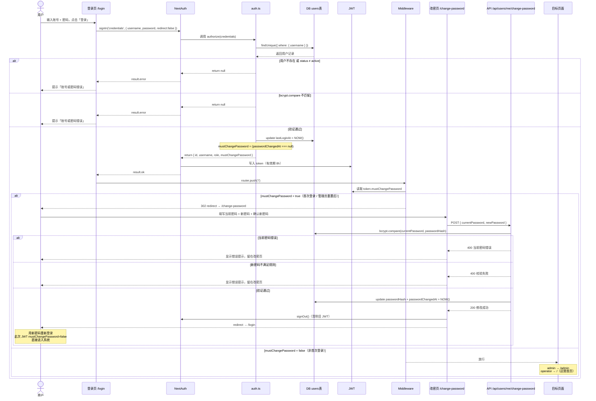

# M1 登录与鉴权交互文档

> 里程碑：M1 基础底座
> 覆盖范围：登录页、首次改密流程、Middleware 路由保护、JWT 会话管理
> 相关文件：
> - `apps/web/src/app/(auth)/login/page.tsx`
> - `apps/web/src/app/(auth)/change-password/page.tsx`
> - `apps/web/src/app/api/auth/[...nextauth]/route.ts`
> - `apps/web/src/app/api/users/me/change-password/route.ts`
> - `apps/web/src/lib/auth.ts`
> - `apps/web/src/middleware.ts`

---

## 一、整体流程概览

用户拿到账号后，完整的首次上线路径分三段：

```
拿到账号
  │
  ▼
① 登录验证（/login）
  │  账号/密码正确 → 签发 JWT，写入 mustChangePassword=true
  ▼
② 强制改密（/change-password）
  │  新密码设置成功 → 清除旧 JWT，跳回登录页
  ▼
③ 用新密码重新登录（/login）
     JWT 中 mustChangePassword=false → 进入系统
```

---

## 二、角色与权限说明

系统有两种角色，登录同一个入口（`/login`），登录成功后自动分发到不同端。

### 角色定位

| 角色 | 中文名 | 登录后进入 | 定位 |
|---|---|---|---|
| `admin` | 管理员 | `/admin`（管理后台） | 负责基础数据维护和账号管理，不参与日常内容创作 |
| `operator` | 运营 | `/`（业务运营端） | 日常使用 AI 工具进行内容创作，不可进入后台 |

### 各端可访问功能

**管理后台（admin 专属）**

| 模块 | 路由 | 说明 |
|---|---|---|
| 用户管理 | `/admin/users` | 新建/编辑/禁用账号，重置密码 |
| 红人管理 | `/admin/kols` | 新建/编辑红人档案、上传素材 |
| 产品管理 | `/admin/products` | 新建/编辑产品信息 |
| 爆款脚本库 | `/admin/viral-scripts` | 管理参考脚本素材 |

**业务运营端（operator 使用，M3 陆续上线）**

| 模块 | 路由 | 说明 |
|---|---|---|
| 首页 | `/` | 工具入口卡片墙 |
| 红人详情 | `/kols/[id]` | 只读查看红人档案 |
| 产品详情 | `/products/[id]` | 只读查看产品信息 |
| AI 工具（M3） | `/tools/*` | 人设仿写、千川仿写、复盘等（待上线） |

### 权限边界

- operator 访问 `/admin/*` 任意路由 → **403 Forbidden**，直接拒绝
- admin 可访问运营端所有页面（兼容查看）
- 所有 API 写操作（红人/产品/素材的增删改）仅 admin 可调用

---

## 三、完整交互时序图



---

## 四、登录页交互说明

**页面路径**：`/login`
**对应文件**：`apps/web/src/app/(auth)/login/page.tsx`

### 表单字段

| 字段 | 类型 | 说明 |
|---|---|---|
| 账号 | text | 用户名（非邮箱），autocomplete=username |
| 密码 | password | 初始密码由管理员提供，autocomplete=current-password |

### 交互状态

| 状态 | 触发条件 | 页面表现 |
|---|---|---|
| 正常 | 初始加载 | 账号/密码输入框，登录按钮可用 |
| 加载中 | 点击登录后 | 按钮文字变「登录中…」，disabled |
| 错误 | 账号密码不匹配 | 表单下方红色提示「账号或密码错误」 |
| 成功 | 验证通过 | router.push('/') 触发 Middleware 跳转 |

### 后端验证逻辑（auth.ts authorize）

```
1. 查询 users 表，用户名精确匹配
2. 用户不存在 → return null
3. user.status ≠ 'active' → return null（账号已禁用）
4. bcrypt.compare(输入密码, passwordHash) 失败 → return null
5. 全部通过 → 更新 lastLoginAt，返回用户对象
6. mustChangePassword = (passwordChangedAt === null)
```

---

## 五、改密页交互说明

**页面路径**：`/change-password`
**对应文件**：`apps/web/src/app/(auth)/change-password/page.tsx`

### 触发条件

Middleware 检测到 `token.mustChangePassword === true` 时，所有请求（除白名单外）强制 302 到此页面。

**白名单（不拦截）**：
- `/change-password`
- `/api/auth/*`
- `/api/users/me/change-password`

### 表单字段

| 字段 | 类型 | 说明 |
|---|---|---|
| 当前密码 | password | 管理员发放的初始密码 |
| 新密码 | password | 用户自定义，≥ 8 位 |
| 确认新密码 | password | 与新密码一致 |

### 客户端校验（提交前）

| 校验规则 | 错误提示 |
|---|---|
| 新密码 ≠ 确认密码 | 两次输入的新密码不一致 |
| 新密码长度 < 8 | 新密码至少 8 位 |

### 服务端校验（API）

| 校验规则 | HTTP 状态 | 错误提示 |
|---|---|---|
| currentPassword 或 newPassword 为空 | 400 | currentPassword 和 newPassword 均为必填 |
| 新密码长度 < 8 | 400 | 新密码至少 8 位 |
| 新密码 = 当前密码 | 400 | 新密码不能与当前密码相同 |
| bcrypt 验证当前密码失败 | 400 | 当前密码错误 |
| 用户不存在 | 404 | 用户不存在 |

### 改密成功后的处理

```
1. API 更新 passwordHash + passwordChangedAt = NOW()
2. 前端调用 signOut()，清除 JWT Cookie
3. 跳转 /login
4. 用户用新密码登录，新 JWT 中 mustChangePassword = false
5. Middleware 放行，进入系统
```

---

## 六、Middleware 路由保护规则

**对应文件**：`apps/web/src/middleware.ts`
**保护范围**：所有路径，排除 `_next/static`、`_next/image`、`favicon.ico`、`/login`、`/api/auth/*`

### 拦截优先级

```
请求到达
  │
  ├─ 未携带有效 JWT → 302 /login（NextAuth withAuth 处理）
  │
  ├─ token.mustChangePassword = true → 302 /change-password（优先级最高）
  │
  ├─ 访问 /admin/* 或 /api/admin/* 且 role ≠ admin → 403 Forbidden
  │
  ├─ 访问 /api/users/* （非 /me）且 role ≠ admin → 403 Forbidden
  │
  └─ 通过所有检查 → NextResponse.next()，正常访问
```

### 角色与可访问路由

| 角色 | 可访问路由 | 说明 |
|---|---|---|
| admin | `/admin/*`、`/api/*` | 完整权限 |
| operator | `/`、`/kols/*`、`/products/*`、`/api/kols/*`、`/api/products/*` | 不可访问 admin 路由 |

---

## 七、JWT 结构

```typescript
// token 字段（存储于 HttpOnly Cookie，有效期 8h）
{
  id: string            // 用户 ID
  username: string      // 登录账号
  displayName: string   // 显示名称
  role: 'admin' | 'operator'
  mustChangePassword: boolean  // true = 强制改密未完成
}
```

---

## 八、账号状态与流程对应关系

| 场景 | `passwordChangedAt` | `mustChangePassword` | 进入流程 |
|---|---|---|---|
| 管理员新建账号 | `NULL` | `true` | 首次登录 → 强制改密 → 重新登录 |
| 完成改密后正常使用 | 时间戳 | `false` | 直接进入系统 |
| 管理员重置密码（清空字段） | `NULL` | `true` | 再次走强制改密流程 |
| 账号被禁用（status=disabled） | 任意 | 不可登录 | 登录页返回「账号已停用，请联系管理员」 |

---

## 九、忘记密码处理

当前版本不支持用户自助找回密码，登录页提示「忘记密码？联系管理员重置」。

**管理员重置流程**（后台操作）：

1. 进入「用户管理」页面
2. 找到对应用户，点击「重置密码」
3. 弹窗预填默认密码 `Mcn@123456`（明文显示，可修改），点击「重置密码」提交
4. 提交成功后弹窗切换为成功反馈页，显示已设置的密码，管理员复制后告知用户
5. 用户下次登录自动走强制改密流程

---

## 十、用户管理页交互说明（管理员端）

**页面路径**：`/admin/users`
**对应文件**：`apps/web/src/app/(admin)/admin/users/page.tsx`

### 10.1 新建账号

| 字段 | 交互说明 |
|---|---|
| 姓名 | 先填，输入后自动生成账号 |
| 账号 | 由姓名全拼自动生成，可手动修改；重复时追加递增数字（如 `zhangsan` 已存在则生成 `zhangsan1`） |
| 角色 | 管理员 / 运营，默认运营 |
| 初始密码 | 预填默认密码 `Mcn@123456`，**明文显示**，可直接删除修改；首次登录强制修改 |

**账号生成规则**：
- 汉字转全拼（无声调），数字原样保留
- 示例：「张三」→ `zhangsan`，「测试1」→ `ceshi1`
- 重复：`zhangsan` 已存在 → `zhangsan1`，以此类推

### 10.2 重置密码

| 步骤 | 说明 |
|---|---|
| 打开弹窗 | 密码框预填 `Mcn@123456`，**明文显示**，可修改 |
| 提交成功 | 弹窗内容切换为成功反馈页：显示 ✓ 重置成功 + 已设置的密码明文 |
| 关闭 | 管理员记录密码后点「关闭」，告知用户新密码 |
| 用户侧 | 下次登录被强制跳至 `/change-password` 页修改密码 |

### 10.3 其他操作

| 操作 | 说明 |
|---|---|
| 编辑 | 修改姓名和角色，账号不可改 |
| 禁用 / 启用 | 立即生效，禁用后用户无法登录，数据保留 |
| 删除 | 软删除（status → disabled） |

### 10.4 默认密码约定

| 场景 | 默认密码 |
|---|---|
| 新建账号 | `Mcn@123456` |
| 重置密码 | `Mcn@123456` |
