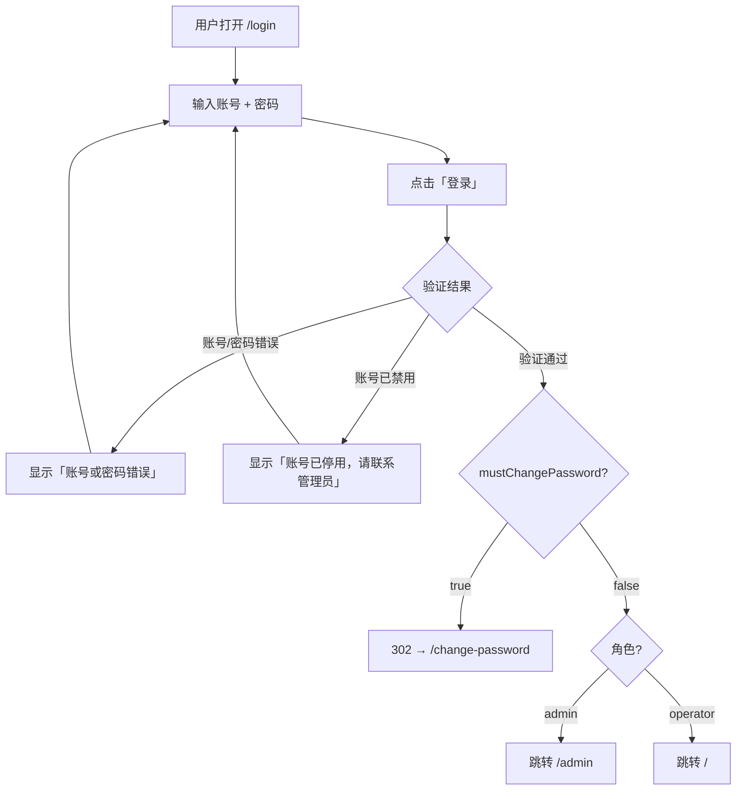
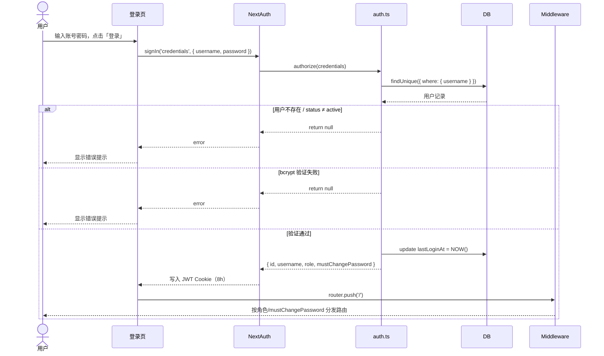
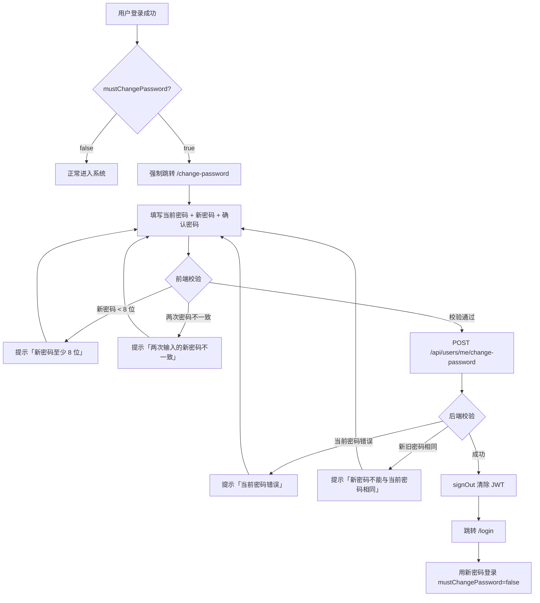
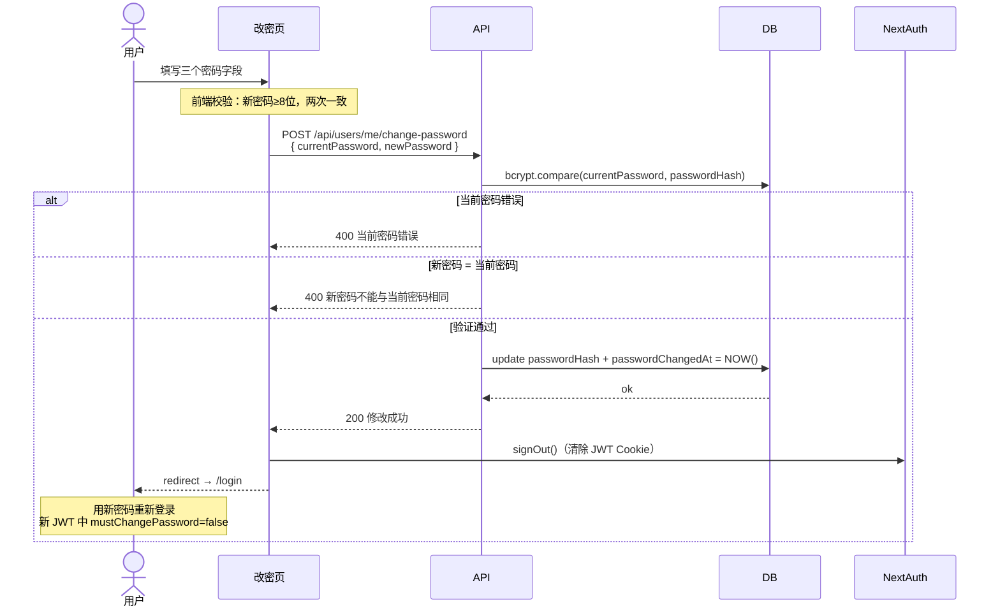
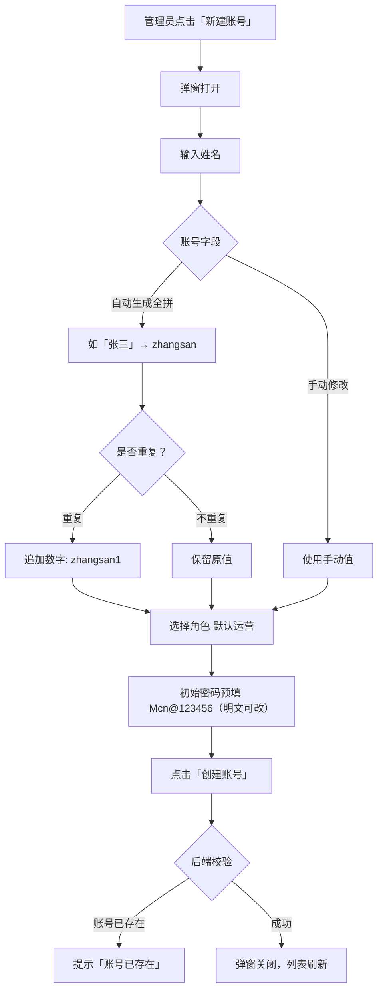
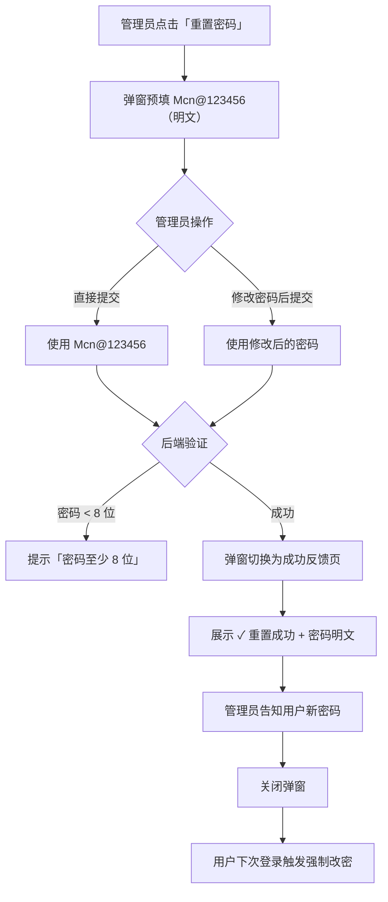

# M1 验收报告

> 里程碑：M1 基础底座
> 验收日期：2026-06-02
> 验收结论：✅ 通过

---

## 一、交付范围

| 模块 | 交付内容 |
|---|---|
| 登录认证 | 登录页、JWT 签发、next-auth 集成 |
| 首次改密 | 强制改密页、改密 API |
| 路由保护 | Middleware 鉴权、角色隔离、mustChangePassword 拦截 |
| 用户管理 | 新建 / 编辑 / 重置密码 / 禁用 / 删除账号（管理员端） |

---

## 二、功能验收明细

### 2.1 登录流程

#### 用户交互流程



#### 逻辑流程



#### 验收结果

| 测试场景 | 预期结果 | 验收状态 |
|---|---|---|
| 正确账号密码登录 | 跳转至 `/`，Middleware 按角色分发 | ✅ |
| 错误账号或密码 | 页面提示「账号或密码错误」，不跳转 | ✅ |
| 已禁用账号登录 | 页面提示「账号已停用，请联系管理员」 | ✅ |
| 登录中状态 | 按钮显示「登录中…」并 disabled | ✅ |

---

### 2.2 首次登录强制改密

#### 用户交互流程



#### 逻辑流程



#### 验收结果

| 测试场景 | 预期结果 | 验收状态 |
|---|---|---|
| 首次登录（passwordChangedAt=NULL） | 登录成功后自动跳转 `/change-password` | ✅ |
| 强制改密期间访问其他页面 | Middleware 强制 302 回 `/change-password` | ✅ |
| 当前密码填错 | 提示「当前密码错误」，留在改密页 | ✅ |
| 新密码少于 8 位 | 前端提示「新密码至少 8 位」 | ✅ |
| 两次新密码不一致 | 前端提示「两次输入的新密码不一致」 | ✅ |
| 新密码与当前密码相同 | 后端返回「新密码不能与当前密码相同」 | ✅ |
| 改密成功 | signOut 清除 JWT → 跳 `/login` → 新密码登录直接进系统 | ✅ |

---

### 2.3 路由保护

#### 逻辑流程

```mermaid
flowchart TD
    A[请求到达 Middleware] --> B{携带有效 JWT？}
    B -->|否| C[302 → /login]
    B -->|是| D{mustChangePassword = true？}
    D -->|是| E[302 → /change-password]
    D -->|否| F{访问路径}
    F -->|/admin/* 且 role ≠ admin| G[403 Forbidden]
    F -->|/api/users/* 非 /me 且 role ≠ admin| G
    F -->|其他| H[NextResponse.next() 放行]
    H --> I{role?}
    I -->|admin 访问 /| J[redirect → /admin]
    I -->|operator 访问 /admin/*| G
    I -->|正常匹配| K[渲染目标页面]
```

#### 验收结果

| 测试场景 | 预期结果 | 验收状态 |
|---|---|---|
| 未登录访问任意页面 | 跳转 `/login` | ✅ |
| operator 访问 `/admin/*` | 返回 403 | ✅ |
| operator 访问 `/api/users`（非 /me） | 返回 403 | ✅ |
| admin 访问运营端页面 | 正常访问 | ✅ |
| JWT 过期（8h）后访问 | 跳转 `/login` | ✅ |

---

### 2.4 用户管理 - 新建账号

#### 用户交互流程



#### 验收结果

| 测试场景 | 预期结果 | 验收状态 |
|---|---|---|
| 输入中文姓名 | 账号字段自动填入全拼（如「张三」→ `zhangsan`） | ✅ |
| 姓名含数字（如「测试1」） | 账号生成 `ceshi1`，数字保留 | ✅ |
| 全拼与已有账号重复 | 自动追加序号（`zhangsan` → `zhangsan1`） | ✅ |
| 账号字段可手动修改 | 手动修改后不再自动覆盖 | ✅ |
| 初始密码预填 | 打开弹窗时密码框显示 `Mcn@123456`（明文） | ✅ |
| 提交成功 | 用户列表刷新，新账号出现 | ✅ |
| 账号重复 | 后端返回「账号已存在」 | ✅ |

---

### 2.5 用户管理 - 重置密码

#### 用户交互流程



#### 验收结果

| 测试场景 | 预期结果 | 验收状态 |
|---|---|---|
| 点击「重置密码」 | 弹窗预填 `Mcn@123456`，明文显示 | ✅ |
| 修改密码后提交 | 使用修改后的密码重置 | ✅ |
| 重置成功 | 弹窗内容切换为成功反馈页，显示 ✓ 重置成功 + 密码明文 | ✅ |
| 重置后用户登录 | 触发强制改密流程 | ✅ |
| 密码少于 8 位 | 提示「密码至少 8 位」 | ✅ |

---

### 2.6 用户管理 - 其他操作

| 测试场景 | 预期结果 | 验收状态 |
|---|---|---|
| 编辑姓名/角色 | 更新成功，列表刷新 | ✅ |
| 禁用账号 | 用户立即无法登录 | ✅ |
| 启用账号 | 用户可正常登录 | ✅ |
| 删除账号 | 账号状态改为 disabled，列表消失 | ✅ |

---

## 三、变更记录

| 变更时间 | 变更内容 | 变更原因 |
|---|---|---|
| 2026-06-02 | 新建账号：账号由姓名全拼自动生成，含数字保留 | 减少管理员手动输入，降低错误率 |
| 2026-06-02 | 新建账号：初始密码预填 `Mcn@123456` 并明文显示 | 管理员需直接看到并告知员工初始密码 |
| 2026-06-02 | 重置密码：预填默认密码，改为明文显示 | 与新建账号体验一致 |
| 2026-06-02 | 重置密码：成功后展示密码明文反馈页 | 确保管理员能看到密码后再关闭弹窗 |
| 2026-06-02 | 新增管理员账号 `admin` / `admin123` | 便于管理员快速登录测试 |

---

## 四、已知限制

| 限制 | 说明 |
|---|---|
| 忘记密码无自助找回 | 需联系管理员重置，当前团队规模下可接受 |
| 账号创建后不可修改用户名 | 用户名作为唯一标识，不支持变更 |
| 默认密码硬编码在前端 | `Mcn@123456` 写在 `users/page.tsx`，后续可考虑移至环境变量 |

---

## 五、相关文档

- [M1-需求文档.md](./M1-需求文档.md) — 功能需求与权限规则
- [M1-登录与鉴权交互文档.md](./M1-登录与鉴权交互文档.md) — 完整流程图与字段说明
