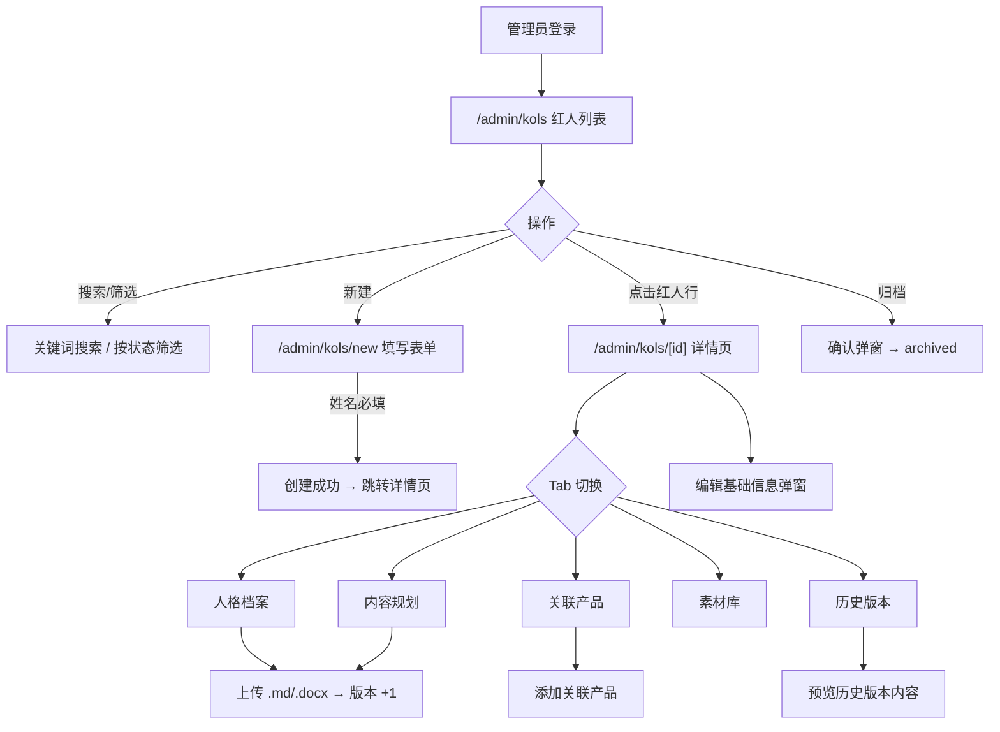
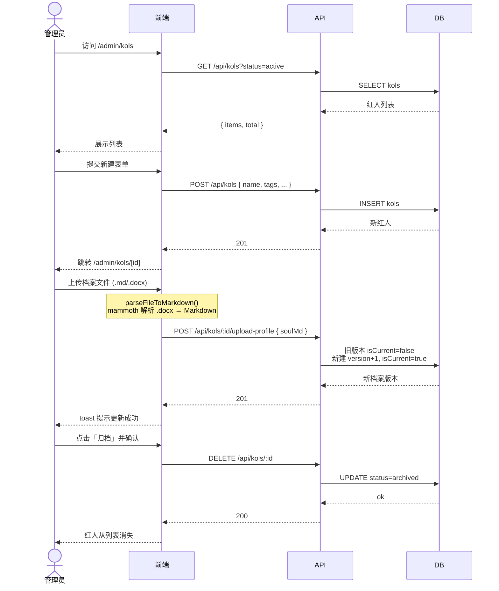
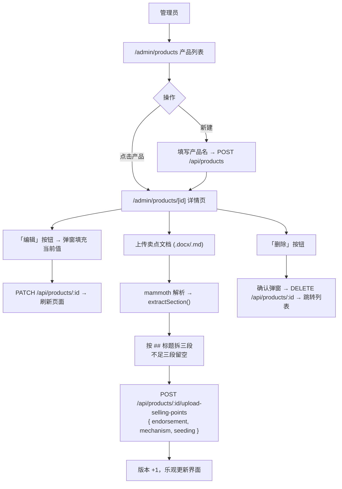
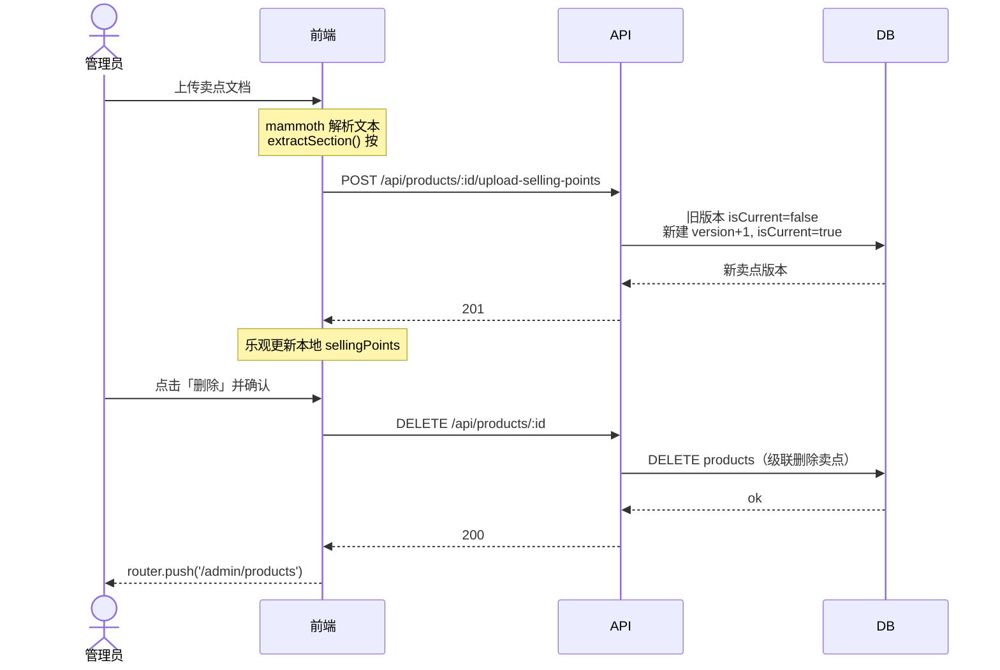
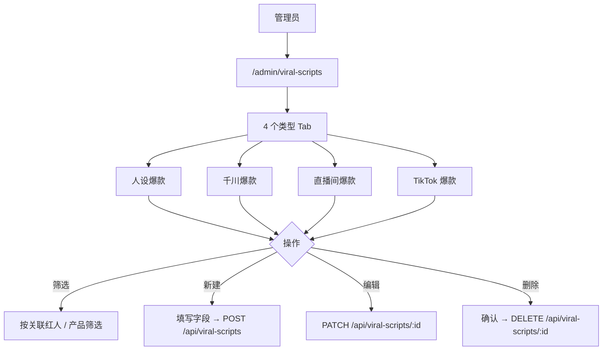
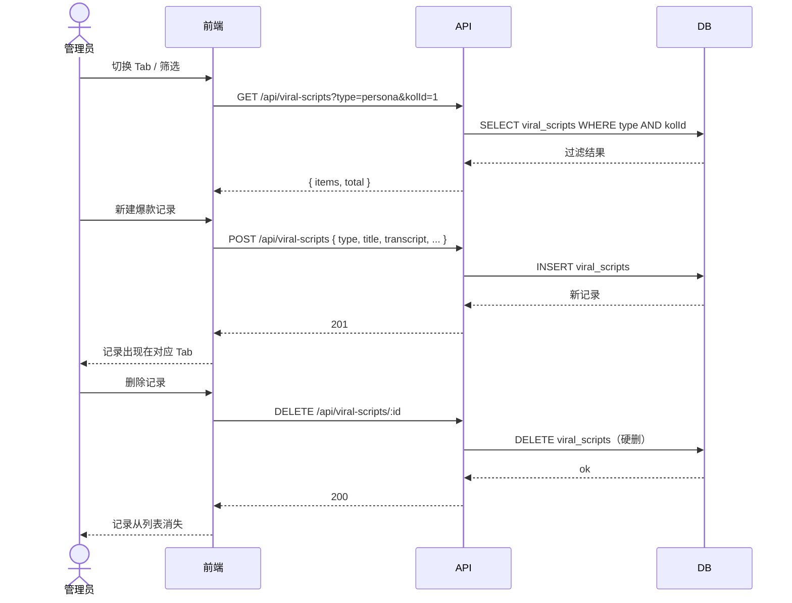
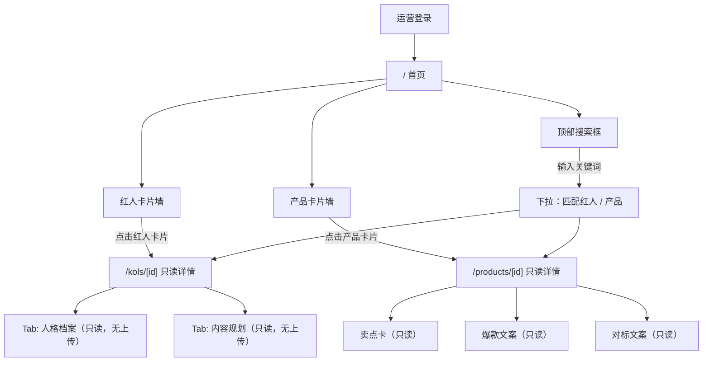
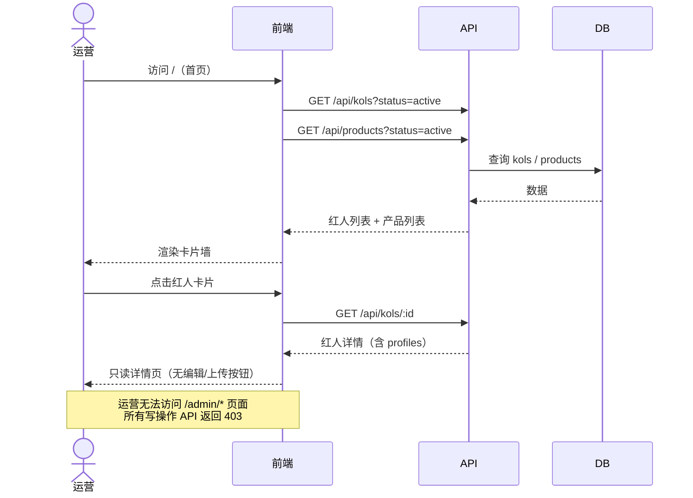
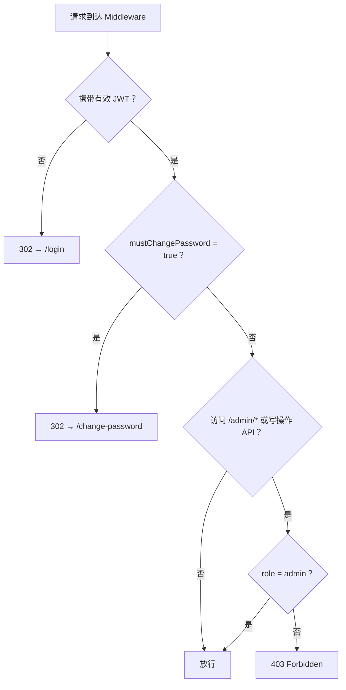

# M2 验收文档

> 里程碑：M2 数据中台
> 验收时间：2026-06-02
> 验收结论：✅ 通过（运营端详情/搜索待数据补充后回归）

---

## 一、测试准备

- 确认服务已启动：`http://localhost:3000`
- 准备两个测试账号：
  - 管理员：`admin` / `admin123`（登录后需改密）
  - 运营：`operator01` / `Operator@123`（登录后需改密）
- 准备测试文件：一个 `.docx` 文档（任意内容），一个 `.md` 文件

---

## 二、红人管理验收

### 用户交互流程

### 逻辑流程

### 2.1 红人列表

| 测试场景 | 预期结果 | 验收状态 |
|---|---|---|
| 管理员访问 `/admin/kols` | 展示红人列表，有表头和分页 | ✅ |
| 按状态筛选「已归档」 | 列表仅显示归档红人 | ✅ |
| 搜索框输入关键词 | 列表实时过滤 | ✅ |
| 点击红人行 | 跳转到红人详情页 | ✅ |
| 运营访问 `/admin/kols` | 返回 403 | ✅ |

### 2.2 新建红人

| 测试场景 | 预期结果 | 验收状态 |
|---|---|---|
| 填写姓名后提交 | 创建成功，跳转到详情页 | ✅ |
| 不填姓名直接提交 | 表单报错，不提交 | ✅ |
| 填写人格档案 Markdown 后提交 | 详情页「人格档案」Tab 展示内容，版本号为 1 | ✅ |
| 运营访问新建页面 | 无法操作（403 或无入口） | ✅ |

### 2.3 红人详情 · 人格档案 Tab

| 测试场景 | 预期结果 | 验收状态 |
|---|---|---|
| 打开详情页 | 人格档案 Markdown 正确渲染 | ✅ |
| 上传 .md 文件 | 内容更新，版本号 +1 | ✅ |
| 上传 .docx 文件 | 文档解析为 Markdown，内容更新，版本号 +1 | ✅ |
| 上传其他格式文件 | 报错提示格式不支持 | ✅ |

### 2.4 红人详情 · 历史版本 Tab

| 测试场景 | 预期结果 | 验收状态 |
|---|---|---|
| 上传过两次后查看历史版本 | 显示两条版本记录，版本号/时间/创建人正确 | ✅ |
| 点击历史版本 | 可预览该版本内容 | ✅ |

### 2.5 红人详情 · 关联产品 Tab

| 测试场景 | 预期结果 | 验收状态 |
|---|---|---|
| 打开关联产品 Tab | 展示已关联产品列表 | ✅ |
| 添加关联产品 | 产品出现在列表中 | ✅ |

### 2.6 归档红人

| 测试场景 | 预期结果 | 验收状态 |
|---|---|---|
| 点击「归档」并确认 | 红人从列表消失，状态变为 archived | ✅ |
| 筛选「已归档」 | 被归档的红人出现在列表 | ✅ |

---

## 三、产品管理验收

### 用户交互流程

### 逻辑流程

### 3.1 产品列表与新建

| 测试场景 | 预期结果 | 验收状态 |
|---|---|---|
| 管理员访问 `/admin/products` | 展示产品列表 | ✅ |
| 新建产品（仅填产品名） | 创建成功，跳转详情页 | ✅ |
| 不填产品名直接提交 | 表单报错 | ✅ |

### 3.2 产品详情 · 卖点卡

| 测试场景 | 预期结果 | 验收状态 |
|---|---|---|
| 打开产品详情页 | 展示背书/机制/种草三个区块 | ✅ |
| 上传 .docx 卖点文档 | 三段内容自动解析填入对应区块 | ✅ |

### 3.3 产品详情 · 爆款与对标

| 测试场景 | 预期结果 | 验收状态 |
|---|---|---|
| 关联了爆款的产品详情 | 爆款文案区块显示关联脚本 | ✅ |
| 关联了对标素材的产品详情 | 对标文案库区块正确展示 | ✅ |

---

## 四、爆款库验收

### 用户交互流程

### 逻辑流程

| 测试场景 | 预期结果 | 验收状态 |
|---|---|---|
| 访问 `/admin/viral-scripts` | 展示 4 个类型 Tab | ✅ |
| 切换不同 Tab | 列表内容按类型过滤 | ✅ |
| 新建一条爆款记录 | 出现在对应 Tab 列表中 | ✅ |
| 编辑已有记录 | 内容更新成功 | ✅ |
| 删除记录 | 记录从列表消失 | ✅ |
| 按关联红人筛选 | 仅显示该红人关联的爆款 | ✅ |

---

## 五、运营端验收

### 用户交互流程

### 逻辑流程

### 5.1 首页卡片墙

| 测试场景 | 预期结果 | 验收状态 |
|---|---|---|
| 运营账号登录后进入首页 | 展示红人卡片墙和产品卡片墙 | ✅ |
| 点击红人卡片 | 跳转到 `/kols/[id]` 只读详情 | ⬜ 待补充数据后测试 |
| 点击产品卡片 | 跳转到 `/products/[id]` 只读详情 | ⬜ 待补充数据后测试 |
| 顶部搜索框输入关键词 | 下拉展示匹配的红人/产品 | ⬜ 待补充数据后测试 |

### 5.2 只读详情页

| 测试场景 | 预期结果 | 验收状态 |
|---|---|---|
| 运营访问 `/kols/[id]` | 展示人格档案、内容规划两个 Tab，无上传/编辑按钮 | ⬜ 待补充数据后测试 |
| 运营访问 `/products/[id]` | 展示卖点卡/爆款/对标，无编辑按钮 | ⬜ 待补充数据后测试 |

---

## 六、权限边界验收

### 逻辑流程

| 测试场景 | 预期结果 | 验收状态 |
|---|---|---|
| 运营调用 `POST /api/kols` | 返回 403 | ✅ |
| 运营调用 `PATCH /api/products/[id]` | 返回 403 | ✅ |
| 运营调用 `DELETE /api/viral-scripts/[id]` | 返回 403 | ✅ |

---

## 七、前置修复项（已全部完成）

后端于 2026-06-02 补齐以下 4 项，测试不再受阻：

| 项目 | 完成内容 | 状态 |
|---|---|---|
| `kols/[id]/profile` 路由 | GET 返回 isCurrent=true 档案；POST 事务内旧版本置 false，新建 version+1 | ✅ |
| `kols/[id]/materials` 路由 | GET 支持 ?type= 过滤；POST 写入 kolId + uploadedById；DELETE 硬删并校验归属 | ✅ |
| `viral-scripts/[id]` 路由 | GET 含 transcript/structureMd；PATCH updateData 模式；DELETE 硬删 | ✅ |
| `prisma.ts` 连接池配置 | datasources.db.url 已补；.env.production 连接池参数已存在，未重复写入 | ✅ |

---

## 八、测试中发现的问题与修复记录

| 发现时间 | 问题描述 | 根因 | 修复方 | 状态 |
|---|---|---|---|---|
| 2026-06-02 | 红人人格档案/内容规划上传失败 | 前端用 multipart/form-data，后端接收 JSON，格式不匹配 | 前端 | ✅ 已修复 |
| 2026-06-02 | 产品详情「编辑」按钮点击无反应 | 按钮为空壳，未实现 onClick 和编辑弹窗 | 前端 | ✅ 已修复 |
| 2026-06-02 | 产品卖点文档上传失败 | onUpload 为假函数；后端路由已补 `POST /api/products/[id]/upload-selling-points`，接收 JSON `{endorsement, mechanism, seeding}` | 前端 | ✅ 已修复 |
| 2026-06-02 | 产品详情无删除功能 | 前端缺删除按钮；后端已有 `DELETE /api/products/[id]`（物理删除），API 合同已补录 5.5 节 | 前端 | ✅ 已修复 |
| 2026-06-02 | 红人基础信息编辑按钮点击无反应 | `kols/[id]/page.tsx` 第 150 行按钮为空壳，未实现 onClick 和编辑弹窗 | 前端 | ✅ 已修复 |
| 2026-06-02 | API 层权限漏洞：运营可直接调用红人新建/编辑接口 | `POST /api/kols` 和 `PATCH /api/kols/[id]` 使用 `requireAuth` 而非 `requireAdmin`；前端页面受 Middleware 保护，但 API 层未拦截，运营可绕过 UI 直接发请求 | 后端 | 🔧 待修复 |

### 红人上传修复详情（2026-06-02 已完成）

- 安装 `mammoth` 库
- 新增 `src/types/mammoth.d.ts` 最小类型声明
- `kols/[id]/page.tsx` 新增 `parseFileToMarkdown` 函数：
  - `.md` → `file.text()` 直接读文本
  - `.docx` → `mammoth.convertToMarkdown({ arrayBuffer })` 转 Markdown
  - 其他格式 → toast 提示「仅支持 .md / .docx 格式」
  - 处理期间显示「解析中…」toast，成功/失败各自提示

### 产品页三项修复详情（2026-06-02 已完成）

**编辑功能**
- `products/[id]/page.tsx` 新增编辑弹窗：填充当前值 → `updateProduct()` 调用 `PATCH /api/products/:id` → `load()` 刷新页面

**卖点文档上传**
- 复用 `mammoth` 解析 .md / .docx 为文本
- 新增 `extractSection()` 函数：按 `## heading` 分段，缺 heading 则按 `---` 分割
- 第 1、2、3 段依次映射 `endorsement` / `mechanism` / `seeding`，不足三段的字段留空
- 解析结果以 JSON 方式 `POST /api/products/:id/upload-selling-points`
- 成功后乐观更新本地 `sellingPoints` 状态

**删除功能**
- 新增确认弹窗（ConfirmDialog）→ `DELETE /api/products/:id` → `router.push('/admin/products')`
