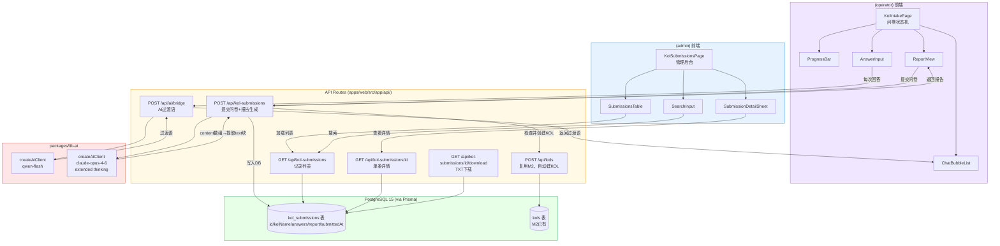
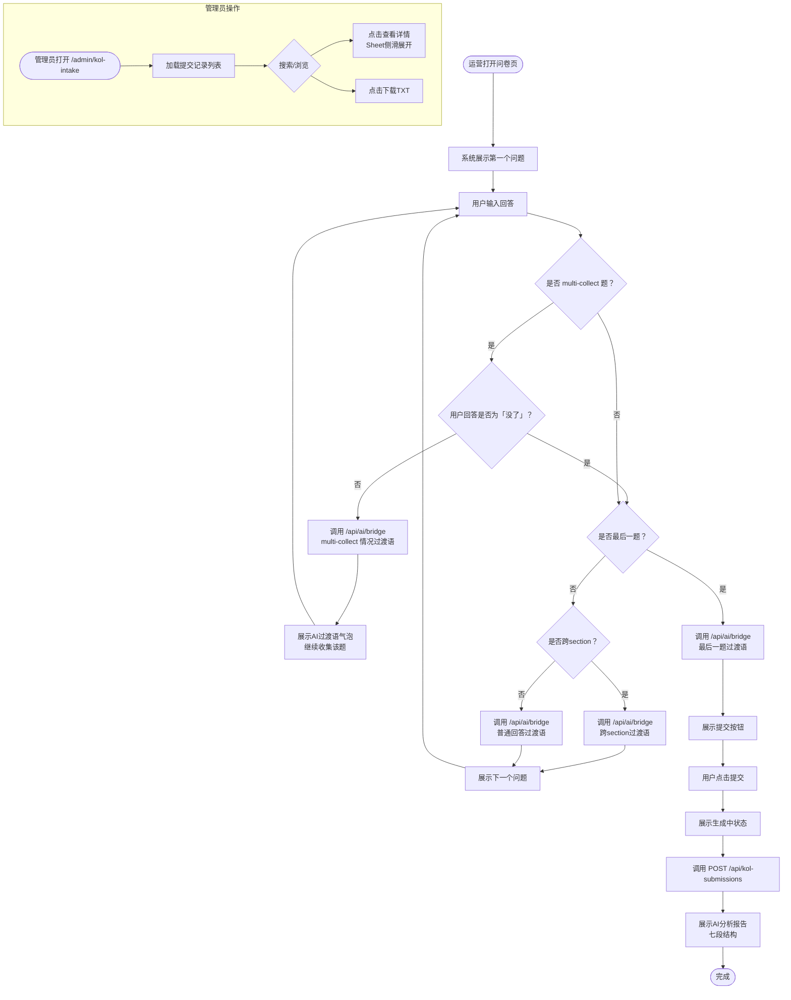

## 红人信息采集（kol-intake）迁移分析文档

> 旧路径：/kol-intake | 旧端口：3007
> 迁移目标：新平台 (operator) 路由（采集页面） + (admin) 路由（管理后台）

---

### 1. 旧架构梳理

#### 1.1 前端页面结构

**采集页面（/kol-intake）**
- 整体布局：仿聊天气泡的对话式问卷，主色调紫色系
- 顶部进度条：实时显示当前答题进度（已完成题数 / 总题数）
- 消息区域：左侧AI提问气泡 + 右侧用户回答气泡，历史问答滚动展示
- 输入区域：文本输入框 + 发送按钮，部分题目附带选项按钮
- 提交成功页：显示AI生成的分析报告（七段结构）
- 问卷覆盖23个字段：昵称、抖音账号名、年龄、城市、情感状态、子女情况、父母关系、直播频率、日程安排、职业经历、独特经历、说话风格、内容方向、目标受众等

**管理后台（/kol-intake/admin）**
- 提交记录列表：表格展示所有提交记录（ID、昵称、提交时间、答题数）
- 搜索/筛选：支持按昵称关键词搜索
- 详情查看：点击记录展开查看完整问答内容和AI报告
- 下载功能：将单条记录导出为 .txt 文件

**用户主要操作路径**
1. 打开问卷页 → 系统展示第一个问题
2. 用户输入回答 → 前端发送 bridge 请求获取AI过渡语 → 展示下一个问题
3. multi-collect 题目：用户持续回答，直到输入「没了」才进入下一题
4. 完成全部23题 → 点击提交 → 后端生成AI分析报告 → 前端展示报告
5. 管理员访问 /admin → 查看/搜索/下载提交记录

#### 1.2 后端 API 清单

| 接口 | 方法 | 功能 |
|---|---|---|
| /api/bridge | POST | 接收当前问题和用户回答，生成AI情感过渡语（非流式，qwen-flash） |
| /api/submit | POST | 提交完整问卷23题，调用claude-opus-4-6（extended thinking 6000 tokens）生成分析报告，写入JSON文件 |
| /api/submissions | GET | 列出所有提交记录（id / nickname / submittedAt / answerCount） |
| /api/submissions/[id] | GET | 获取单条完整记录（含所有答案和AI报告） |
| /api/download/[id] | GET | 将单条记录格式化为 .txt 文件下载 |

#### 1.3 数据存储

**存储路径**：`/opt/kol-intake/data/*.json`

每条记录文件命名规则：`{id}.json`，id 为 `Date.now().toString(36) + random` 生成的短串

**核心数据字段**：
| 字段 | 类型 | 说明 |
|---|---|---|
| id | string | 唯一标识（base36时间戳+随机串） |
| answers | object | 23个问题的回答，key为问题编号 |
| report | string | AI生成的分析报告（七段结构Markdown文本） |
| submittedAt | string | 提交时间（ISO 8601） |

**报告七段结构**：人物画像 / 人格标签 / 核心差异化素材 / 表达风格 / 投入节奏 / 合作适配度 / 内容方向建议

#### 1.4 第三方调用

| 服务 | 调用场景 | 调用方式 |
|---|---|---|
| 云雾AI（qwen-flash） | /api/bridge，生成AI过渡语 | OpenAI兼容接口，非流式，max_tokens约100 |
| 云雾AI（claude-opus-4-6） | /api/submit，生成分析报告 | OpenAI兼容接口，非流式，extended thinking budget: 6000 tokens |

**extended thinking 注意点**：返回的 `content` 字段为数组，需遍历找到 `type === "text"` 的块，提取其 `text` 字段作为正式报告内容。

#### 1.5 旧架构图

```mermaid
graph TD
    subgraph Frontend["前端 (Next.js, Port 3007)"]
        A[问卷采集页 /kol-intake<br/>对话式UI + 进度条]
        B[管理后台 /kol-intake/admin<br/>记录列表 + 搜索 + 下载]
    end

    subgraph Backend["后端 API Routes"]
        C[POST /api/bridge<br/>AI过渡语生成]
        D[POST /api/submit<br/>问卷提交 + 报告生成]
        E[GET /api/submissions<br/>记录列表]
        F[GET /api/submissions/id<br/>单条详情]
        G[GET /api/download/id<br/>TXT下载]
    end

    subgraph Storage["文件系统"]
        H[/opt/kol-intake/data/*.json<br/>每条记录独立JSON文件]
    end

    subgraph ThirdParty["第三方服务"]
        I[云雾AI qwen-flash<br/>过渡语，非流式]
        J[云雾AI claude-opus-4-6<br/>分析报告，extended thinking]
    end

    A -->|用户每次回答| C
    C --> I
    I -->|过渡语文本| C
    C -->|AI过渡语| A

    A -->|全部23题完成，点击提交| D
    D --> J
    J -->|七段报告content数组| D
    D -->|写入JSON| H
    D -->|返回报告| A

    B -->|加载列表| E
    B -->|查看详情| F
    B -->|下载| G
    E --> H
    F --> H
    G --> H
```

---

### 2. 新架构设计

#### 2.1 前端

**路由位置**：
- 问卷采集页：`apps/web/src/app/(operator)/kol-intake/page.tsx`
- 管理后台：`apps/web/src/app/(admin)/kol-intake/page.tsx`

**页面组件拆分**：

_operator 端 - 问卷采集_：
| 组件 | 路径 | 说明 |
|---|---|---|
| `KolIntakePage` | `(operator)/kol-intake/page.tsx` | 页面入口，维护问卷状态机 |
| `ProgressBar` | `components/kol-intake/ProgressBar.tsx` | 顶部进度条，显示 n/23 |
| `ChatBubbleList` | `components/kol-intake/ChatBubbleList.tsx` | 问答气泡列表，区分AI侧/用户侧 |
| `AnswerInput` | `components/kol-intake/AnswerInput.tsx` | 输入框 + 发送按钮 + 选项按钮组 |
| `ReportView` | `components/kol-intake/ReportView.tsx` | 提交成功后展示AI七段报告 |

_admin 端 - 管理后台_：
| 组件 | 路径 | 说明 |
|---|---|---|
| `KolSubmissionsPage` | `(admin)/kol-intake/page.tsx` | 页面入口 |
| `SubmissionsTable` | `components/kol-intake/SubmissionsTable.tsx` | 使用 shadcn/ui `Table` 展示记录列表 |
| `SubmissionDetailSheet` | `components/kol-intake/SubmissionDetailSheet.tsx` | 使用 shadcn/ui `Sheet` 侧滑展示详情 |
| `SearchInput` | `components/kol-intake/SearchInput.tsx` | 搜索框，使用 shadcn/ui `Input` |

**shadcn/ui 组件映射**：
- 进度条：`Progress`
- 表格：`Table`, `TableHeader`, `TableRow`, `TableCell`
- 详情侧滑：`Sheet`
- 搜索框：`Input`
- 按钮：`Button`（variant: default / outline）
- 加载状态：`Skeleton`

#### 2.2 后端

**复用 M2 接口**：
- `GET/POST /api/kols`（提交问卷后自动创建KOL记录时复用）

**新增 API 路由**：

| 接口 | 方法 | 是否新增 | 说明 |
|---|---|---|---|
| /api/kol-submissions | POST | 新增 | 提交完整问卷，生成AI报告，写入DB，若kols表无同名记录则自动创建 |
| /api/kol-submissions | GET | 新增 | 列出所有提交记录（支持按 kolName 搜索，分页） |
| /api/kol-submissions/[id] | GET | 新增 | 获取单条完整记录（含 answers 和 report） |
| /api/kol-submissions/[id] | DELETE | 新增 | 删除单条提交记录 |
| /api/kol-submissions/[id]/download | GET | 新增 | 将单条记录格式化为 .txt 下载 |
| /api/ai/bridge | POST | 新增 | AI过渡语生成（qwen-flash，非流式） |
| /api/kols | GET/POST | 复用M2 | 查询/创建KOL记录 |

#### 2.3 数据存储

**新增表**：

| 表名 | 字段 | 说明 |
|---|---|---|
| kol_submissions | id (cuid) | 主键 |
| kol_submissions | kolName (string) | 达人昵称（来自问卷第一题） |
| kol_submissions | answers (Json) | 23题完整答案，JSON对象 |
| kol_submissions | report (text) | AI生成的七段分析报告（Markdown文本） |
| kol_submissions | submittedAt (DateTime) | 提交时间，默认 now() |

**复用 M2 已有表**：

| 表名 | 复用场景 | 说明 |
|---|---|---|
| kols | 提交问卷后自动创建KOL记录 | 检查 name 字段是否存在同名，不存在则 create |

**Prisma Schema 新增**：
```prisma
model KolSubmission {
  id          String   @id @default(cuid())
  kolName     String
  answers     Json
  report      String   @db.Text
  submittedAt DateTime @default(now())
}
```

#### 2.4 第三方调用

| 旧调用方式 | 新平台调用方式 | 说明 |
|---|---|---|
| 直接调用云雾AI HTTP接口（qwen-flash） | `import { createAiClient } from '@repo/lib-ai'`，使用 qwen-flash 模型 | 生成AI过渡语，非流式 |
| 直接调用云雾AI HTTP接口（claude-opus-4-6，extended thinking） | `import { createAiClient } from '@repo/lib-ai'`，使用 claude-opus-4-6 模型，传入 thinkingBudget: 6000 | 生成分析报告，返回content数组需提取 type=text 块 |

#### 2.5 新架构图



---

### 3. 核心流程图

#### 3.1 用户操作流程图



#### 3.2 后端业务逻辑图

```mermaid
flowchart TD
    subgraph BridgeAPI["POST /api/ai/bridge"]
        B1[接收: currentQuestion, userAnswer, situation]
        B1 --> B2{situation 类型判断}
        B2 -->|last_question| B3[构造最后一题过渡prompt]
        B2 -->|multi_collect| B4[构造继续收集prompt]
        B2 -->|new_section| B5[构造跨section过渡prompt]
        B2 -->|normal| B6[构造普通过渡prompt]
        B3 & B4 & B5 & B6 --> B7[调用 lib-ai qwen-flash<br/>非流式，max_tokens~100]
        B7 --> B8{响应正常？}
        B8 -->|是| B9[返回 200 + bridgeText]
        B8 -->|否| B10[返回 500 + 错误信息]
    end

    subgraph SubmitAPI["POST /api/kol-submissions"]
        S1[接收: answers 对象（23题）]
        S1 --> S2[Zod 校验 answers 结构]
        S2 --> S3{校验通过？}
        S3 -->|否| S4[返回 400 + 校验错误]
        S3 -->|是| S5[从 answers 提取 kolName<br/>第一题昵称字段]
        S5 --> S6[构造七段报告生成 prompt<br/>含全部23题答案]
        S6 --> S7[调用 lib-ai claude-opus-4-6<br/>extended thinking budget: 6000]
        S7 --> S8{返回 content 是否为数组？}
        S8 -->|是| S9[遍历 content 数组<br/>找 type === 'text' 的块<br/>提取 text 字段]
        S8 -->|否| S10[直接使用 content 字符串]
        S9 & S10 --> S11[report = 提取到的文本]
        S11 --> S12[Prisma: 创建 kol_submissions 记录]
        S12 --> S13[查询 kols 表是否存在同名 KOL<br/>where: name === kolName]
        S13 --> S14{KOL 是否已存在？}
        S14 -->|否| S15[Prisma: 创建 kols 记录<br/>name=kolName, platform默认'抖音']
        S14 -->|是| S16[跳过创建]
        S15 & S16 --> S17[返回 200 + submissionId + report]
        S12 -->|DB异常| S18[返回 500 + 错误信息]
        S7 -->|AI调用失败| S19[返回 502 + AI服务错误]
    end
```



---

### 4. 迁移差异对照

| 维度 | 旧架构 | 新架构 | 迁移工作量 |
|---|---|---|---|
| 数据来源 | 文件系统 /opt/kol-intake/data/*.json | PostgreSQL kol_submissions 表（Prisma） | 中：需写 Prisma schema + migration，旧数据可选择性导入 |
| 权限控制 | 无认证（任何人可访问 /admin） | next-auth JWT，operator 端需登录，admin 端需 role=admin | 高：需加 middleware 保护路由，旧系统零认证 |
| UI框架 | 自定义 CSS（紫色系） | Tailwind CSS + shadcn/ui 组件库 | 中：对话气泡 UI 需重新实现，逻辑可复用 |
| 第三方调用 | 直接 HTTP 调用云雾AI接口 | lib-ai 包封装调用 | 低：接口兼容，换用包即可，需处理 extended thinking 返回格式 |
| 存储 | 单机文件 JSON，无法跨服务器 | PostgreSQL，支持多实例部署 | 中：旧数据需手动迁移脚本（可选） |
| 问卷状态机 | 前端 JS 维护 | 前端 React state 维护（逻辑相同） | 低：状态机逻辑直接移植 |
| KOL 联动 | 无，提交后独立存储 | 提交后自动在 kols 表创建记录（联动素材库） | 低：新增逻辑，约20行 |
| 管理后台路由 | /kol-intake/admin | /admin/kol-intake（独立 admin 布局） | 低：路由重新规划 |

---

### 5. 开发要点与风险

**关键实现注意事项**：

1. **extended thinking 返回格式处理**
   - claude-opus-4-6 开启 extended thinking 后，`response.choices[0].message.content` 为数组而非字符串
   - 必须遍历数组，找到 `type === 'text'` 的元素，取其 `text` 字段
   - thinking 块（`type === 'thinking'`）不应写入数据库

2. **问卷状态机的 multi-collect 逻辑**
   - multi-collect 题（如"独特经历"、"职业经历"）允许用户多次回答
   - 前端需维护每道题的 `isCollecting` 状态，只有当用户输入触发词（「没了」/「结束」）才推进到下一题
   - Bridge API 需接收 `situation` 参数以生成对应风格的过渡语

3. **AI Bridge 的降级处理**
   - Bridge 过渡语失败不应中断问卷流程
   - 前端在 Bridge API 超时或失败时，应直接展示下一个问题，不阻塞用户

4. **KOL 自动创建的幂等性**
   - 同一个 kolName 提交多次问卷时，应只创建一条 kols 记录
   - 使用 Prisma `upsert` 或先 `findFirst` 再条件 `create`，避免重复数据

5. **问卷字段的版本管理**
   - 23个问题的结构硬编码在前端，未来修改问题需同步更新 Zod 校验 schema
   - answers 字段存 Json 类型便于扩展，但历史记录与当前问卷结构可能不一致，详情展示时需做兼容处理

6. **TXT 下载格式**
   - 后端拼接 kolName + 提交时间 + 每题问答 + AI报告，以换行分隔
   - 响应头设置 `Content-Disposition: attachment; filename="kol-{kolName}-{date}.txt"`，字符编码用 UTF-8 BOM 防止 Windows 乱码

**已知技术风险**：

| 风险 | 等级 | 说明 | 缓解措施 |
|---|---|---|---|
| extended thinking 响应时间长 | 高 | claude-opus-4-6 + 6000 thinking tokens 生成报告可能需30-60秒 | 前端展示明确的等待提示，后端设置足够长的超时时间（120s） |
| 并发提交导致 KOL 重复创建 | 中 | 两个同名KOL同时提交问卷可能创建两条 kols 记录 | 对 kols.name 添加 unique 约束（或 upsert 操作），捕获唯一键冲突 |
| 旧数据迁移 | 低 | /opt/kol-intake/data/*.json 中的历史记录无法自动迁移 | 可选：写一次性迁移脚本，将 JSON 文件批量 insert 到 kol_submissions 表 |
| next-auth 中间件遗漏 | 高 | 若 middleware 配置不当，operator 端可能被未登录用户访问 | 在 middleware.ts 中明确配置 (operator) 和 (admin) 路径的认证规则 |

**与其他模块的依赖关系**：

- **依赖 M2 kols 表**：提交问卷后自动创建 kols 记录，与素材库模块（material-library）共享同一张表
- **被 persona-positioning 模块依赖**：persona-positioning 的"从kol-intake导入"功能需要读取 `kol_submissions` 表（`GET /api/kol-submissions`），因此本模块的 API 需优先实现
- **共享 lib-ai 包**：与 persona-positioning、素材库等多个模块共用，lib-ai 的异常应有统一错误码规范
