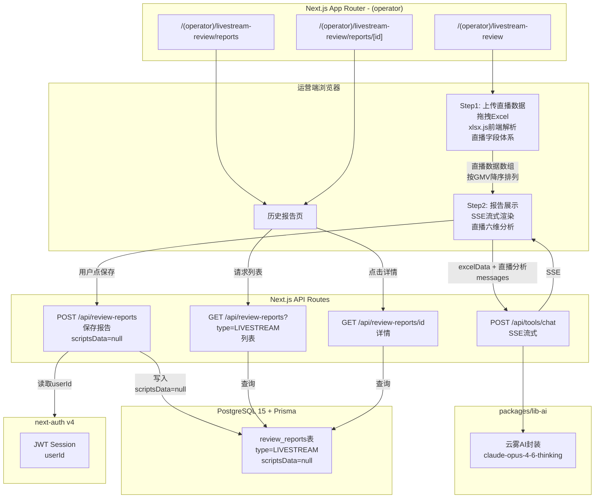
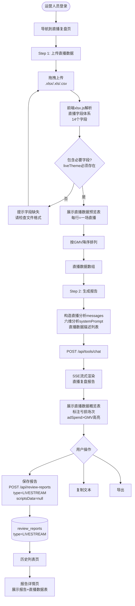
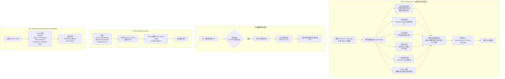

## 直播复盘（livestream-review） 迁移分析文档

> 旧路径：/livestream-review | 旧端口：3014
> 迁移目标：新平台 (operator) 路由 → `/(operator)/livestream-review`

---

### 1. 旧架构梳理

#### 1.1 前端页面结构

旧版为独立 Next.js 应用，**与人设/千川复盘最大的差异是无脚本上传步骤**，流程从两步开始：

| 路由 | 描述 |
|---|---|
| `/livestream-review` | 主流程页（两步骤：上传直播数据 → 复盘报告） |
| `/livestream-review/report` | 历史报告列表页 |
| `/livestream-review/report/[id]` | 历史报告详情页 |

**Step 1 - 上传直播数据**：
- 拖拽上传 `.xlsx` / `.xls` / `.csv` 文件
- 前端 `xlsx.js` 解析，字段体系为直播专属（直播主题/场次/GMV/GPM/涨粉等）
- 解析后展示预览表格，每行代表一场直播

**Step 2 - 复盘报告**：
- 调用流式 AI 接口，SSE 实时渲染报告
- 报告下方展示直播数据概览表
- 提供：保存报告、导出、复制功能
- **排序维度**：按 GMV 降序（区别于人设复盘的按点赞降序）

**历史报告页**：
- 与人设/千川复盘结构相同，列表 + 详情

#### 1.2 后端 API 清单

| 接口 | 方法 | 功能 |
|---|---|---|
| `/livestream-review/api/chat` | POST | 流式 AI 生成复盘报告（SSE） |
| `/api/reports` | POST | 保存报告到本地 JSON 文件 |
| `/api/reports` | GET | 获取报告列表（id/摘要/createdAt） |
| `/api/reports/[id]` | GET | 获取单条完整报告数据 |

> 直播复盘无脚本文件解析接口（无需 parse-script）。

#### 1.3 数据存储

- **存储介质**：本地文件系统
- **路径**：`/opt/livestream-review/reports/*.json`
- **文件命名**：以报告 UUID 为文件名
- **文件结构**（与人设复盘完全相同的 schema，scripts 字段为空数组或 null）：
  ```json
  {
    "id": "uuid",
    "report": "AI生成的完整报告文本",
    "scripts": null,
    "excelData": [
      {
        "liveTheme": "618大促直播",
        "liveDate": "2026-06-18",
        "duration": "4h",
        "gmv": "58000",
        "gpm": "1200",
        "adSpend": "3000"
      }
    ],
    "createdAt": "2026-06-01T12:00:00Z"
  }
  ```

#### 1.4 第三方调用

| 服务 | 调用场景 | 调用方式 |
|---|---|---|
| 云雾AI（claude-opus-4-6-thinking） | Step 2 生成复盘报告 | HTTP SSE 流式，后端转发 |

#### 1.5 旧架构图

```mermaid
graph TD
    subgraph Browser["浏览器（端口3014）"]
        P1[Step1: 上传直播数据\n拖拽Excel文件]
        P2[Step2: 报告展示\nSSE流式渲染]
        PH[历史报告页]
    end

    subgraph API["Next.js API Routes"]
        A1[POST /livestream-review/api/chat\nSSE流式]
        A2[POST /api/reports\n保存]
        A3[GET /api/reports\n列表]
        A4[GET /api/reports/id\n详情]
    end

    subgraph Storage["本地文件系统"]
        FS[/opt/livestream-review/reports/*.json]
    end

    subgraph External["外部服务"]
        AI[云雾AI\nclaude-opus-4-6-thinking]
    end

    P1 -->|xlsx.js解析直播字段| P2
    P2 -->|excelData| A1
    A1 -->|SSE| P2
    A1 -->|调用| AI
    P2 -->|用户点保存| A2
    A2 -->|写入| FS
    PH -->|请求列表| A3
    A3 -->|读取| FS
    PH -->|点击详情| A4
    A4 -->|读取| FS
```

---

### 2. 新架构设计

#### 2.1 前端

- **路由**：`apps/web/src/app/(operator)/livestream-review/page.tsx`
- **历史列表**：`apps/web/src/app/(operator)/livestream-review/reports/page.tsx`
- **历史详情**：`apps/web/src/app/(operator)/livestream-review/reports/[id]/page.tsx`
- **技术选型**：Next.js 14 App Router + TypeScript + Tailwind CSS + shadcn/ui
- **无脚本上传**：整个模块不涉及脚本上传，前端无需文件解析接口
- **Excel解析**：前端 `xlsx.js` 解析（直播字段体系）
- **流式渲染**：使用 `fetch` + `ReadableStream` 消费 SSE

**直播 Excel 字段别名**：
- `liveTheme`：直播主题
- `liveDate`：直播日期
- `duration`：时长
- `peakViewers`：峰值在线人数
- `avgViewers`：平均在线人数
- `totalUV`：累计进入人数
- `avgStayTime`：平均停留时长
- `likes`：点赞数
- `comments`：评论数
- `followsGained`：涨粉数
- `conversions`：成交数
- `gmv`：成交金额
- `gpm`：千次观看成交额（GPM）
- `adSpend`：投放金额

**数据排序**：按 GMV 降序展示（前端排序后再传给 AI）

#### 2.2 后端

| 接口 | 方法 | 是否新增 | 说明 |
|---|---|---|---|
| `/api/tools/chat` | POST | 复用M2已有 | 调用 lib-ai 的 SSE 流式接口，传入直播分析 messages |
| `/api/review-reports` | POST | 新增（与其他模块共用） | 保存报告至 review_reports 表（type=LIVESTREAM） |
| `/api/review-reports` | GET | 新增（与其他模块共用） | 查询当前用户报告列表，支持 `?type=LIVESTREAM` 过滤 |
| `/api/review-reports/[id]` | GET | 新增（与其他模块共用） | 查询单条完整报告数据 |

**报告保存请求体结构**：
```json
{
  "type": "LIVESTREAM",
  "title": "直播复盘-2026-06-01",
  "report": "AI生成的报告文本",
  "scriptsData": null,
  "excelData": [
    {
      "liveTheme": "618大促直播",
      "liveDate": "2026-06-18",
      "gmv": "58000",
      "gpm": "1200",
      "adSpend": "3000"
    }
  ]
}
```

#### 2.3 数据存储

| 表名 | 字段 | 说明 |
|---|---|---|
| `review_reports` | `id` | UUID 主键 |
| `review_reports` | `type` | enum: PERSONA / QIANCHUAN / LIVESTREAM，此处为 LIVESTREAM |
| `review_reports` | `title` | 报告标题 |
| `review_reports` | `report` | AI 生成的完整报告文本（text 类型） |
| `review_reports` | `scriptsData` | **null**（直播复盘无脚本） |
| `review_reports` | `excelData` | 直播 Excel 解析结果（JSON 类型，含 gmv/gpm/涨粉 等字段） |
| `review_reports` | `createdAt` | 创建时间 |
| `review_reports` | `userId` | 关联当前登录运营人员 |

> 与人设复盘、千川复盘共用同一张 `review_reports` 表，通过 `type=LIVESTREAM` 区分。`scriptsData` 字段为 null，Prisma Schema 已定义为可空（`Json?`）。

#### 2.4 第三方调用

| 服务 | 调用场景 | 调用位置 | 说明 |
|---|---|---|---|
| 云雾AI（claude-opus-4-6-thinking） | 生成直播复盘报告 | 后端 `/api/tools/chat` → lib-ai | SSE 流式 |

> 直播复盘无需 mammoth / JSZip / snappyjs 等文件解析库，是三个模块中后端依赖最少的。

#### 2.5 新架构图



---

### 3. 核心流程图

#### 3.1 用户操作流程图



#### 3.2 后端业务逻辑图



---

### 4. 迁移差异对照

| 维度 | 旧架构 | 新架构 | 迁移工作量 |
|---|---|---|---|
| 运行方式 | 独立 Next.js 应用，端口3014 | 集成到主平台 (operator) 路由 | 中：路由结构调整 |
| 认证 | 无认证 | next-auth JWT，operator 角色 | 中：需加权限守卫 |
| 流程步骤 | 两步（上传Excel + 报告） | 两步（保持不变） | 无 |
| 脚本上传 | 无 | 无（scriptsData=null） | 无 |
| Excel解析 | 前端 xlsx.js，直播字段 | 前端 xlsx.js，逻辑完整保留 | 无 |
| 数据排序 | 按 GMV 降序 | 按 GMV 降序（保持不变） | 无 |
| 亏损场次标注 | adSpend > GMV 高亮 | adSpend > GMV 高亮（保持不变） | 无 |
| AI分析维度 | 直播六维（留人/留存/互动/转化/亏损/人设） | 直播六维（完整保留） | 小：复制提示词 |
| 数据存储 | /opt/livestream-review/reports/*.json | PostgreSQL review_reports表 type=LIVESTREAM | 大：同其他模块 |
| scriptsData字段 | JSON文件中为null或空 | 数据库中存null（Prisma Json?可空） | 无：字段已声明可空 |
| 报告关联用户 | 无用户概念，共享所有记录 | userId 关联 | 中：同其他模块 |
| 与其他模块共用API | 各自独立接口 | 共用 /api/review-reports，type=LIVESTREAM 区分 | 无额外工作量 |
| 后端额外依赖 | 无 | 无（最简单的模块） | 无 |

**直播复盘 vs 人设/千川复盘核心差异汇总**：

| 维度 | 人设复盘 | 千川复盘 | 直播复盘 |
|---|---|---|---|
| 流程步骤数 | 三步 | 三步 | **两步** |
| 脚本上传 | 有 | 有 | **无** |
| scriptsData | 脚本数组 | 脚本数组 | **null** |
| Excel字段 | 内容数据（播放/完播/点赞） | 投放数据（消耗/ROI/CPM） | **直播数据（GMV/GPM/涨粉）** |
| 排序维度 | 按点赞降序 | 按ROI排序 | **按GMV降序** |
| AI角色 | 内容操盘大师 | 千川投流专家 | **直播复盘专家** |
| 后端额外依赖 | 无 | mammoth/JSZip/snappy | **无** |
| 数据库 type | PERSONA | QIANCHUAN | **LIVESTREAM** |

---

### 5. 开发要点与风险

**开发要点**：

1. **scriptsData 字段为 null 的一致性处理**：Prisma Schema 中 `scriptsData Json?` 已声明为可空，但前端保存时需显式传 `null`，后端 API 需接受 null 值并直接存储，不可做非空校验。详情页渲染时需跳过脚本展示区块。

2. **直播字段完整性**：共 14 个直播字段，Excel 文件格式多样（运营可能从抖音直播后台不同页面导出），建议用宽松匹配策略（`header.includes(alias)` 而非精确匹配），且非核心字段（如 `avgViewers`、`comments`）解析失败不应阻断整体流程。

3. **亏损场次识别逻辑**：`adSpend > gmv` 的判断需注意字段类型（Excel 解析后可能为字符串），需转 Number 后比较，且两个字段都为有效数字时才做判断。

4. **GMV 降序排列**：排序在前端完成，传给 AI 的场次描述列表已经是排序后的顺序，AI 报告中的排名分析会以此顺序为基准。

5. **两步流程的 UI 简化**：与人设/千川三步流程相比，直播复盘只有两步，Step 条导航组件需适配两步模式，可以复用同一个步骤组件但传入不同的 `steps` 配置数组。

6. **历史报告详情页中的 scriptsData 为 null 的处理**：详情页复用可能与其他模块共用同一详情组件，需做 `scriptsData != null` 的判断，null 时不渲染脚本区块。

7. **直播数据量通常较小**：直播场次通常在 10-50 场之间，不存在 context 超限风险，AI 可以接收所有场次的完整数据。

**风险点**：

| 风险 | 等级 | 应对措施 |
|---|---|---|
| 抖音后台不同版本导出的直播数据 Excel 列名不一致 | HIGH | 建立充分的字段别名库，使用 includes 宽松匹配，添加字段未识别的明确提示 |
| adSpend 或 gmv 字段为空/非数字时亏损判断逻辑报错 | MEDIUM | 转换前做 isFinite 校验，空值跳过亏损标注 |
| 直播主题字段 liveTheme 为空（部分运营填写不规范） | MEDIUM | 字段为空时用"场次+行号"作为默认主题（如"第3场"） |
| 报告详情页误渲染脚本区块（scriptsData=null 未判断） | MEDIUM | 详情组件加 `{scriptsData && <ScriptsSection />}` 防御 |
| 跨模块历史列表混入（type 过滤参数漏传） | LOW | 前端路由层自动附加 `?type=LIVESTREAM` 参数，后端做 type 参数的必填校验 |
| 旧版历史报告数据（JSON文件）数据迁移 | LOW | 与其他模块统一执行一次性迁移脚本，直播报告 scripts 字段迁移为 null |
