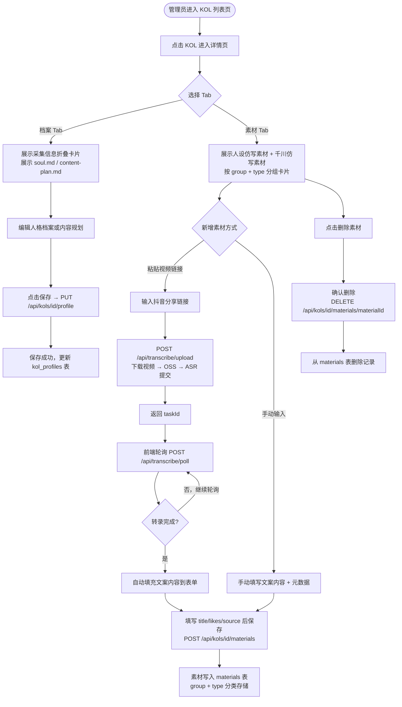

# 素材库（material-library-web）迁移分析文档

> 旧路径：/material-library | 旧端口：3008
> 迁移目标：新平台 (admin) 路由，整合进 KOL 详情页

---

## 1. 旧架构梳理

### 1.1 前端页面结构

```
/material-library
├── 顶部操作栏
│   ├── 下拉选择达人（GET /api/personas 获取列表）
│   ├── 手动添加达人按钮（POST /api/personas）
│   └── 删除达人按钮（DELETE /api/personas）
├── 主体区域1：达人档案管理
│   ├── 红人采集信息展示区（来自 kol-intake，折叠展示 AI 分析报告）
│   └── Tab 切换
│       ├── 「人格档案」（soul.md，可编辑/保存）
│       └── 「内容规划」（content-plan.md，可编辑/保存）
└── 主体区域2：素材管理
    ├── 人设仿写素材组
    │   ├── 红人爆款文案（卡片 + 列表展开）
    │   ├── 红人喜欢的内容（卡片 + 列表展开）
    │   └── 风格参考（卡片 + 列表展开）
    └── 千川仿写素材组
        ├── 千川爆款文案（卡片 + 列表展开）
        ├── 千川喜欢的内容（卡片 + 列表展开）
        └── 千川风格参考（卡片 + 列表展开）
```

每类素材卡片支持：粘贴抖音视频链接 → 触发转录（上传 + 轮询）→ 自动填充文案内容 → 保存为 .md 文件。

### 1.2 后端 API 清单

| 接口 | 方法 | 功能 |
|---|---|---|
| `/api/personas` | GET | 读取全部达人列表，扫描 /opt/kol-intake/data/*.json 建立双索引（nickname + douyin_name），软删除过滤，合并 intake 数据 |
| `/api/personas` | POST | 新建达人目录（创建 /opt/material-library/data/personas/达人名/ 目录，初始化空 soul.md、content-plan.md、references/） |
| `/api/personas` | PUT | 更新达人的 soul.md 或 content-plan.md 内容 |
| `/api/personas` | DELETE | 软删除达人（记入 /opt/material-library/data/_deleted.json） |
| `/api/personas/references` | POST | 新增参考素材，写入 Markdown 文件（路径：data/personas/达人名/references/YYYY-MM-DD-标题名.md，frontmatter 含 title/likes/source/type/date） |
| `/api/personas/references` | DELETE | 删除指定素材文件 |
| `/api/transcribe/upload` | POST | 下载抖音视频（fetch 伪装 Referer/UA，90s AbortController 超时）→ 上传 OSS → 提交 ASR 任务，返回 taskId |
| `/api/transcribe/poll` | POST | 接收 taskId，轮询 ASR 结果，返回转录文本 |

### 1.3 数据存储

文件系统结构（Node.js 直接读写磁盘）：

```
/opt/material-library/data/
├── _deleted.json                       # 软删除达人名单
└── personas/
    └── <达人名>/
        ├── soul.md                     # 人格档案（Markdown 全文）
        ├── content-plan.md             # 内容规划（Markdown 全文）
        └── references/
            └── YYYY-MM-DD-标题名.md   # 参考素材（frontmatter: title/likes/source/type/date）
```

素材 Markdown frontmatter 示例：
```yaml
---
title: "爆款文案示例"
likes: 150000
source: "https://www.douyin.com/video/xxx"
type: "红人爆款文案"
date: "2026-05-20"
---
正文内容...
```

跨服务数据：
- 达人采集数据来自 kol-intake-web（/opt/kol-intake/data/*.json），素材库扫描该目录合并展示
- AI 聊天功能：GET 当前服务的 /api/chat（SSE 流式，直接透传云雾AI）

### 1.4 第三方调用

| 服务 | 调用场景 | 调用方式 |
|---|---|---|
| 阿里云 OSS | 转录流程：视频下载后作为中转存储，上传至 OSS | 直接调用 OSS SDK，multipart upload |
| 阿里云 ASR | 转录流程：提交音频/视频文件 URL 进行语音转录 | 提交任务（返回 taskId）+ 轮询结果接口 |
| 云雾AI（Claude） | /api/chat 端点，前端 SSE 对话（主要用于档案编辑辅助） | OpenAI 兼容接口，SSE 流式输出 |

### 1.5 旧架构图

```mermaid
graph TD
    subgraph "material-library-web (port 3008)"
        FE[前端 React 页面<br>/material-library]
        API_PERSONAS[/api/personas<br>GET/POST/PUT/DELETE]
        API_REFS[/api/personas/references<br>POST/DELETE]
        API_UPLOAD[/api/transcribe/upload]
        API_POLL[/api/transcribe/poll]
        API_CHAT[/api/chat<br>SSE流式]
    end

    subgraph "文件系统"
        FS_PERSONAS[/opt/material-library/data/personas/<br>soul.md / content-plan.md]
        FS_REFS[references/*.md<br>frontmatter存元数据]
        FS_DELETED[_deleted.json<br>软删除名单]
    end

    subgraph "外部服务"
        KOL_INTAKE[kol-intake-web<br>/opt/kol-intake/data/*.json]
        OSS[阿里云 OSS]
        ASR[阿里云 ASR]
        AI[云雾AI<br>claude-opus-4-6-thinking]
    end

    FE -->|选达人/档案列表| API_PERSONAS
    FE -->|编辑保存档案| API_PERSONAS
    FE -->|新增/删除素材| API_REFS
    FE -->|粘贴视频链接转录| API_UPLOAD
    FE -->|轮询转录结果| API_POLL
    FE -->|AI辅助对话| API_CHAT

    API_PERSONAS -->|扫描合并| KOL_INTAKE
    API_PERSONAS <-->|读写| FS_PERSONAS
    API_PERSONAS -->|软删除| FS_DELETED
    API_REFS <-->|读写| FS_REFS
    API_UPLOAD -->|中转上传| OSS
    API_UPLOAD -->|提交任务| ASR
    API_POLL -->|查询结果| ASR
    API_CHAT -->|流式推理| AI
```

---

## 2. 新架构设计

### 2.1 前端

不单独成页。素材库整合进 admin 端的 KOL 详情页，作为新增 Tab 扩展：

```
apps/web/src/app/(admin)/kols/[id]/
├── page.tsx                  # KOL 详情页主体（已有）
├── _components/
│   ├── KolProfileTab.tsx     # 「档案」Tab：人格档案 + 内容规划编辑器
│   ├── KolMaterialsTab.tsx   # 「素材」Tab：人设仿写素材组 + 千川仿写素材组
│   ├── MaterialGroup.tsx     # 单素材组（标题 + 3种类型卡片）
│   ├── MaterialCard.tsx      # 单类型卡片（卡片头部 + 素材列表展开）
│   ├── MaterialAddForm.tsx   # 新增素材表单（粘贴链接 or 手动输入）
│   └── TranscribeButton.tsx  # 转录触发按钮（含轮询状态展示）
```

KOL 列表页（已有）新增入口：点击 KOL 进入详情页，Tab 栏增加「档案」「素材」。

KOL 采集信息（kol_submissions）：在「档案」Tab 上方折叠展示，JOIN 查询自动填充。

### 2.2 后端

| 接口 | 方法 | 是否新增 | 说明 |
|---|---|---|---|
| `/api/kols` | GET | 已有，扩展 | 复用 M2 已有接口，新增 JOIN kol_submissions 返回采集数据 |
| `/api/kols` | POST | 已有 | 复用，新建 KOL 记录 |
| `/api/kols/[id]` | GET | 已有 | 复用，获取单个 KOL 详情 |
| `/api/kols/[id]` | PUT | 已有 | 复用，更新 KOL 基础信息 |
| `/api/kols/[id]` | DELETE | 已有，扩展 | 改为软删除（新增 deletedAt 字段），而非文件标记 |
| `/api/kols/[id]/profile` | GET | 已有 | 获取 soulMd + contentPlanMd（kol_profiles 表） |
| `/api/kols/[id]/profile` | PUT | 已有 | 保存 soulMd 或 contentPlanMd |
| `/api/kols/[id]/materials` | GET | 已有，扩展 | 按 group + type 过滤，返回分组素材列表 |
| `/api/kols/[id]/materials` | POST | 已有，扩展 | 新增素材记录（支持 group/type/title/content/likes/source/date） |
| `/api/kols/[id]/materials/[materialId]` | DELETE | 已有 | 删除指定素材 |
| `/api/transcribe/upload` | POST | 新增 | 下载抖音视频 → 调用 lib-oss 上传 → 调用 lib-asr 提交任务，返回 taskId |
| `/api/transcribe/poll` | POST | 新增 | 接收 taskId，调用 lib-asr 轮询结果，返回转录文本 |

### 2.3 数据存储

| 表名 | 字段 | 说明 |
|---|---|---|
| `kols` | id, name, platform, accountId, followersCount, bio, avatar, createdAt, **deletedAt** | 新增 deletedAt 软删除字段，替代旧的 _deleted.json |
| `kol_profiles` | id, kolId, soulMd, contentPlanMd, updatedAt | 对应旧的 soul.md 和 content-plan.md 文件内容 |
| `materials` | id, kolId, type, title, content, likes, source, date, **group** | group 字段区分「人设仿写素材」/「千川仿写素材」；type 字段存具体类型（6种） |
| `kol_submissions` | id, kolName, answers(JSON), report(text), submittedAt | M3 新增，kol-intake 提交数据，JOIN kols 后在档案上方展示 |

素材 type 枚举值（对应旧的 frontmatter.type）：
- 人设仿写素材：`红人爆款文案` / `红人喜欢的内容` / `风格参考`
- 千川仿写素材：`千川爆款文案` / `千川喜欢的内容` / `千川风格参考`

Prisma schema 变更说明：
```prisma
model Kol {
  id           String    @id @default(cuid())
  name         String
  // ... 其他字段
  deletedAt    DateTime? // 新增软删除
  materials    Material[]
  profile      KolProfile?
  submissions  KolSubmission[]
}

model Material {
  id      String   @id @default(cuid())
  kolId   String
  group   String   // "人设仿写素材" | "千川仿写素材"
  type    String   // 6种类型之一
  title   String
  content String   @db.Text
  likes   Int?
  source  String?
  date    DateTime?
  kol     Kol      @relation(fields: [kolId], references: [id])
}
```

### 2.4 第三方调用

转录流程保持不变，改用统一包调用：
- **lib-oss**：替代旧的直接 OSS SDK 调用，封装 STS Token 直传和签名 URL 获取
- **lib-asr**：替代旧的直接 ASR HTTP 请求，封装提交任务（返回 taskId）和轮询结果
- 抖音视频下载：保持旧逻辑（fetch 伪装 Referer/UA，90s AbortController 超时）

### 2.5 新架构图

```mermaid
graph TD
    subgraph "新平台 (admin) 路由"
        FE_LIST[/admin/kols<br>KOL列表页]
        FE_DETAIL[/admin/kols/id<br>KOL详情页]
        TAB_PROFILE[「档案」Tab<br>KolProfileTab]
        TAB_MATERIALS[「素材」Tab<br>KolMaterialsTab]
    end

    subgraph "API Routes (Next.js)"
        API_KOLS[/api/kols<br>GET/POST]
        API_KOL[/api/kols/id<br>GET/PUT/DELETE]
        API_PROFILE[/api/kols/id/profile<br>GET/PUT]
        API_MATERIALS[/api/kols/id/materials<br>GET/POST/DELETE]
        API_UPLOAD[/api/transcribe/upload<br>新增]
        API_POLL[/api/transcribe/poll<br>新增]
    end

    subgraph "数据库 PostgreSQL"
        DB_KOLS[(kols<br>+deletedAt)]
        DB_PROFILES[(kol_profiles<br>soulMd/contentPlanMd)]
        DB_MATERIALS[(materials<br>group/type/content)]
        DB_SUBMISSIONS[(kol_submissions<br>采集数据)]
    end

    subgraph "共享包"
        LIB_OSS[lib-oss<br>STS Token直传]
        LIB_ASR[lib-asr<br>提交+轮询]
    end

    FE_LIST -->|进入详情| FE_DETAIL
    FE_DETAIL --> TAB_PROFILE
    FE_DETAIL --> TAB_MATERIALS

    TAB_PROFILE -->|读写档案| API_PROFILE
    TAB_MATERIALS -->|读写素材| API_MATERIALS
    TAB_MATERIALS -->|粘贴链接转录| API_UPLOAD
    TAB_MATERIALS -->|轮询结果| API_POLL
    FE_LIST -->|KOL列表+采集数据| API_KOLS

    API_KOLS <--> DB_KOLS
    API_KOLS -->|JOIN| DB_SUBMISSIONS
    API_KOL <--> DB_KOLS
    API_PROFILE <--> DB_PROFILES
    API_MATERIALS <--> DB_MATERIALS
    API_UPLOAD -->|上传| LIB_OSS
    API_UPLOAD -->|提交任务| LIB_ASR
    API_POLL -->|查询结果| LIB_ASR
```

---

## 3. 核心流程图

### 3.1 用户操作流程图



### 3.2 后端业务逻辑图

```mermaid
flowchart TD
    subgraph "GET /api/kols (列表)"
        G1[查询 kols 表\nWHERE deletedAt IS NULL] --> G2[LEFT JOIN kol_submissions\n匹配 kolName = kols.name]
        G2 --> G3[返回 KOL 列表\n含采集数据 submissions 字段]
    end

    subgraph "PUT /api/kols/id/profile (保存档案)"
        P1[接收 soulMd 或 contentPlanMd] --> P2{kol_profiles 记录存在?}
        P2 -->|是| P3[UPDATE kol_profiles SET ...\nWHERE kolId = id]
        P2 -->|否| P4[INSERT INTO kol_profiles]
        P3 --> P5[返回更新后记录]
        P4 --> P5
    end

    subgraph "POST /api/kols/id/materials (新增素材)"
        M1[接收 group/type/title/content/likes/source/date] --> M2[验证 group 合法性\n人设仿写素材 or 千川仿写素材]
        M2 --> M3[验证 type 合法性\n6种枚举值之一]
        M3 --> M4[INSERT INTO materials\n绑定 kolId]
        M4 --> M5[返回新素材记录]
    end

    subgraph "POST /api/transcribe/upload (视频转录)"
        T1[接收视频链接 URL] --> T2[fetch 下载视频\n伪装 Referer/UA\nAbortController 90s 超时]
        T2 --> T3{下载成功?}
        T3 -->|否| T4[返回 500 下载失败]
        T3 -->|是| T5[lib-oss.upload\nSTS Token 直传 OSS]
        T5 --> T6[lib-asr.submitTask\n提交 OSS 视频 URL]
        T6 --> T7[返回 taskId]
    end

    subgraph "POST /api/transcribe/poll (轮询结果)"
        R1[接收 taskId] --> R2[lib-asr.getResult taskId]
        R2 --> R3{任务状态}
        R3 -->|RUNNING| R4[返回 status: pending]
        R3 -->|SUCCESS| R5[返回 status: done\n转录文本 text]
        R3 -->|FAILED| R6[返回 status: failed]
    end

    subgraph "DELETE /api/kols/id (软删除)"
        D1[接收 KOL id] --> D2[UPDATE kols\nSET deletedAt = NOW()\nWHERE id = id]
        D2 --> D3[返回成功]
    end
```

---

## 4. 迁移差异对照

| 维度 | 旧架构 | 新架构 | 迁移工作量 |
|---|---|---|---|
| 页面入口 | 独立应用，port 3008，/material-library | 整合进 /admin/kols/[id]，新增「档案」「素材」Tab | 中：需改造已有 KOL 详情页，增加两个 Tab 组件 |
| 达人列表接口 | GET /api/personas（扫描文件目录 + 合并 intake JSON） | GET /api/kols（数据库查询 + JOIN kol_submissions） | 低：接口已有，仅需补充 JOIN 逻辑 |
| 档案存储 | 文件系统（soul.md / content-plan.md） | 数据库 kol_profiles 表（soulMd / contentPlanMd 字段） | 低：接口已有，数据迁移需一次性脚本 |
| 素材存储 | 文件系统（.md 文件，frontmatter 存元数据） | 数据库 materials 表（group/type 字段分类） | 中：接口已有但需验证 group/type 枚举，数据迁移需脚本 |
| 软删除机制 | _deleted.json 文件记录黑名单 | kols 表新增 deletedAt 字段（NULL = 未删除） | 低：Prisma migration 加字段，查询加 WHERE 条件 |
| 素材分组 | 文件 frontmatter.type 字符串区分 | materials.group + materials.type 两级区分 | 低：字段语义不变，存储形式变更 |
| 跨服务依赖 | 扫描 kol-intake /opt 目录（紧耦合文件路径） | 查询 kol_submissions 表（松耦合数据库） | 中：需要 kol-intake 模块也迁移写入 kol_submissions |
| 视频转录 | 自建 /api/transcribe/upload、/api/transcribe/poll | 新增相同路由，改用 lib-oss 和 lib-asr 包 | 低：逻辑不变，仅替换调用方式 |
| AI 聊天 | 自建 /api/chat（SSE，直连云雾AI） | 暂不在素材库集成，由 persona-writer 使用 | 无（素材库侧不需要对话功能） |
| 认证鉴权 | 无鉴权（内网服务） | next-auth admin 角色校验 | 低：Next.js middleware 统一处理 |
| 数据迁移 | - | 需要一次性迁移脚本：文件 → 数据库 | 中：需处理存量 soul.md/content-plan.md 和 references/*.md |

---

## 5. 开发要点与风险

### 5.1 数据迁移脚本

旧数据全部存储于文件系统，迁移时需编写一次性迁移脚本：

1. 扫描 `/opt/material-library/data/personas/` 目录，每个子目录对应一个达人
2. 读取 `_deleted.json`，跳过已软删除的达人
3. 对每个达人：
   - 查找或创建 `kols` 记录（按 name 匹配）
   - 读取 soul.md → 写入 `kol_profiles.soulMd`
   - 读取 content-plan.md → 写入 `kol_profiles.contentPlanMd`
   - 扫描 `references/*.md`，解析 frontmatter → 写入 `materials` 表（按 type 推断 group）
4. 验证迁移条目数一致性后删除旧文件

**风险**：frontmatter.type 字段为自由文本，可能存在历史脏数据（类型名称不完全匹配枚举），迁移前需清洗。

### 5.2 kol-intake 跨服务解耦

旧架构中素材库直接扫描 kol-intake 的 `/opt` 目录，属于文件路径级别的紧耦合。新架构依赖 kol-intake 模块（M3 中的 kol-intake 迁移）将采集数据写入 `kol_submissions` 表。

**风险**：若 kol-intake 迁移滞后，kol_submissions 表数据为空，档案上方采集信息展示区为空白。需协调 kol-intake 模块优先完成数据写入。

### 5.3 视频下载的服务端限制

抖音 CDN 视频下载（伪装 Referer/UA）在旧架构中运行于 Node.js 服务器，新平台运行于 Next.js API Route（同样是 Node.js），逻辑可直接移植。

**风险**：抖音 CDN 反爬策略可能更新，需保留旧的 Referer/UA 头部配置并做好降级提示。90s 超时对于 Vercel 等平台（默认 10s 函数超时）可能超限，若部署在自托管服务器则无影响。

### 5.4 materials 表 group 字段约束

旧架构中 group/type 均为自由文本，新架构建议在 Prisma 层使用枚举或在 API 层做入参校验，防止历史脏数据污染：

```typescript
const VALID_GROUPS = ['人设仿写素材', '千川仿写素材'] as const
const VALID_TYPES = ['红人爆款文案', '红人喜欢的内容', '风格参考', '千川爆款文案', '千川喜欢的内容', '千川风格参考'] as const
```

### 5.5 UI 整合工作量评估

「档案」Tab 需支持 Markdown 编辑（soul.md 和 content-plan.md 内容较长），建议引入轻量 Markdown 编辑器组件（如 `@uiw/react-md-editor` 或 `react-simplemde-editor`），而非普通 `<textarea>`，以保持与旧架构的编辑体验一致。

### 5.6 认证边界

素材库整合进 (admin) 路由后，所有操作需要 admin 角色。若需要 operator 也能查看（只读），需在 middleware 和 API 层分别设置权限边界，避免过度限制。当前 M2 规划中素材库仅 admin 可操作，保持此设计即可。
