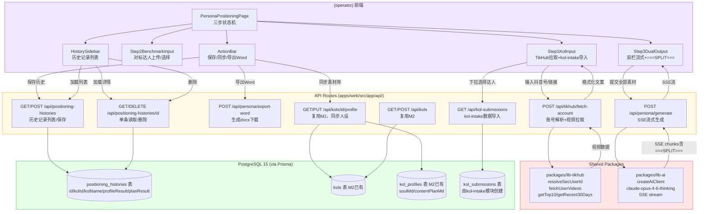
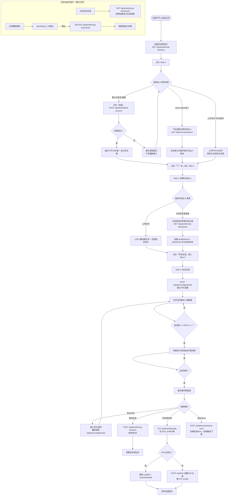

## 人设定位（persona-positioning）迁移分析文档

> 旧路径：/persona-positioning | 旧端口：3006（3004 为对标分析，同源双路由）
> 迁移目标：新平台 (operator) 路由

---

### 1. 旧架构梳理

#### 1.1 前端页面结构

**主流程三步式布局**：

**Step 1 — 达人信息录入**
- 输入区域A：输入抖音号 / 主页链接 / 分享链接（三种格式），点击「拉取」调用 /api/fetch-account
- 展示区域：拉取成功后显示 TOP10 视频文案 + 近30天文案列表
- 输入区域B：从 kol-intake 下拉选择已提交的达人记录（直接导入问卷内容）
- 上传区域：上传达人文件（PDF/txt） + 补充资料文本框

**Step 2 — 对标达人配置**
- 上传区域：上传对标达人的人格档案文件 + 内容规划文件（PDF/txt/md）
- 历史记录选择：从已生成记录中选择某条，复用其 profileResult / planResult 作为对标参考

**Step 3 — 流式生成与后处理**
- 双栏流式输出：左栏显示人格档案（soul），右栏显示内容规划（plan）
- 分隔符检测：后端在输出中插入 `===SPLIT===`，前端检测到后切换到右栏继续流式输出
- 优化对话：生成完成后支持继续对话优化（追加 prompt）
- 操作按钮组：保存到历史记录 / 同步到素材库 / 导出 Word
- 侧边栏历史记录：左侧常驻，展示所有历史生成记录，点击加载回溯，支持删除

#### 1.2 后端 API 清单

| 接口 | 方法 | 功能 |
|---|---|---|
| /api/fetch-account | POST | 智能解析三种抖音格式（抖音号/主页链接/分享链接），拉取 TOP10（按点赞降序）和近30天作品，格式化为文案文本 |
| /api/generate | POST | 流式生成人设档案+内容规划，SSE 输出，输出中含 ===SPLIT=== 分隔两部分，systemPrompt包含运营方向规则 |
| /api/sync-to-library | POST | 同步到素材库：进程内直接写文件到 /opt/material-library/data/personas/{达人名}/soul.md 和 content-plan.md |
| /api/history | GET | 列出所有历史记录（id / name / createdAt） |
| /api/history | POST | 保存一条历史记录（id=Date.now字符串，写 JSON 文件） |
| /api/history?id=xxx | GET | 读取单条历史记录详情 |
| /api/history?id=xxx | DELETE | 删除单条历史记录文件 |

#### 1.3 数据存储

**历史记录**：`/opt/persona-positioning/data/history/*.json`

每条记录文件命名规则：`{id}.json`，id 为 `Date.now()` 字符串

**核心数据字段**：
| 字段 | 类型 | 说明 |
|---|---|---|
| id | string | 时间戳字符串 |
| name | string | 达人昵称（用于侧边栏展示） |
| createdAt | string | 创建时间（ISO 8601） |
| profileResult | string | 人格档案全文（Markdown） |
| planResult | string | 内容规划全文（Markdown） |

**同步到素材库**（进程内文件写入，非HTTP）：
- 路径：`/opt/material-library/data/personas/{达人名}/soul.md`
- 路径：`/opt/material-library/data/personas/{达人名}/content-plan.md`

#### 1.4 第三方调用

| 服务 | 调用场景 | 调用方式 |
|---|---|---|
| TikHub | /api/fetch-account，解析账号格式 + 拉取视频数据 | lib/tikhub.resolveSecUserId（智能解析三种格式）→ fetchUserVideos → getTop10（按点赞排序） + getRecent30Days（近30天） |
| 云雾AI（claude-opus-4-6-thinking） | /api/generate，流式生成人设档案+内容规划 | OpenAI兼容SSE流式接口，检测 ===SPLIT=== 分隔符，systemPrompt含运营规则 |

**generate systemPrompt 关键规则**：
- 运营指定方向优先级最高
- 禁止产品露出
- 人格档案与内容规划用 `===SPLIT===` 分隔

#### 1.5 旧架构图

```mermaid
graph TD
    subgraph Frontend["前端 (Next.js, Port 3006)"]
        A[Step1: 达人信息录入<br/>TikHub拉取 / kol-intake导入 / 文件上传]
        B[Step2: 对标达人配置<br/>文件上传 / 历史记录选择]
        C[Step3: 双栏流式输出<br/>soul | plan + ===SPLIT===检测]
        D[侧边栏: 历史记录列表<br/>加载 / 删除]
        E[操作区: 保存/同步素材库/导出Word]
    end

    subgraph Backend["后端 API Routes"]
        F[POST /api/fetch-account<br/>TikHub账号解析+视频拉取]
        G[POST /api/generate<br/>SSE流式生成]
        H[POST /api/sync-to-library<br/>进程内写文件]
        I[GET/POST /api/history<br/>历史记录CRUD]
        J[GET/DELETE /api/history?id<br/>单条读取/删除]
    end

    subgraph Storage["文件系统"]
        K[/opt/persona-positioning/data/history/*.json<br/>历史记录JSON文件]
        L[/opt/material-library/data/personas/{名}/\nsoul.md + content-plan.md]
    end

    subgraph ThirdParty["第三方服务"]
        M[TikHub API<br/>resolveSecUserId + fetchUserVideos<br/>getTop10 + getRecent30Days]
        N[云雾AI claude-opus-4-6-thinking<br/>SSE流式，含===SPLIT===]
    end

    A -->|输入抖音号/链接| F
    F --> M
    M -->|视频数据| F
    F -->|格式化文案| A

    C -->|提交全部素材| G
    G --> N
    N -->|SSE流+===SPLIT===| G
    G -->|SSE流| C

    E -->|同步到素材库| H
    H -->|进程内写文件| L

    D -->|加载列表| I
    D -->|加载详情/删除| J
    E -->|保存记录| I
    I --> K
    J --> K

    A -->|从kol-intake导入| K2[(kol-intake数据\n/opt/kol-intake/data)]
```

---

### 2. 新架构设计

#### 2.1 前端

**路由位置**：`apps/web/src/app/(operator)/persona-positioning/page.tsx`

**页面组件拆分**：

_主流程组件_：
| 组件 | 路径 | 说明 |
|---|---|---|
| `PersonaPositioningPage` | `(operator)/persona-positioning/page.tsx` | 页面入口，管理三步状态和历史侧边栏 |
| `StepIndicator` | `components/persona/StepIndicator.tsx` | 顶部步骤指示器，使用 shadcn/ui `Badge` |
| `Step1KolInput` | `components/persona/Step1KolInput.tsx` | Step1：TikHub拉取 + kol-intake导入（改为从DB查询） + 文件上传 |
| `Step2BenchmarkInput` | `components/persona/Step2BenchmarkInput.tsx` | Step2：对标达人上传 + 历史记录选择 |
| `Step3DualOutput` | `components/persona/Step3DualOutput.tsx` | Step3：双栏流式输出，检测===SPLIT===切换栏 |
| `OptimizeChat` | `components/persona/OptimizeChat.tsx` | 生成完成后的优化对话区域 |
| `ActionBar` | `components/persona/ActionBar.tsx` | 保存/同步素材库/导出Word按钮组 |

_历史侧边栏_：
| 组件 | 路径 | 说明 |
|---|---|---|
| `HistorySidebar` | `components/persona/HistorySidebar.tsx` | 左侧历史记录列表，使用 shadcn/ui `ScrollArea` |
| `HistoryItem` | `components/persona/HistoryItem.tsx` | 单条历史记录行，含加载/删除操作 |

**shadcn/ui 组件映射**：
- 步骤指示：`Badge`（步骤编号） + `Separator`
- 文件上传区：`Button` + 原生 `<input type="file">` 包装
- 下拉选择（kol-intake导入）：`Select`, `SelectContent`, `SelectItem`
- 双栏输出区：`Card`, `CardHeader`, `CardContent`（两个并排）
- 历史侧边栏滚动：`ScrollArea`
- 操作按钮：`Button`（variant: default / outline / ghost）
- 加载状态：`Skeleton`
- 确认删除：`AlertDialog`

#### 2.2 后端

**复用 M2 接口**：
- `GET /api/kols`（获取KOL列表，用于侧边栏选择）
- `GET/PUT /api/kols/[id]/profile`（同步人设档案到 kol_profiles 表）
- `POST /api/kols`（同步到素材库时若KOL不存在则创建）

**新增 API 路由**：

| 接口 | 方法 | 是否新增 | 说明 |
|---|---|---|---|
| /api/tikhub/fetch-account | POST | 新增 | 调用 lib-tikhub，智能解析三种格式，拉取TOP10+近30天，返回格式化文案 |
| /api/persona/generate | POST | 新增 | SSE流式生成人设档案+内容规划，含===SPLIT===分隔符检测逻辑 |
| /api/persona/export-word | POST | 新增 | 接收 profileResult+planResult，后端生成 docx blob，前端触发下载 |
| /api/positioning-histories | GET | 新增 | 列出历史记录（支持按 kolName 过滤，分页） |
| /api/positioning-histories | POST | 新增 | 保存一条历史记录到 DB |
| /api/positioning-histories/[id] | GET | 新增 | 获取单条历史记录详情 |
| /api/positioning-histories/[id] | DELETE | 新增 | 删除单条历史记录 |
| /api/kol-submissions | GET | 新增（kol-intake模块） | 列出kol-intake提交记录，供Step1下拉导入使用 |
| /api/kols/[id]/profile | GET/PUT | 复用M2 | 同步人设到 kol_profiles 表 |
| /api/kols | GET/POST | 复用M2 | 查询/创建KOL记录 |

#### 2.3 数据存储

**新增表**：

| 表名 | 字段 | 说明 |
|---|---|---|
| positioning_histories | id (cuid) | 主键 |
| positioning_histories | kolId (string, 可空) | 关联 kols.id，若KOL已在系统中则关联，否则为null |
| positioning_histories | kolName (string) | 达人昵称（冗余存储，便于展示无需join） |
| positioning_histories | profileResult (text) | 人格档案全文（Markdown） |
| positioning_histories | planResult (text) | 内容规划全文（Markdown） |
| positioning_histories | createdAt (DateTime) | 创建时间，默认 now() |

**复用 M2 已有表**：

| 表名 | 复用场景 | 说明 |
|---|---|---|
| kols | 同步到素材库时查找/创建KOL | 按 name 查找，不存在则 create |
| kol_profiles | 同步人设档案 | PUT /api/kols/[id]/profile，写 soulMd 和 contentPlanMd 字段 |
| kol_submissions | Step1 从kol-intake下拉导入 | GET /api/kol-submissions，读取问卷结果 |

**Prisma Schema 新增**：
```prisma
model PositioningHistory {
  id            String   @id @default(cuid())
  kolId         String?
  kolName       String
  profileResult String   @db.Text
  planResult    String   @db.Text
  createdAt     DateTime @default(now())

  kol           Kol?     @relation(fields: [kolId], references: [id], onDelete: SetNull)
}
```

#### 2.4 第三方调用

| 旧调用方式 | 新平台调用方式 | 说明 |
|---|---|---|
| lib/tikhub.resolveSecUserId（本地lib文件） | `import { resolveSecUserId, fetchUserVideos } from '@repo/lib-tikhub'` | 三种格式解析 + TOP10 + 近30天，接口不变换包即可 |
| 直接 HTTP fetch 云雾AI SSE接口 | `import { createAiClient } from '@repo/lib-ai'`，使用 claude-opus-4-6-thinking，开启 stream | SSE流式，需在 Response 中设置 text/event-stream 头 |
| 进程内直接 fs.writeFile 到 material-library | 调用 Prisma：`prisma.kol.upsert` + `prisma.kolProfile.upsert` | 彻底消除跨目录文件耦合，改为DB操作 |

#### 2.5 新架构图



---

### 3. 核心流程图

#### 3.1 用户操作流程图



#### 3.2 后端业务逻辑图

```mermaid
flowchart TD
    subgraph FetchAccountAPI["POST /api/tikhub/fetch-account"]
        FA1[接收: input 字符串]
        FA1 --> FA2[lib-tikhub: resolveSecUserId<br/>智能识别三种格式]
        FA2 --> FA3{格式识别成功？}
        FA3 -->|否| FA4[返回 400: 无法识别的账号格式]
        FA3 -->|是| FA5[lib-tikhub: fetchUserVideos<br/>拉取该用户所有视频]
        FA5 --> FA6{拉取成功？}
        FA6 -->|否| FA7[返回 502: TikHub API 错误]
        FA6 -->|是| FA8[getTop10: 按点赞数降序排列，取前10]
        FA8 --> FA9[getRecent30Days: 过滤30天内发布的视频]
        FA9 --> FA10[格式化为文案文本<br/>视频标题 + 描述 + 话题标签]
        FA10 --> FA11[返回 200 + top10Texts + recent30Texts]
    end

    subgraph GenerateAPI["POST /api/persona/generate (SSE)"]
        G1[接收: kolInfo/benchmarkProfile/benchmarkPlan/direction/uploadedContent]
        G1 --> G2[Zod 校验必要字段]
        G2 --> G3{校验通过？}
        G3 -->|否| G4[返回 400 + 校验错误]
        G3 -->|是| G5[构造 systemPrompt<br/>含: 运营方向优先/禁止产品露出等规则]
        G5 --> G6[构造 userPrompt<br/>拼接: 达人信息+对标参考+运营方向]
        G6 --> G7[设置响应头: Content-Type: text/event-stream]
        G7 --> G8[调用 lib-ai claude-opus-4-6-thinking<br/>stream: true]
        G8 --> G9[逐chunk转发SSE<br/>data: chunk.content]
        G9 --> G10{当前chunk含===SPLIT===？}
        G10 -->|是| G11[发送 data: SPLIT 事件<br/>前端切换右栏]
        G10 -->|否| G9
        G11 --> G9
        G9 --> G12{流结束？}
        G12 -->|是| G13[发送 data: DONE 事件<br/>关闭SSE连接]
        G8 -->|AI调用失败| G14[发送 data: ERROR 事件<br/>关闭连接]
    end

    subgraph SyncAPI["PUT /api/kols/[id]/profile (复用M2)"]
        S1[接收: kolId, soulMd, contentPlanMd]
        S1 --> S2[验证 next-auth session<br/>role: operator 或 admin]
        S2 --> S3{认证通过？}
        S3 -->|否| S4[返回 401]
        S3 -->|是| S5[查询 kols 表: findUnique by id]
        S5 --> S6{KOL存在？}
        S6 -->|否| S7[返回 404: KOL不存在]
        S6 -->|是| S8[Prisma upsert kol_profiles<br/>where: kolId, update: soulMd+contentPlanMd<br/>create: kolId+soulMd+contentPlanMd]
        S8 --> S9[返回 200 + profile]
        S8 -->|DB异常| S10[返回 500]
    end

    subgraph SaveHistoryAPI["POST /api/positioning-histories"]
        H1[接收: kolName, kolId?, profileResult, planResult]
        H1 --> H2[Zod 校验: kolName/profileResult/planResult 必填]
        H2 --> H3{校验通过？}
        H3 -->|否| H4[返回 400]
        H3 -->|是| H5[Prisma create positioning_histories]
        H5 --> H6[返回 200 + 新记录 id]
        H5 -->|DB异常| H7[返回 500]
    end

    subgraph ExportWordAPI["POST /api/persona/export-word"]
        E1[接收: kolName, profileResult, planResult]
        E1 --> E2[使用 docx 库构造 Document 对象<br/>章节1: 人格档案 / 章节2: 内容规划]
        E2 --> E3[生成 Buffer]
        E3 --> E4[设置响应头: Content-Disposition: attachment<br/>filename: persona-{kolName}.docx]
        E4 --> E5[返回 Buffer 流]
    end
```

---

### 4. 迁移差异对照

| 维度 | 旧架构 | 新架构 | 迁移工作量 |
|---|---|---|---|
| 数据来源（历史记录） | 文件系统 /opt/persona-positioning/data/history/*.json | PostgreSQL positioning_histories 表（Prisma） | 中：需新增表和API，旧历史记录可选择性迁移 |
| 同步到素材库 | 进程内 fs.writeFile 直接写 material-library 目录（强文件耦合） | Prisma PUT /api/kols/[id]/profile 写 kol_profiles 表（DB解耦） | 高：架构性改变，消除文件系统耦合，需确保KOL记录存在 |
| kol-intake导入 | 从 /opt/kol-intake/data/*.json 文件目录读取 | 调用 GET /api/kol-submissions 从 kol_submissions 表读取 | 低：接口改变，前端下拉逻辑不变 |
| 权限控制 | 无认证 | next-auth JWT，operator 端需登录 | 中：需在 middleware.ts 配置路由保护 |
| UI框架 | 自定义 CSS | Tailwind CSS + shadcn/ui 组件库 | 中：三步骤流程 + 双栏布局 + 侧边栏需重新实现 |
| TikHub调用 | 本地 lib/tikhub.ts 文件 | @repo/lib-tikhub 共享包 | 低：功能相同，换包调用即可 |
| AI调用（流式生成） | 直接 HTTP fetch 云雾AI SSE接口 | lib-ai 包 createAiClient，stream: true | 低：接口兼容，SSE转发逻辑相同 |
| 导出Word | 前端/后端生成（需确认原始实现） | 后端 POST /api/persona/export-word，使用 docx 库 | 低-中：若原来是前端生成则需迁移到后端 |
| 存储架构 | 单机文件，无法跨服务器 | PostgreSQL，支持多实例部署 | 中：旧历史数据需手动迁移脚本 |

---

### 5. 开发要点与风险

**关键实现注意事项**：

1. **SSE 流式 + ===SPLIT=== 分隔符检测**
   - 后端使用 Node.js `ReadableStream` 或 Next.js 15 的 `StreamingTextResponse` 转发 SSE
   - 分隔符 `===SPLIT===` 可能被拆分到两个 chunk 中（例如一个chunk以`===SP`结尾，下一个以`LIT===`开头）
   - 前端需维护 buffer 拼接逻辑，在 buffer 中检测完整分隔符，避免遗漏
   - 分隔符本身不应渲染到界面上（检测到后清除该 token）

2. **TikHub 三种格式解析**
   - 抖音号（@xxx）：直接搜索用户
   - 主页链接（https://www.douyin.com/user/xxx）：提取 secUid
   - 分享链接（https://v.douyin.com/xxx）：需先 follow 重定向获取真实链接再解析
   - lib-tikhub 包需确认已实现 `resolveSecUserId`，若未实现需在 API Route 层处理重定向

3. **同步到素材库的 KOL 匹配逻辑**
   - 用户在 Step3 点击「同步素材库」时，前端应先展示 KOL 选择对话框（从 kols 表中搜索）
   - 若找不到对应KOL，提供「自动创建」选项，先 POST /api/kols 创建记录，再 PUT profile
   - kolId 确认后调用 PUT /api/kols/[id]/profile，写入 soulMd + contentPlanMd

4. **历史记录的 kolId 关联**
   - 保存历史时 kolId 为可空字段，允许在未关联KOL时也能保存历史
   - 若用户同步到了素材库（kolId确定），建议更新 positioning_histories 记录的 kolId 字段

5. **优化对话的 prompt 管理**
   - 优化对话时应将完整生成结果（profileResult + planResult）和用户的优化需求合并到下一次 generate 请求
   - 避免 prompt 无限叠加导致 token 超限，设置最大对话轮次（建议3-5轮）

6. **导出 Word 的依赖**
   - 需安装 `docx` npm 包（`@types/docx` 可选）
   - Word 导出内容包含 Markdown，需在后端做简单的 Markdown → Word 段落格式转换

7. **侧边栏历史记录的性能**
   - 历史记录列表仅加载 id / kolName / createdAt，详情按需加载（点击时再请求）
   - 对 positioning_histories 表的 kolName 和 createdAt 字段建立索引

**已知技术风险**：

| 风险 | 等级 | 说明 | 缓解措施 |
|---|---|---|---|
| ===SPLIT=== 被 chunk 截断 | 高 | SSE 流式输出中分隔符可能跨两个 chunk | 前端维护 buffer，在 buffer 中做字符串搜索，而非单 chunk 检测 |
| TikHub API 限流/失效 | 高 | TikHub 接口可能因反爬被限制，导致拉取失败 | 做好错误提示，提供手动输入文案的降级方案 |
| 旧历史数据丢失 | 中 | /opt/persona-positioning/data/history/ 中的历史记录无法自动迁移到新DB | 提供一次性迁移脚本，或告知用户旧记录不予迁移 |
| KOL 匹配歧义 | 中 | 同名达人可能在 kols 表中有多条记录（不同平台） | 同步素材库时展示 KOL 选择器，而不是自动按名称匹配 |
| claude-opus-4-6-thinking 输出超长 | 中 | 人设档案+内容规划两部分总 token 可能超过8k | 设置合理的 max_tokens 上限，或在 prompt 中明确字数要求 |
| next-auth 中间件遗漏 | 高 | operator 端未保护时任何人可访问并调用 TikHub/AI API | middleware.ts 中明确配置 /persona-positioning 路径需认证 |

**与其他模块的依赖关系**：

- **依赖 kol-intake 模块**：Step1 的「从kol-intake导入」功能需要 `GET /api/kol-submissions` 接口，kol-intake 模块需优先完成
- **依赖 M2 kols / kol_profiles 表**：同步素材库功能直接读写这两张表，与素材库模块共享数据层
- **被素材库模块依赖**：素材库展示的 soul.md 和 content-plan.md 数据来源于本模块写入的 kol_profiles 表
- **共享 lib-tikhub 包**：若其他模块（如达人数据分析）也需要拉取 TikHub 数据，应共用同一个包，避免各自维护调用逻辑
- **共享 lib-ai 包**：与 kol-intake、viral-scripts 等模块共用，lib-ai 的版本升级需全局评估影响
