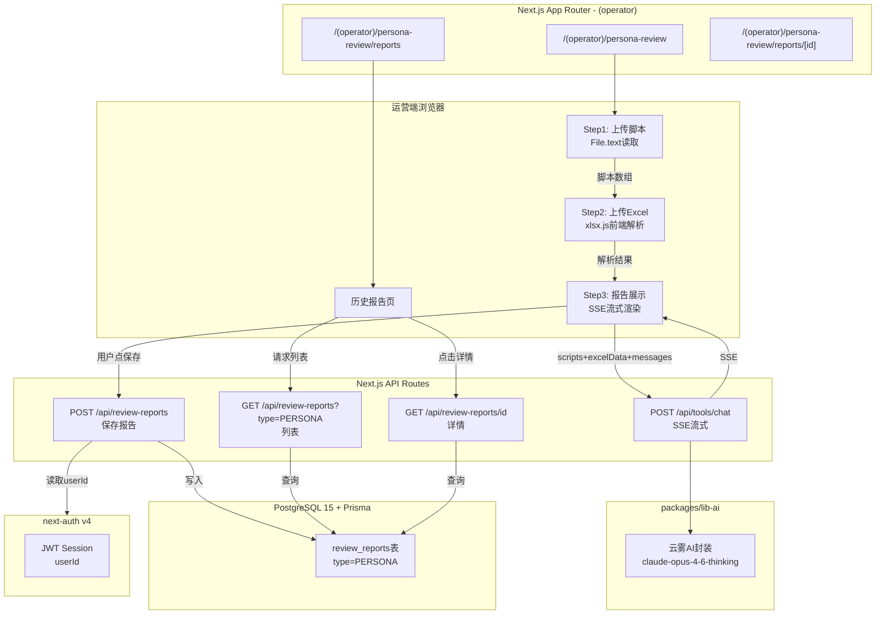
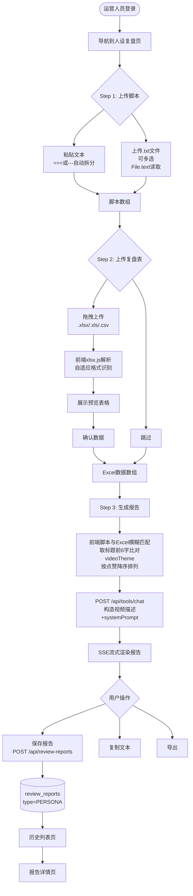

## 人设脚本复盘（persona-review） 迁移分析文档

> 旧路径：/persona-review | 旧端口：3010
> 迁移目标：新平台 (operator) 路由 → `/(operator)/persona-review`

---

### 1. 旧架构梳理

#### 1.1 前端页面结构

旧版为独立 Next.js 应用，页面结构如下：

| 路由 | 描述 |
|---|---|
| `/persona-review` | 主流程页（三步骤：上传脚本 → 上传复盘表 → 复盘报告） |
| `/persona-review/report` | 历史报告列表页（所有保存记录） |
| `/persona-review/report/[id]` | 历史报告详情页 |

**Step 1 - 上传脚本**：
- 支持粘贴文本，多条脚本以 `===` 或 `---` 分隔，自动拆分为数组
- 支持上传 `.txt` 文件（可多选），前端通过 `File.text()` 读取内容

**Step 2 - 上传复盘表（可跳过）**：
- 拖拽上传 `.xlsx` / `.xls` / `.csv` 文件
- 前端用 `xlsx.js` 解析，支持自适应格式识别（转置格式 + 标准格式）
- 解析后展示预览表格，用户确认后进入下一步

**Step 3 - 复盘报告**：
- 调用流式 AI 接口，SSE 实时渲染报告
- 报告下方展示数据概览表（合并后的脚本+数据列表）
- 提供：保存报告、导出（复制文本）、复制到剪贴板功能

**历史报告页**：
- 列表展示所有保存记录（id / 报告前120字摘要 / createdAt）
- 点击进入详情，完整展示报告内容 + 数据

#### 1.2 后端 API 清单

| 接口 | 方法 | 功能 |
|---|---|---|
| `/persona-review/api/chat` | POST | 流式 AI 生成复盘报告（SSE） |
| `/api/reports` | POST | 保存报告到本地 JSON 文件 |
| `/api/reports` | GET | 获取报告列表（id/摘要/createdAt） |
| `/api/reports/[id]` | GET | 获取单条完整报告数据 |

#### 1.3 数据存储

- **存储介质**：本地文件系统
- **路径**：`/opt/persona-review/reports/*.json`
- **文件命名**：以报告 UUID 为文件名
- **文件结构**：
  ```json
  {
    "id": "uuid",
    "report": "AI生成的完整报告文本",
    "scripts": ["脚本1", "脚本2"],
    "excelData": [{ "videoTheme": "...", "totalPlays": "..." }],
    "createdAt": "2026-06-01T12:00:00Z"
  }
  ```

#### 1.4 第三方调用

| 服务 | 调用场景 | 调用方式 |
|---|---|---|
| 云雾AI（claude-opus-4-6-thinking） | Step 3 生成复盘报告 | HTTP SSE 流式，后端转发 |

#### 1.5 旧架构图

```mermaid
graph TD
    subgraph Browser["浏览器（端口3010）"]
        P1[Step1: 上传脚本\n粘贴/txt文件]
        P2[Step2: 上传Excel\n可跳过]
        P3[Step3: 报告展示\nSSE流式渲染]
        PH[历史报告页\n/report]
    end

    subgraph API["Next.js API Routes"]
        A1[POST /persona-review/api/chat\nSSE流式]
        A2[POST /api/reports\n保存]
        A3[GET /api/reports\n列表]
        A4[GET /api/reports/id\n详情]
    end

    subgraph Storage["本地文件系统"]
        FS[/opt/persona-review/reports/*.json]
    end

    subgraph External["外部服务"]
        AI[云雾AI\nclaude-opus-4-6-thinking]
    end

    P1 -->|脚本数组| P2
    P2 -->|xlsx.js解析| P3
    P3 -->|scripts+excelData| A1
    A1 -->|SSE| P3
    A1 -->|调用| AI
    P3 -->|用户点保存| A2
    A2 -->|写入| FS
    PH -->|请求列表| A3
    A3 -->|读取| FS
    PH -->|点击详情| A4
    A4 -->|读取| FS
```

---

### 2. 新架构设计

#### 2.1 前端

- **路由**：`apps/web/src/app/(operator)/persona-review/page.tsx`
- **历史列表**：`apps/web/src/app/(operator)/persona-review/reports/page.tsx`
- **历史详情**：`apps/web/src/app/(operator)/persona-review/reports/[id]/page.tsx`
- **技术选型**：Next.js 14 App Router + TypeScript + Tailwind CSS + shadcn/ui
- **脚本解析**：前端 `File.text()` 读取 `.txt` 文件（逻辑不变）
- **Excel解析**：前端 `xlsx.js` 解析（自适应逻辑完整保留，逻辑不变）
- **流式渲染**：使用 `fetch` + `ReadableStream` 消费 SSE，渲染 AI 报告

**Excel 自适应解析逻辑（前端保留）**：
1. **尝试转置格式**：扫描第 A 列有无已知标签，匹配 ≥3 个字段 → 按列读取（A列=字段名，B列起=各条数据）
2. **尝试标准格式**：Pass1 精确匹配 → Pass2 模糊匹配（`header.endsWith(alias)`）→ `colMapping.length ≥ 2` → 按列索引读取
3. **过滤**：必须有 `videoTheme` 字段
4. **字段别名**：
   - `date`：发布时间
   - `videoTheme`：视频主题
   - `totalPlays`：总播放量/播放量
   - `completionRate`：完播率
   - `fiveSecRate`：5s完播率/5秒完播率
   - `likes`：点赞
   - `adSpend`：投放金额/投放

#### 2.2 后端

| 接口 | 方法 | 是否新增 | 说明 |
|---|---|---|---|
| `/api/tools/chat` | POST | 复用M2已有 | 调用 lib-ai 的 SSE 流式接口，传入 messages |
| `/api/review-reports` | POST | 新增 | 保存报告至 review_reports 表（type=PERSONA） |
| `/api/review-reports` | GET | 新增 | 查询当前用户报告列表，支持 `?type=PERSONA` 过滤 |
| `/api/review-reports/[id]` | GET | 新增 | 查询单条完整报告数据 |

**报告保存请求体结构**：
```json
{
  "type": "PERSONA",
  "title": "人设复盘-2026-06-01",
  "report": "AI生成的报告文本",
  "scriptsData": ["脚本1", "脚本2"],
  "excelData": [{ "videoTheme": "...", "totalPlays": "..." }]
}
```

#### 2.3 数据存储

| 表名 | 字段 | 说明 |
|---|---|---|
| `review_reports` | `id` | UUID 主键 |
| `review_reports` | `type` | enum: PERSONA / QIANCHUAN / LIVESTREAM |
| `review_reports` | `title` | 报告标题（前端生成，如"人设复盘-日期"） |
| `review_reports` | `report` | AI 生成的完整报告文本（text 类型） |
| `review_reports` | `scriptsData` | 脚本数组（JSON 类型） |
| `review_reports` | `excelData` | Excel 解析结果数组（JSON 类型） |
| `review_reports` | `createdAt` | 创建时间，自动生成 |
| `review_reports` | `userId` | 关联当前登录运营人员（next-auth session.user.id） |

**Prisma Schema 片段**：
```prisma
model ReviewReport {
  id          String   @id @default(uuid())
  type        ReviewType
  title       String
  report      String   @db.Text
  scriptsData Json?
  excelData   Json?
  createdAt   DateTime @default(now())
  userId      String
  user        User     @relation(fields: [userId], references: [id])
}

enum ReviewType {
  PERSONA
  QIANCHUAN
  LIVESTREAM
}
```

#### 2.4 第三方调用

- **云雾AI**：通过 `packages/lib-ai/` 的封装调用，模型 `claude-opus-4-6-thinking`，SSE 流式
- 前端直接调用 `/api/tools/chat`，后端 API Route 内调用 lib-ai，将 SSE 透传给前端
- 无新增第三方依赖

#### 2.5 新架构图



---

### 3. 核心流程图

#### 3.1 用户操作流程图



#### 3.2 后端业务逻辑图

```mermaid
flowchart TD
    subgraph ChatAPI["POST /api/tools/chat"]
        C1[接收请求\nscripts + excelData + messages]
        C2{有Excel数据?}
        C3[构造基础systemPrompt\n抖音顶级内容操盘大师]
        C4[追加数据分析指令\n完播率洞察/投放效率分析]
        C5[构造视频描述列表\n每条: 标题+数据指标+脚本截断2000字]
        C6[调用lib-ai\nclaude-opus-4-6-thinking\nSSE流式]
        C7[透传SSE给前端]

        C1 --> C2
        C2 -->|否| C3
        C2 -->|是| C4
        C3 --> C5
        C4 --> C5
        C5 --> C6
        C6 --> C7
    end

    subgraph MergeLogic["前端合并逻辑（客户端）"]
        M1[脚本数组]
        M2[Excel数据数组]
        M3[模糊匹配\n脚本标题前6字 vs videoTheme]
        M4[已匹配: script+data合并]
        M5[未匹配Excel行: 仅data无脚本]
        M6[按点赞降序排列mergedList]

        M1 --> M3
        M2 --> M3
        M3 --> M4
        M3 --> M5
        M4 --> M6
        M5 --> M6
    end

    subgraph SaveAPI["POST /api/review-reports"]
        S1[接收请求体\ntype/title/report/scriptsData/excelData]
        S2[读取next-auth session\n获取userId]
        S3{userId有效?}
        S4[401 Unauthorized]
        S5[Prisma创建记录\nreview_reports表]
        S6[返回新记录id]

        S1 --> S2
        S2 --> S3
        S3 -->|否| S4
        S3 -->|是| S5
        S5 --> S6
    end

    subgraph ListAPI["GET /api/review-reports?type=PERSONA"]
        L1[读取session userId]
        L2[Prisma查询\nWHERE type=PERSONA AND userId=xxx\nORDER BY createdAt DESC]
        L3[返回列表\nid/title/report前120字/createdAt]

        L1 --> L2
        L2 --> L3
    end
```



---

### 4. 迁移差异对照

| 维度 | 旧架构 | 新架构 | 迁移工作量 |
|---|---|---|---|
| 运行方式 | 独立 Next.js 应用，端口3010 | 集成到主平台 (operator) 路由 | 中：路由结构调整 |
| 认证 | 无认证（局域网访问） | next-auth JWT，operator 角色 | 中：需加权限守卫 |
| 脚本解析 | 前端 File.text() | 前端 File.text()（完全不变） | 无 |
| Excel解析 | 前端 xlsx.js，自适应逻辑 | 前端 xlsx.js，逻辑完全保留 | 无 |
| 数据存储 | 本地文件系统 JSON 文件 | PostgreSQL + Prisma ORM | 大：需新建表+迁移API |
| 报告关联用户 | 无用户概念，共享所有报告 | userId 关联，各运营看各自报告 | 中：列表查询加userId过滤 |
| 流式AI调用 | 独立后端API转发 | 复用 /api/tools/chat（lib-ai封装） | 小：仅调整请求参数格式 |
| AI提示词 | 硬编码在旧应用 | 迁移到新API Route或前端 | 小：复制提示词逻辑 |
| 历史报告路由 | /persona-review/report | /(operator)/persona-review/reports | 小：路由重命名 |
| 报告导出 | 复制文本 | 保持复制文本（可后续扩展） | 无 |

---

### 5. 开发要点与风险

**开发要点**：

1. **Excel 自适应解析完整迁移**：旧版解析逻辑较复杂（两次 Pass 匹配 + 转置格式），需完整复制到新项目前端，建议封装为独立工具函数 `parsePersonaExcel(file: File): Promise<ExcelRow[]>`，放在 `apps/web/src/lib/parsers/persona-excel.ts`。

2. **脚本分隔解析**：支持 `===` 和 `---` 两种分隔符，前端处理即可，逻辑简单，注意 trim 每条脚本、过滤空字符串。

3. **前端合并逻辑**：脚本与 Excel 的模糊匹配（取标题前6字比对 `videoTheme`）在前端完成，匹配结果作为 messages 内容传给 `/api/tools/chat`，需确认 API 的 messages 格式与 lib-ai 接口兼容。

4. **SSE 消费**：新平台使用 fetch + `ReadableStream`，注意处理 `[DONE]` 终止信号和流异常断开的重试逻辑。

5. **userId 隔离**：历史列表 API 必须加 `WHERE userId = session.user.id` 条件，避免运营人员互相看到对方报告。

6. **报告摘要生成**：列表 API 返回 report 前120字作为摘要，Prisma 查询时可直接返回完整 report 字段，在 API 层截断返回（避免返回 MB 级文本）。

**风险点**：

| 风险 | 等级 | 应对措施 |
|---|---|---|
| Excel 自适应解析逻辑迁移不完整，导致部分文件解析失败 | HIGH | 编写单元测试覆盖转置格式、标准格式、模糊匹配三种场景 |
| AI生成报告文本过长（>1MB），写入 PostgreSQL text 字段时性能下降 | MEDIUM | 监控报告长度，必要时加字符限制或截断警告 |
| SSE 流式传输在弱网下断连，前端无错误提示 | MEDIUM | 实现前端断流检测，展示重试按钮 |
| 多运营人员同时提交，数据库写入并发 | LOW | Prisma 默认连接池处理，无需特殊处理 |
| 旧版本历史报告数据（JSON文件）无法在新平台查看 | LOW | 一次性迁移脚本将旧 JSON 导入 review_reports 表（M3上线前执行） |
