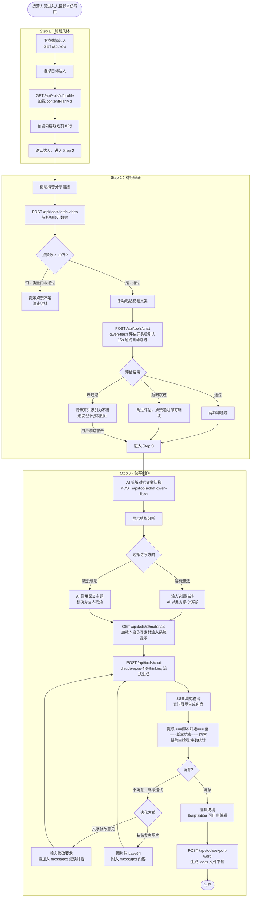

# 人设脚本仿写（persona-writer-web）迁移分析文档

> 旧路径：/persona-writer | 旧端口：3001
> 迁移目标：新平台 (operator) 路由，路径：/(operator)/persona-writer

---

## 1. 旧架构梳理

### 1.1 前端页面结构

三步线性流程，步骤间单向推进（完成当前步骤才能进入下一步）：

```
/persona-writer
├── Step 1：加载风格
│   ├── 下拉选择达人（GET /material-library/api/personas 跨服务获取）
│   └── 预览所选达人的内容规划前 8 行（从 content-plan.md 截取）
│
├── Step 2：对标验证（质量门）
│   ├── 粘贴抖音分享链接 → POST /api/fetch-video 解析点赞数
│   ├── 质量门 1：点赞数 ≥ 10 万（不满足则阻止进入 Step 3）
│   ├── 粘贴视频文案（手动输入）
│   ├── AI 评估开头吸引力（qwen-flash，15s 超时自动跳过，不强制阻止）
│   └── 质量门 2：开头吸引力通过（两项均通过才启用进入 Step 3 按钮）
│
└── Step 3：仿写创作
    ├── AI 拆解对标文案结构（qwen-flash，展示结构分析）
    ├── 选择仿写方向
    │   ├── 「我有想法」：用户输入选题描述，AI 以此为核心仿写
    │   └── 「我没想法」：AI 沿用原文主题，替换为达人视角
    ├── 流式生成脚本（claude-opus-4-6-thinking，SSE）
    │   └── 输出用 ===脚本开始=== / ===脚本结束=== 标记包裹正文
    ├── 多轮迭代（支持粘贴图片 base64，AI 参考图片继续修改）
    ├── 脚本提取与终稿编辑（精确提取标记内容，排除自检表/字数统计）
    └── 导出 Word（POST /api/export-word，生成 .docx 文件下载）
```

### 1.2 后端 API 清单

| 接口 | 方法 | 功能 |
|---|---|---|
| `/material-library/api/personas` | GET | 跨服务调用素材库，获取达人列表（含 soul.md、content-plan.md） |
| `/api/fetch-video` | POST | 调用 TikHub 解析抖音分享链接，返回 title / diggCount / awemeId |
| `/api/chat` | POST | 流式 AI 对话（SSE），支持 messages 数组（含图片 base64），重试机制：最多 3 次，429 状态等待 3000ms |
| `/api/export-word` | POST | 接收脚本文本，生成 .docx 文件，返回 Blob 供前端下载 |

### 1.3 数据存储

无持久化存储。所有状态均为前端会话级状态（React state），关闭页面后丢失：

- 选中的达人信息（从素材库 API 获取后存 state）
- 对标视频信息（fetch-video 返回后存 state）
- 对标文案内容（用户输入，存 state）
- AI 对话历史 messages 数组（存 state，多轮迭代时累加）
- 生成的脚本终稿（存 state，可导出）

无数据库读写，无文件读写。

### 1.4 第三方调用

| 服务 | 调用场景 | 调用方式 |
|---|---|---|
| TikHub | Step 2：解析抖音分享链接，获取视频标题、点赞数、awemeId | GET fetch_one_video_by_share_url，传入分享链接，返回视频元数据 |
| 云雾AI / qwen-flash | Step 2：评估对标文案开头吸引力（15s 超时自动跳过）；Step 3：拆解文案结构 | OpenAI 兼容接口，非流式，max_tokens 较小，快速响应 |
| 云雾AI / claude-opus-4-6-thinking | Step 3：流式仿写生成，多轮迭代（含图片 base64） | OpenAI 兼容接口，SSE 流式输出，messages 累积传入 |

### 1.5 旧架构图

```mermaid
graph TD
    subgraph "persona-writer-web (port 3001)"
        FE[前端 React 页面<br>/persona-writer<br>三步流程 State Machine]
        API_FETCH[/api/fetch-video]
        API_CHAT[/api/chat<br>SSE流式]
        API_WORD[/api/export-word]
    end

    subgraph "跨服务调用"
        MAT_API[material-library-web<br>/api/personas<br>port 3008]
    end

    subgraph "第三方服务"
        TIKHUB[TikHub API<br>fetch_one_video_by_share_url]
        QWEN[云雾AI<br>qwen-flash<br>快速评估/结构拆解]
        CLAUDE[云雾AI<br>claude-opus-4-6-thinking<br>流式仿写生成]
    end

    FE -->|Step1: 获取达人列表| MAT_API
    MAT_API -->|返回达人+content-plan.md| FE

    FE -->|Step2: 解析视频链接| API_FETCH
    API_FETCH -->|获取diggCount/title| TIKHUB
    TIKHUB -->|返回视频元数据| API_FETCH
    API_FETCH -->|返回diggCount| FE

    FE -->|Step2: 开头评估<br>Step3: 结构拆解| API_CHAT
    API_CHAT -->|qwen-flash请求| QWEN
    QWEN -->|返回评估结果| API_CHAT

    FE -->|Step3: 流式仿写生成<br>多轮迭代 含图片base64| API_CHAT
    API_CHAT -->|claude流式请求| CLAUDE
    CLAUDE -->|SSE流式输出| API_CHAT
    API_CHAT -->|SSE转发| FE

    FE -->|Step3: 导出终稿| API_WORD
    API_WORD -->|生成docx Blob| FE
```

---

## 2. 新架构设计

### 2.1 前端

独立运营端页面，不整合进 KOL 管理页：

```
apps/web/src/app/(operator)/persona-writer/
├── page.tsx                      # 主页面，三步流程容器（State Machine）
└── _components/
    ├── Step1LoadStyle.tsx         # Step 1：达人选择 + 内容规划预览
    ├── Step2Validate.tsx          # Step 2：视频链接解析 + 质量门 + 文案输入 + 开头评估
    ├── Step3Write.tsx             # Step 3：结构拆解 + 方向选择 + 流式生成 + 多轮迭代 + 导出
    ├── ScriptEditor.tsx           # 终稿编辑器（提取 ===脚本开始=== 内容后可编辑）
    ├── ImagePasteArea.tsx         # 图片粘贴区（base64 转换，附入 messages）
    └── ExportButton.tsx           # 导出 Word 按钮（触发 POST /api/tools/export-word）
```

Step 1 数据来源变更：不再跨服务调用 material-library，改为调用新平台自身 API：
- `GET /api/kols` → 获取达人列表
- `GET /api/kols/[id]/profile` → 获取 soulMd 和 contentPlanMd

### 2.2 后端

| 接口 | 方法 | 是否新增 | 说明 |
|---|---|---|---|
| `/api/kols` | GET | 已有 | 复用 M2 已有接口，Step 1 获取达人列表 |
| `/api/kols/[id]/profile` | GET | 已有 | 复用，获取 soulMd + contentPlanMd，Step 1 预览内容规划前 8 行 |
| `/api/kols/[id]/materials` | GET | 已有 | 复用，Step 3 获取人设仿写素材（group="人设仿写素材"），注入系统提示词 |
| `/api/tools/fetch-video` | POST | 新增 | 调用 lib-tikhub，解析抖音分享链接，返回 title/diggCount/awemeId |
| `/api/tools/chat` | POST | 新增 | SSE 流式 AI 对话，调用 lib-ai，含重试逻辑（最多 3 次，429 等待 3000ms），支持 messages 数组（含图片 base64） |
| `/api/tools/export-word` | POST | 新增 | 接收脚本文本，生成 .docx 文件，返回文件流供下载 |

### 2.3 数据存储

无持久化存储变更（与旧架构一致，全为前端会话状态）。

| 表名 | 字段 | 说明 |
|---|---|---|
| `kols` | id, name, platform, ... | Step 1 达人选择，只读 |
| `kol_profiles` | kolId, soulMd, contentPlanMd | Step 1 预览内容规划（contentPlanMd 前 8 行），Step 3 注入系统提示词（soulMd） |
| `materials` | kolId, group, type, content, ... | Step 3 仿写时注入参考素材（WHERE group = '人设仿写素材'） |

注：仿写过程中 AI 的 messages 历史不落库，关闭页面丢失。如需保存历史记录，为后续迭代功能，当前版本不实现。

### 2.4 第三方调用

| 服务 | 调用方式 | 变更说明 |
|---|---|---|
| TikHub | 通过 `packages/lib-tikhub` 包调用 | 从旧架构直接 HTTP 调用改为使用共享包，接口语义不变 |
| 云雾AI / qwen-flash | 通过 `packages/lib-ai` 包调用 | 封装 OpenAI 兼容接口，非流式，用于开头评估和结构拆解 |
| 云雾AI / claude-opus-4-6-thinking | 通过 `packages/lib-ai` 包调用，SSE 流式 | 主力仿写模型，含重试逻辑，支持图片 base64 |

### 2.5 新架构图

```mermaid
graph TD
    subgraph "新平台 (operator) 路由"
        FE[/(operator)/persona-writer<br>三步流程页面]
        S1[Step1LoadStyle<br>达人选择+内容规划预览]
        S2[Step2Validate<br>视频解析+质量门+开头评估]
        S3[Step3Write<br>结构拆解+流式仿写+迭代+导出]
    end

    subgraph "API Routes (Next.js)"
        API_KOLS[/api/kols<br>GET - 已有]
        API_PROFILE[/api/kols/id/profile<br>GET - 已有]
        API_MATERIALS[/api/kols/id/materials<br>GET - 已有]
        API_VIDEO[/api/tools/fetch-video<br>POST - 新增]
        API_CHAT[/api/tools/chat<br>POST - 新增 SSE]
        API_WORD[/api/tools/export-word<br>POST - 新增]
    end

    subgraph "数据库 PostgreSQL"
        DB_KOLS[(kols)]
        DB_PROFILES[(kol_profiles<br>soulMd/contentPlanMd)]
        DB_MATERIALS[(materials<br>人设仿写素材)]
    end

    subgraph "共享包"
        LIB_TIKHUB[lib-tikhub<br>fetch_one_video_by_share_url]
        LIB_AI_QWEN[lib-ai<br>qwen-flash]
        LIB_AI_CLAUDE[lib-ai<br>claude-opus-4-6-thinking]
    end

    FE --> S1 --> S2 --> S3

    S1 -->|获取达人列表| API_KOLS
    S1 -->|获取内容规划| API_PROFILE
    S2 -->|解析分享链接| API_VIDEO
    S2 -->|开头吸引力评估| API_CHAT
    S3 -->|获取人设仿写素材| API_MATERIALS
    S3 -->|结构拆解| API_CHAT
    S3 -->|流式仿写生成+多轮迭代| API_CHAT
    S3 -->|导出Word| API_WORD

    API_KOLS <--> DB_KOLS
    API_PROFILE <--> DB_PROFILES
    API_MATERIALS <--> DB_MATERIALS
    API_VIDEO --> LIB_TIKHUB
    API_CHAT -->|评估/拆解| LIB_AI_QWEN
    API_CHAT -->|仿写生成| LIB_AI_CLAUDE
```

---

## 3. 核心流程图

### 3.1 用户操作流程图



### 3.2 后端业务逻辑图

```mermaid
flowchart TD
    subgraph "POST /api/tools/fetch-video"
        FV1[接收 shareUrl] --> FV2[lib-tikhub.fetchVideoByShareUrl shareUrl]
        FV2 --> FV3{请求成功?}
        FV3 -->|否| FV4[返回 500 解析失败]
        FV3 -->|是| FV5[提取 title / diggCount / awemeId]
        FV5 --> FV6[返回视频元数据 JSON]
    end

    subgraph "POST /api/tools/chat (SSE流式)"
        C1[接收 messages 数组<br>含 model / system / maxTokens] --> C2[设置 SSE 响应头\nContent-Type: text/event-stream]
        C2 --> C3[初始化重试计数 retries = 0]
        C3 --> C4[调用 lib-ai.streamChat\nmodel / messages / system]
        C4 --> C5{响应状态}
        C5 -->|200 流式输出| C6[逐 chunk 转发 SSE 事件\ndata: content]
        C6 --> C7[流结束，发送 data: DONE]
        C5 -->|429 限流| C8{retries < 3?}
        C8 -->|是| C9[等待 3000ms\nretries++]
        C9 --> C4
        C8 -->|否| C10[返回 429 超出重试次数]
        C5 -->|其他错误| C11[返回对应错误状态]
    end

    subgraph "脚本提取逻辑 (前端)"
        E1[接收完整 AI 输出文本] --> E2[查找 ===脚本开始=== 标记位置]
        E2 --> E3[查找 ===脚本结束=== 标记位置]
        E3 --> E4{两个标记均存在?}
        E4 -->|否| E5[不提取，展示原始输出]
        E4 -->|是| E6[截取两标记间内容]
        E6 --> E7[去除首尾空白]
        E7 --> E8[填入 ScriptEditor 可编辑区]
    end

    subgraph "POST /api/tools/export-word"
        W1[接收 scriptText / title / kolName] --> W2[初始化 docx Document]
        W2 --> W3[添加标题段落\nfontSize 28 bold]
        W3 --> W4[按换行符分割 scriptText\n逐段落写入 Paragraph]
        W4 --> W5[Packer.toBuffer document]
        W5 --> W6[设置响应头\nContent-Type: application/vnd.openxmlformats-officedocument.wordprocessingml.document\nContent-Disposition: attachment filename=脚本.docx]
        W6 --> W7[返回 Buffer 文件流]
    end

    subgraph "系统提示词构建 (Step 3 仿写)"
        SP1[GET /api/kols/id/profile\n获取 soulMd] --> SP2[GET /api/kols/id/materials\ngroup=人设仿写素材]
        SP2 --> SP3[拼接系统提示词:\n达人人格档案 soulMd\n+ 人设仿写素材列表\n+ 仿写规则说明\n+ 输出格式要求 ===脚本开始=== ...]
        SP3 --> SP4[作为 system 参数传入 /api/tools/chat]
    end
```



---

## 4. 迁移差异对照

| 维度 | 旧架构 | 新架构 | 迁移工作量 |
|---|---|---|---|
| 页面路由 | 独立应用，port 3001，/persona-writer | /(operator)/persona-writer（新平台运营端路由） | 低：路由结构变化，三步流程逻辑不变 |
| 认证鉴权 | 无鉴权（内网服务） | next-auth operator 角色校验，middleware 统一处理 | 低：新平台统一处理，无需自行实现 |
| 达人数据来源 | 跨服务 HTTP 调用 material-library:3008/api/personas | 调用本平台 GET /api/kols + GET /api/kols/[id]/profile | 低：接口返回数据结构需对齐（persona → kol 字段映射） |
| 视频解析 | POST /api/fetch-video（直接调用 TikHub HTTP） | POST /api/tools/fetch-video（通过 lib-tikhub 包） | 低：逻辑不变，封装层变化 |
| AI 对话接口 | POST /api/chat（SSE，内置重试） | POST /api/tools/chat（SSE，lib-ai 包，保留重试） | 低：重试逻辑移植，model 参数透传 |
| 图片多轮迭代 | 前端图片转 base64，拼入 messages，后端透传 | 前端逻辑不变，后端透传给 lib-ai（接口兼容） | 低：无变化 |
| 脚本提取逻辑 | 前端正则提取 ===脚本开始/结束=== 标记 | 完全保留，逻辑不变 | 无：直接移植 |
| 导出 Word | POST /api/export-word（生成 docx Blob） | POST /api/tools/export-word（逻辑不变，路径规范化） | 低：路径变更，docx 生成逻辑直接移植 |
| 人设素材注入 | 从 soul.md 和 references/ 文件读取后拼系统提示 | 从 kol_profiles.soulMd + materials 表（group=人设仿写素材）拼系统提示 | 中：提示词拼接逻辑需适配数据库数据结构 |
| 跨服务依赖 | 强依赖 material-library-web 启动状态（HTTP 直连） | 仅依赖同一数据库，无跨服务 HTTP 调用 | 高（改善）：消除跨服务耦合，可靠性提升 |
| 数据持久化 | 无（全前端 state，关闭丢失） | 无（保持一致，本期不实现历史记录） | 无 |
| 质量门逻辑 | 点赞 ≥ 10万 + 开头评估通过（前端判断） | 完全保留，逻辑移植到新前端组件 | 低：直接移植 |

---

## 5. 开发要点与风险

### 5.1 达人数据字段映射

旧架构从 material-library 的 /api/personas 获取达人数据，字段结构为：
```json
{ "name": "达人A", "soulMd": "...", "contentPlanMd": "...", "intakeData": {...} }
```

新架构需两次请求拼合：
1. `GET /api/kols` → 返回 `{ id, name, platform, ... }` 列表
2. `GET /api/kols/[id]/profile` → 返回 `{ soulMd, contentPlanMd }`

前端 Step 1 组件需适配两步请求（先选达人，再加载档案），与旧架构一次性加载有差异，需注意加载状态和错误处理。

### 5.2 系统提示词拼接逻辑迁移

旧架构在前端或 /api/chat 内直接读取文件内容拼接系统提示词（soulMd + references 素材列表）。新架构改为：
1. 前端 Step 3 组件中，在生成请求前预先 `GET /api/kols/[id]/materials?group=人设仿写素材`
2. 将 materials 列表（title + content）拼入系统提示词字符串
3. 随 POST /api/tools/chat 请求的 `system` 字段一起发送

**风险**：人设仿写素材数量较多时，系统提示词可能超长，影响 claude-opus-4-6-thinking 的上下文利用率。建议在拼接时按 likes 降序取前 N 条素材（如 TOP 10），避免 prompt 过长。

### 5.3 SSE 流式响应在 Next.js App Router 中的实现

Next.js 14 App Router 的 API Route 需要正确使用 `ReadableStream` 和 `TransformStream` 实现 SSE：

```typescript
// /api/tools/chat/route.ts 示例
export async function POST(req: Request) {
  const { messages, model, system } = await req.json()
  const encoder = new TextEncoder()

  const stream = new ReadableStream({
    async start(controller) {
      let retries = 0
      while (retries < 3) {
        try {
          const aiStream = await libAi.streamChat({ model, messages, system })
          for await (const chunk of aiStream) {
            controller.enqueue(encoder.encode(`data: ${JSON.stringify(chunk)}\n\n`))
          }
          controller.enqueue(encoder.encode('data: [DONE]\n\n'))
          controller.close()
          return
        } catch (err: any) {
          if (err.status === 429 && retries < 2) {
            retries++
            await new Promise(r => setTimeout(r, 3000))
          } else {
            controller.error(err)
            return
          }
        }
      }
    }
  })

  return new Response(stream, {
    headers: {
      'Content-Type': 'text/event-stream',
      'Cache-Control': 'no-cache',
      'Connection': 'keep-alive',
    }
  })
}
```

**风险**：Next.js 在某些部署环境（Vercel Edge）下 SSE 长连接可能有超时限制。若部署在自托管 Node.js 服务器则无影响。

### 5.4 图片 base64 多轮迭代的消息体大小

用户粘贴图片后，base64 编码的图片数据附入 messages 数组，随每次请求全量发送（OpenAI messages 格式）。多张图片或高分辨率图片会导致请求体很大。

**风险**：Next.js API Route 默认请求体大小限制为 4MB，多图高分辨率场景可能触发 413 错误。建议在 `next.config.js` 中增大限制，或在前端对图片进行压缩处理（降分辨率后再转 base64）。

### 5.5 15 秒超时的开头评估实现

旧架构使用 `AbortController` + `setTimeout` 实现 15s 超时后自动跳过。新架构同样在前端实现：

```typescript
const controller = new AbortController()
const timeoutId = setTimeout(() => controller.abort(), 15000)

try {
  const res = await fetch('/api/tools/chat', {
    method: 'POST',
    body: JSON.stringify({ model: 'qwen-flash', messages, system }),
    signal: controller.signal,
  })
  // 处理结果
} catch (err) {
  if (err instanceof DOMException && err.name === 'AbortError') {
    // 超时自动跳过，不阻断流程
    setEvalResult('skipped')
  }
} finally {
  clearTimeout(timeoutId)
}
```

**风险**：abort 只中断前端 fetch，但 Next.js API Route 中的 AI 请求仍在继续执行。需要在 /api/tools/chat 中监听 `req.signal`，将 abort 信号传递给 lib-ai，避免无效的 API 调用消耗 token。

### 5.6 运营端权限隔离

persona-writer 放在 (operator) 路由下，意味着 admin 也可以访问（admin 权限 >= operator）。需确认产品设计是否允许 admin 使用仿写功能，若仅限 operator 则需要在 middleware 中明确判断 `session.user.role === 'operator'`，而不是 `role !== undefined`。

### 5.7 导出 Word 的 npm 包选择

旧架构生成 docx 的具体实现未知。新架构推荐使用 `docx`（npm 包），纯 Node.js 实现，无系统依赖，适合 Next.js API Route 环境：

```bash
pnpm add docx
```

若旧架构使用 `officegen` 或 `python-docx`（通过子进程调用）则需重新实现，工作量略增（中等）。
