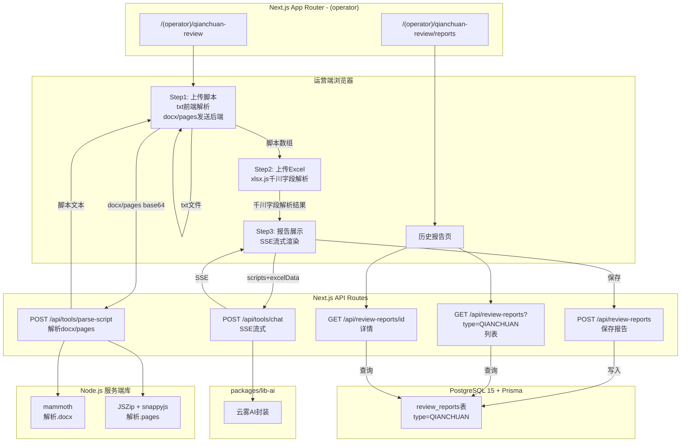
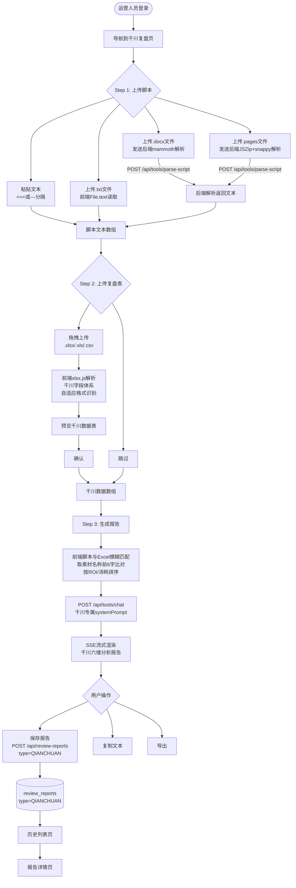
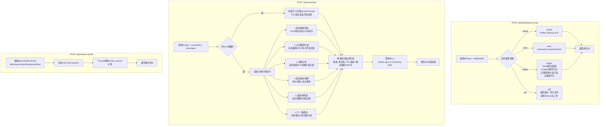

## 千川脚本复盘（qianchuan-review） 迁移分析文档

> 旧路径：/qianchuan-review | 旧端口：3012
> 迁移目标：新平台 (operator) 路由 → `/(operator)/qianchuan-review`

---

### 1. 旧架构梳理

#### 1.1 前端页面结构

旧版为独立 Next.js 应用，页面结构与人设复盘相同（三步流程 + 历史报告页），但业务逻辑有显著差异：

| 路由 | 描述 |
|---|---|
| `/qianchuan-review` | 主流程页（三步骤：上传脚本 → 上传复盘表 → 复盘报告） |
| `/qianchuan-review/report` | 历史报告列表页 |
| `/qianchuan-review/report/[id]` | 历史报告详情页 |

**Step 1 - 上传脚本**：
- 支持粘贴文本（`===` 或 `---` 分隔自动拆分）
- 支持上传 `.txt` / `.docx` / `.pages` 文件（多选）
- `.docx` 文件：后端用 `mammoth.extractRawText` 解析
- `.pages` 文件：后端 JSZip 解压 → snappyjs 解压 IWA Snappy 格式 → 正则提取中文片段 → 过滤噪声行
- `.txt` / `.md`：Buffer.toString('utf-8') 读取

**Step 2 - 上传复盘表（可跳过）**：
- 拖拽上传 `.xlsx` / `.xls` / `.csv` 文件
- 前端 `xlsx.js` 解析，支持转置格式 + 标准格式（两次 Pass 匹配）
- 字段体系为千川专属（消耗/ROI/CPM/转化等）

**Step 3 - 复盘报告**：
- 调用流式 AI 接口，SSE 实时渲染报告
- 报告下方展示千川数据概览表
- 提供：保存报告、导出、复制功能

**历史报告页**：
- 与人设复盘结构相同，列表 + 详情

#### 1.2 后端 API 清单

| 接口 | 方法 | 功能 |
|---|---|---|
| `/qianchuan-review/api/chat` | POST | 流式 AI 生成复盘报告（SSE） |
| `/qianchuan-review/api/parse-script` | POST | 服务端解析脚本文件（.docx/.pages/.txt） |
| `/api/reports` | POST | 保存报告到本地 JSON 文件 |
| `/api/reports` | GET | 获取报告列表（id/摘要/createdAt） |
| `/api/reports/[id]` | GET | 获取单条完整报告数据 |

#### 1.3 数据存储

- **存储介质**：本地文件系统
- **路径**：`/opt/qianchuan-review/reports/*.json`
- **文件命名**：以报告 UUID 为文件名
- **文件结构**：
  ```json
  {
    "id": "uuid",
    "report": "AI生成的完整报告文本",
    "scripts": ["脚本1", "脚本2"],
    "excelData": [{ "videoTheme": "素材名称", "roi": "2.5", "spend": "1000" }],
    "createdAt": "2026-06-01T12:00:00Z"
  }
  ```

#### 1.4 第三方调用

| 服务 | 调用场景 | 调用方式 |
|---|---|---|
| 云雾AI（claude-opus-4-6-thinking） | Step 3 生成复盘报告 | HTTP SSE 流式，后端转发 |
| mammoth（npm库） | 解析 .docx 脚本文件 | 后端 Node.js 调用 |
| JSZip（npm库） | 解压 .pages 文件容器 | 后端 Node.js 调用 |
| snappyjs（npm库） | 解压 .pages 内的 IWA Snappy 格式 | 后端 Node.js 调用 |

#### 1.5 旧架构图

```mermaid
graph TD
    subgraph Browser["浏览器（端口3012）"]
        P1[Step1: 上传脚本\n粘贴/txt/docx/pages]
        P2[Step2: 上传Excel\n千川字段体系]
        P3[Step3: 报告展示\nSSE流式渲染]
        PH[历史报告页]
    end

    subgraph API["Next.js API Routes"]
        A0[POST /api/parse-script\n服务端文件解析]
        A1[POST /qianchuan-review/api/chat\nSSE流式]
        A2[POST /api/reports\n保存]
        A3[GET /api/reports\n列表]
        A4[GET /api/reports/id\n详情]
    end

    subgraph Storage["本地文件系统"]
        FS[/opt/qianchuan-review/reports/*.json]
    end

    subgraph External["外部服务/库"]
        AI[云雾AI\nclaude-opus-4-6-thinking]
        MM[mammoth\n解析.docx]
        JZ[JSZip + snappyjs\n解析.pages]
    end

    P1 -->|上传.docx/.pages| A0
    A0 -->|调用| MM
    A0 -->|调用| JZ
    A0 -->|返回脚本文本| P1
    P1 -->|脚本数组| P2
    P2 -->|xlsx.js解析千川字段| P3
    P3 -->|scripts+excelData| A1
    A1 -->|SSE| P3
    A1 -->|调用| AI
    P3 -->|用户点保存| A2
    A2 -->|写入| FS
    PH -->|请求列表| A3
    A3 -->|读取| FS
    PH -->|点击详情| A4
    A4 -->|读取| FS
```

---

### 2. 新架构设计

#### 2.1 前端

- **路由**：`apps/web/src/app/(operator)/qianchuan-review/page.tsx`
- **历史列表**：`apps/web/src/app/(operator)/qianchuan-review/reports/page.tsx`
- **历史详情**：`apps/web/src/app/(operator)/qianchuan-review/reports/[id]/page.tsx`
- **技术选型**：Next.js 14 App Router + TypeScript + Tailwind CSS + shadcn/ui

**脚本文件处理策略（与人设复盘的关键差异）**：

| 文件类型 | 处理位置 | 原因 |
|---|---|---|
| `.txt` / `.md` | 前端 `File.text()` | 浏览器原生支持，无需后端 |
| `.docx` | **后端 API** | mammoth 库仅运行于 Node.js |
| `.pages` | **后端 API** | JSZip + snappyjs 解压逻辑，浏览器无法处理 |

**千川 Excel 解析逻辑（前端保留，字段体系不同）**：
- 与人设复盘相同的自适应解析策略（转置格式 + 两次 Pass 匹配）
- 千川专属字段别名：
  - `videoTheme`：素材名称、视频主题、素材标题、视频名称
  - `spend`：整体消耗、消耗、花费、总消耗
  - `impressions`：展示次数、展示、曝光、曝光次数
  - `ctr`：点击率、CTR、整体点击率
  - `threeSecRate`：3s完播率、3秒完播率
  - `conversions`：转化数、成交数、订单数
  - `costPerConversion`：转化成本、成交成本、单次转化成本
  - `roi`：ROI、投产比、整体支付ROI、支付ROI
  - `cpm`：千次展示成本、CPM、千展成本、整体千次展现费用

#### 2.2 后端

| 接口 | 方法 | 是否新增 | 说明 |
|---|---|---|---|
| `/api/tools/parse-script` | POST | 新增 | 服务端解析 .docx/.pages 文件，返回纯文本 |
| `/api/tools/chat` | POST | 复用M2已有 | 调用 lib-ai 的 SSE 流式接口 |
| `/api/review-reports` | POST | 新增 | 保存报告至 review_reports 表（type=QIANCHUAN） |
| `/api/review-reports` | GET | 新增 | 查询当前用户报告列表，支持 `?type=QIANCHUAN` 过滤 |
| `/api/review-reports/[id]` | GET | 新增 | 查询单条完整报告数据 |

**`/api/tools/parse-script` 请求体**：
```json
{
  "fileType": "docx",
  "fileBase64": "base64编码的文件内容"
}
```

**`/api/tools/parse-script` 返回**：
```json
{
  "text": "解析后的纯文本内容",
  "success": true
}
```

**报告保存请求体结构**：
```json
{
  "type": "QIANCHUAN",
  "title": "千川复盘-2026-06-01",
  "report": "AI生成的报告文本",
  "scriptsData": ["脚本1", "脚本2"],
  "excelData": [{ "videoTheme": "素材A", "roi": "2.5", "spend": "1000" }]
}
```

#### 2.3 数据存储

| 表名 | 字段 | 说明 |
|---|---|---|
| `review_reports` | `id` | UUID 主键 |
| `review_reports` | `type` | enum: PERSONA / QIANCHUAN / LIVESTREAM，此处为 QIANCHUAN |
| `review_reports` | `title` | 报告标题 |
| `review_reports` | `report` | AI 生成的完整报告文本（text 类型） |
| `review_reports` | `scriptsData` | 脚本数组（JSON 类型） |
| `review_reports` | `excelData` | 千川 Excel 解析结果（JSON 类型，含roi/spend/ctr等字段） |
| `review_reports` | `createdAt` | 创建时间 |
| `review_reports` | `userId` | 关联当前登录运营人员 |

> 与人设复盘共用同一张 `review_reports` 表，通过 `type` 字段区分。

#### 2.4 第三方调用

| 服务 | 调用场景 | 调用位置 | 说明 |
|---|---|---|---|
| 云雾AI（claude-opus-4-6-thinking） | 生成复盘报告 | 后端 `/api/tools/chat` → lib-ai | SSE 流式 |
| mammoth | 解析 .docx 文件 | 后端 `/api/tools/parse-script` | npm 依赖，服务端运行 |
| JSZip | 解压 .pages 容器 | 后端 `/api/tools/parse-script` | npm 依赖，服务端运行 |
| snappyjs | 解压 IWA Snappy 格式 | 后端 `/api/tools/parse-script` | npm 依赖，服务端运行 |

#### 2.5 新架构图



---

### 3. 核心流程图

#### 3.1 用户操作流程图



#### 3.2 后端业务逻辑图



---

### 4. 迁移差异对照

| 维度 | 旧架构 | 新架构 | 迁移工作量 |
|---|---|---|---|
| 运行方式 | 独立 Next.js 应用，端口3012 | 集成到主平台 (operator) 路由 | 中：路由结构调整 |
| 认证 | 无认证 | next-auth JWT，operator 角色 | 中：需加权限守卫 |
| 脚本文件支持 | .txt/.docx/.pages（后端解析） | .txt 前端，.docx/.pages 后端 API | 中：抽取独立 parse-script API |
| .pages 解析 | 独立应用内内联逻辑 | 新建 /api/tools/parse-script | 中：逻辑迁移 + 接口封装 |
| Excel字段体系 | 千川专属字段（9个维度） | 千川专属字段（完全保留） | 无：逻辑完整复用 |
| AI分析维度 | 千川六维分析（硬编码提示词） | 千川六维分析（迁移至新API） | 小：复制提示词 |
| AI角色定义 | 千川投流复盘专家 | 千川投流复盘专家（不变） | 无 |
| 数据存储 | /opt/qianchuan-review/reports/*.json | PostgreSQL review_reports表 type=QIANCHUAN | 大：同人设复盘 |
| 报告关联用户 | 无用户概念 | userId 关联 | 中：同人设复盘 |
| 与人设复盘共用API | 各自独立接口 | 共用 /api/review-reports，type区分 | 小：统一接口设计 |
| 与人设复盘差异点 | 独立部署 | 同一平台，字段和提示词各自维护 | 小 |

**千川复盘 vs 人设复盘核心差异汇总**：

| 维度 | 人设复盘 | 千川复盘 |
|---|---|---|
| Excel字段 | 播放/完播/点赞/投放（6字段） | 消耗/曝光/CTR/3s完播/转化/ROI/CPM（9字段） |
| 脚本文件支持 | 仅 .txt | .txt / .docx / .pages |
| .pages 解析 | 无 | 后端 JSZip + snappyjs |
| AI角色 | 抖音内容操盘大师 | 千川投流复盘专家 |
| 分析维度 | 内容质量/完播/投放效率 | 素材效率/3s完播/消耗/最优拆解/差素材/改版建议 |
| 数据库 type | PERSONA | QIANCHUAN |

---

### 5. 开发要点与风险

**开发要点**：

1. **`/api/tools/parse-script` 的设计**：此接口需同时支持 .docx 和 .pages 两种格式，建议用 `fileType` 字段做路由分发。.pages 的 Snappy 解压逻辑较复杂，需确保 snappyjs 在 Next.js 14 App Router（Edge Runtime 不支持）环境中正常运行，需在 API Route 头部声明 `export const runtime = 'nodejs'`。

2. **前端文件上传方式**：.docx/.pages 文件需转为 base64 或以 FormData 形式发送给后端，推荐使用 `FormData` + `multipart/form-data` 避免 base64 编码开销。

3. **千川 Excel 字段别名完整性**：9 个字段的别名体系需完整迁移，建议封装为独立配置对象 `QIANCHUAN_FIELD_ALIASES`，便于后续维护。

4. **AI提示词隔离**：千川和人设的 systemPrompt 必须完全分开维护，建议放在各自的 constants 文件中（如 `src/lib/prompts/qianchuan.ts`），避免复用同一提示词文件导致分析维度混淆。

5. **PPT类型报告导出（可选）**：千川复盘报告通常需要以投放数据表格形式汇报，可在后续版本中增加 Excel 导出功能（当前 M3 仅复制文本）。

6. **与人设复盘共用路由 `/api/review-reports`**：通过 `type` 字段区分，列表查询时前端必须传 `?type=QIANCHUAN`，否则会返回所有类型的报告。

**风险点**：

| 风险 | 等级 | 应对措施 |
|---|---|---|
| .pages 文件格式版本差异，旧版 Pages 文件 Snappy 解压失败 | HIGH | 增加解压失败的错误提示，引导用户转换为 docx |
| mammoth 解析复杂 .docx（含表格/图片）时提取文本不完整 | MEDIUM | 仅提取纯文本，告知用户表格/图片内容会被忽略 |
| Next.js 14 App Router 中 snappyjs 依赖 Node.js Binary，需确认构建兼容性 | HIGH | 提前验证 `npm install snappyjs` 在 Next.js 14 中的构建结果 |
| 千川数据字段多（9个）且别名复杂，解析测试覆盖不足 | MEDIUM | 准备多份真实千川后台导出文件做集成测试 |
| 大素材批量上传（>50条）时 AI context 超限 | MEDIUM | 前端限制单次最多50条素材，或提示用户分批处理 |
| /api/tools/parse-script 处理大型 .pages 文件（>10MB）超时 | LOW | 设置 API Route 超时为 60s，前端显示进度提示 |
