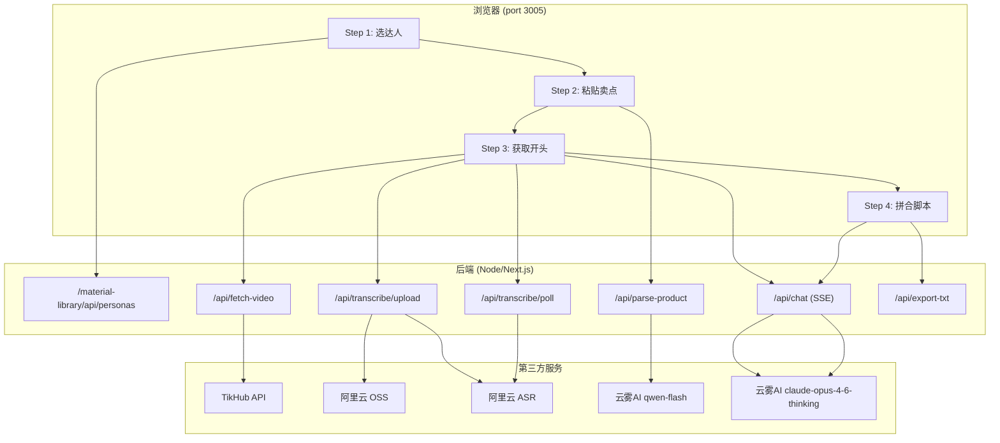
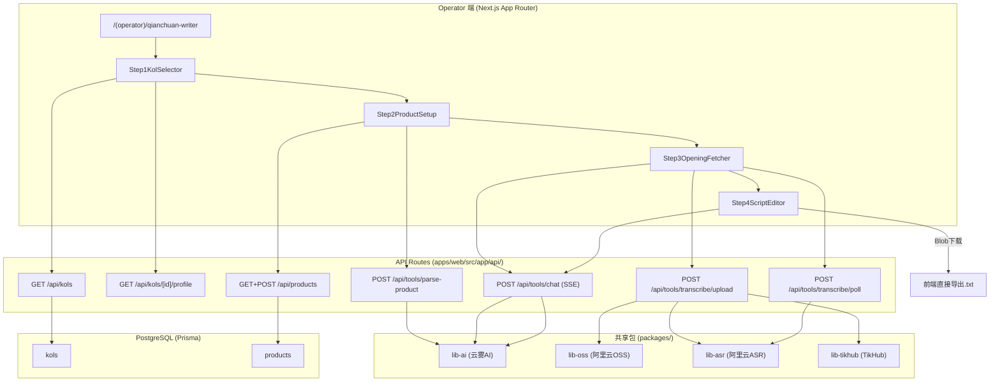
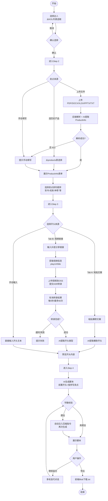

# 千川脚本仿写（qianchuan-writer）迁移分析文档

> 旧路径：/qianchuan-writer | 旧端口：3005
> 迁移目标：新平台 (operator) 路由 → `/(operator)/qianchuan-writer`

---

## 1. 旧架构梳理

### 1.1 前端页面结构

四步向导式流程（Step 1 → 2 → 3 → 4），每步完成后方可进入下一步。

**Step 1 — 选达人**
- 从素材库选择达人（跨服务调用 `GET /material-library/api/personas`）
- 展示达人基本信息（名称、粉丝量、平台）

**Step 2 — 粘贴卖点**
- 多格式文件上传解析（PDF / DOCX / XLSX / PPTX / TXT），调用后端 `POST /api/parse-product`
- 粘贴卖点卡或手动填写 ProductInfo（name / category / price / sellingPoints / targetAudience / scenario / medicalAestheticAnchor）
- 卖点排列顺序选择（三选一）：
  - 背书 → 机制 → 种草
  - 机制 → 背书 → 种草
  - 背书 → 种草 → 机制

**Step 3 — 获取开头**
- Tab A：粘贴文案正文 + AI 提取爆款开头
- Tab B：粘贴抖音分享链接 → 后端获取视频 playUrl → 转录 → AI 提取开头类型（好奇型 / 痛点型 / 反常识型 / 利益型 / 身份筛选型）
- 手动输入开头

**Step 4 — 拼合脚本**
- 系统自动前置爆款开头
- AI 按卖点顺序（spOrder）生成正文
- 实时字数校验（统计汉字数）
- 超出字数上限 → 自动注入压缩指令 → 再次生成 → 替换最后一条消息
- 多轮迭代对话（用户可继续追问修改）
- 导出 `.txt` 文件

### 1.2 后端 API 清单

| 接口 | 方法 | 功能 |
|---|---|---|
| `/material-library/api/personas` | GET | 跨服务调用，获取达人列表（素材库服务） |
| `/api/parse-product` | POST | 多格式文件解析（PDF/DOCX/XLSX/PPTX/TXT），AI 提取 ProductInfo JSON |
| `/api/fetch-video` | POST | TikHub 解析抖音分享链接，返回 playUrl / title / diggCount |
| `/api/transcribe/upload` | POST | 下载视频 → OSS 上传 → 提交 ASR 转录任务，返回 taskId（90s 超时） |
| `/api/transcribe/poll` | POST | 轮询 ASR 转录结果（每 5 秒，最多 60 次） |
| `/api/chat` | POST | 流式 AI 对话（SSE），开头提取 + 脚本生成 + 多轮迭代 |
| `/api/export-txt` | POST | 生成脚本 `.txt` 文件，触发下载 |

### 1.3 数据存储

旧架构无持久化数据库，所有数据存于前端状态（React state）：
- 当前选中达人信息
- ProductInfo（解析/填写的卖点数据）
- 对话历史（messages 数组）
- 生成的脚本文本

### 1.4 第三方调用

| 服务 | 调用场景 | 调用方式 |
|---|---|---|
| 云雾AI（qwen-flash） | Step 2 文件解析后 AI 提取 ProductInfo JSON | 后端 HTTP 请求，非流式，返回 JSON |
| 云雾AI（claude-opus-4-6-thinking） | Step 3 AI 提取开头 / Step 4 脚本生成 + 多轮迭代 | 后端 SSE 流式 |
| TikHub | Step 3 Tab B 解析抖音分享链接获取视频信息 | 后端 HTTP 请求 |
| 阿里云 OSS | Step 3 Tab B 视频中转上传 | 后端 SDK 调用 |
| 阿里云 ASR | Step 3 Tab B 提交转录任务 + 轮询结果 | 后端 SDK 调用 |

### 1.5 旧架构图

---

## 2. 新架构设计

### 2.1 前端

路由：`apps/web/src/app/(operator)/qianchuan-writer/page.tsx`

组件拆分建议：
- `QianchuanWizard`：四步向导容器，管理全局状态
- `Step1KolSelector`：达人选择（复用 M2 已有达人列表逻辑）
- `Step2ProductSetup`：产品卖点配置
  - `FileUploadParser`：文件上传 + 解析触发
  - `ProductInfoForm`：ProductInfo 手动编辑表单
  - `SpOrderSelector`：卖点排列顺序选择
- `Step3OpeningFetcher`：爆款开头获取
  - `OpeningTabA`：粘贴文案提取
  - `OpeningTabB`：视频链接转录提取
  - `OpeningManualInput`：手动输入
- `Step4ScriptEditor`：脚本生成与多轮迭代
  - `ScriptStreamViewer`：SSE 流式展示
  - `WordCountBadge`：实时字数统计
  - `ChatIterationPanel`：多轮追问

**前端关键逻辑保留**：
- 字数校验逻辑（提取正文统计汉字数）移至前端：超出字数上限时，前端在 messages 中追加压缩指令，无需后端感知
- 导出 `.txt`：前端 Blob 下载，无需后端接口（`new Blob([script], { type: 'text/plain' })`）
- 视频转录轮询：前端每 5 秒调用 `POST /api/tools/transcribe/poll`，最多 60 次

### 2.2 后端

| 接口 | 方法 | 是否新增 | 说明 |
|---|---|---|---|
| `/api/kols` | GET | 已有（M2复用） | 获取达人列表，替代旧跨服务调用 |
| `/api/kols/[id]/profile` | GET | 已有（M2复用） | 获取达人 soulMd / contentPlanMd |
| `/api/products` | GET | 已有（M2复用） | 下拉选择历史产品 |
| `/api/products` | POST | 已有（M2复用） | 保存新产品信息（可选） |
| `/api/tools/parse-product` | POST | 新增 | 多格式文件解析 + qwen-flash 提取 ProductInfo |
| `/api/tools/transcribe/upload` | POST | 新增 | 视频下载 → lib-oss 上传 → lib-asr 提交转录，返回 taskId |
| `/api/tools/transcribe/poll` | POST | 新增 | 轮询 lib-asr 转录结果 |
| `/api/tools/chat` | POST | 新增 | 流式 AI 对话（SSE），统一入口，支持 model 参数切换 |

> `/api/tools/chat` 接收 `{ model, messages, systemPrompt }` 参数：
> - `model: 'qwen-flash'`：用于 Step 3 开头提取（速度优先）
> - `model: 'claude-opus-4-6-thinking'`：用于 Step 3 开头类型识别 + Step 4 脚本生成

### 2.3 数据存储

| 表名 | 字段 | 说明 |
|---|---|---|
| `products` | id, name, category, price, sellingPoints(JSON), targetAudience, scenario, medicalAestheticAnchor | 可选保存解析出的产品信息，供历史复用 |
| `kols` | id, name, platform, accountId, followersCount | Step 1 达人选择数据源（M2已有） |
| `kol_profiles` | id, kolId, soulMd, contentPlanMd | 达人人设参考（M2已有） |

> 脚本内容、对话历史均不持久化，属于纯会话状态。

### 2.4 第三方调用

新平台通过 packages 下的共享包调用第三方服务，统一封装：

| 服务 | 包路径 | 调用接口 | 用途 |
|---|---|---|---|
| 云雾AI qwen-flash | `packages/lib-ai` | `/api/tools/parse-product`、`/api/tools/chat?model=qwen-flash` | 产品信息提取、开头提取 |
| 云雾AI claude-opus-4-6-thinking | `packages/lib-ai` | `/api/tools/chat?model=claude-opus-4-6-thinking` | 脚本生成、多轮迭代 |
| TikHub | `packages/lib-tikhub` | `/api/tools/transcribe/upload`（内部调用） | 解析抖音视频信息获取 playUrl |
| 阿里云 OSS | `packages/lib-oss` | `/api/tools/transcribe/upload`（内部调用） | 视频文件中转上传 |
| 阿里云 ASR | `packages/lib-asr` | `/api/tools/transcribe/upload` + `/api/tools/transcribe/poll` | 视频转录 |

### 2.5 新架构图

---

## 3. 核心流程图

### 3.1 用户操作流程图

### 3.2 后端业务逻辑图

```mermaid
flowchart TD
    subgraph PARSE["POST /api/tools/parse-product"]
        P1[接收文件 Buffer + MIME类型]
        P2{文件类型}
        P2 -->|PDF| P3[unpdf 解析]
        P2 -->|DOCX| P4[mammoth 解析]
        P2 -->|XLSX| P5[xlsx 解析]
        P2 -->|PPTX| P6[JSZip 解析]
        P2 -->|TXT| P7[直接读取文本]
        P3 & P4 & P5 & P6 & P7 --> P8[截取前8000字符]
        P8 --> P9[qwen-flash 提取JSON\nname/category/price/\nsellingPoints/targetAudience/\nscenario/medicalAestheticAnchor]
        P9 --> P10{提取成功?}
        P10 -->|是| P11[返回 ProductInfo JSON]
        P10 -->|否| P12[返回 422，提示手动填写]
    end

    subgraph UPLOAD["POST /api/tools/transcribe/upload"]
        U1[接收抖音分享链接]
        U2[lib-tikhub: 解析链接\n获取 playUrl/title/diggCount]
        U3[下载视频到内存]
        U4[lib-oss: 上传视频到OSS\n返回 ossUrl]
        U5[lib-asr: 提交转录任务\n返回 taskId]
        U6[返回 taskId 给前端]
        U1 --> U2 --> U3 --> U4 --> U5 --> U6
        NOTE_U["超时控制: 90s"]
    end

    subgraph POLL["POST /api/tools/transcribe/poll"]
        PL1[接收 taskId]
        PL2[lib-asr: 查询任务状态]
        PL3{状态?}
        PL3 -->|Running| PL4[返回 status: pending]
        PL3 -->|Success| PL5[返回转录文本]
        PL3 -->|Failed| PL6[返回错误]
        PL1 --> PL2 --> PL3
    end

    subgraph CHAT["POST /api/tools/chat (SSE)"]
        C1[接收 model / messages / systemPrompt]
        C2{model?}
        C2 -->|qwen-flash| C3[lib-ai: qwen-flash\n非流式或轻量流式]
        C2 -->|claude-opus-4-6-thinking| C4[lib-ai: claude-opus-4-6-thinking\nSSE流式输出]
        C3 & C4 --> C5[返回 SSE 数据流]
        C1 --> C2
    end

    subgraph SCRIPT_LOGIC["Step 4 脚本生成逻辑（前端/API层）"]
        SL1[构造 systemPrompt\n卖点按spOrder排序\n字数上限=对标原文字数]
        SL2[前置 openingPrefix = 【开头】+ rawOpening]
        SL3[调用 /api/tools/chat 生成]
        SL4[前端统计汉字数]
        SL5{超出字数上限?}
        SL5 -->|否| SL6[展示脚本]
        SL5 -->|是| SL7[注入压缩指令到messages\n替换最后一条AI消息]
        SL7 --> SL3
        SL1 --> SL2 --> SL3 --> SL4 --> SL5
    end
```

---

## 4. 迁移差异对照

| 维度 | 旧架构 | 新架构 | 迁移工作量 |
|---|---|---|---|
| 达人数据来源 | 跨服务 HTTP 调用 `/material-library/api/personas` | 新平台自有 `GET /api/kols`（M2已有） | 小：替换请求地址，数据结构适配 |
| 产品解析接口 | `/api/parse-product`（独立服务内） | `/api/tools/parse-product`（新平台 API Routes） | 中：迁移解析逻辑（unpdf/mammoth/xlsx/JSZip），接入 lib-ai |
| 历史产品复用 | 无（每次重新填写） | `GET /api/products` 下拉选择（M2已有） | 小：新增 UI 下拉，接口已有 |
| 视频获取 | `/api/fetch-video`（TikHub） | 合并到 `/api/tools/transcribe/upload` 内部调用 | 小：逻辑合并，lib-tikhub 封装 |
| 视频转录 | `/api/transcribe/upload` + `/api/transcribe/poll` | `/api/tools/transcribe/upload` + `/api/tools/transcribe/poll`（调用lib-oss/lib-asr） | 中：适配 lib-oss 和 lib-asr 包接口 |
| AI 对话 | `/api/chat`（单一服务，hardcode model） | `/api/tools/chat`（model 参数化，统一入口） | 小：重构为参数化接口 |
| 导出 .txt | 后端接口生成 | 前端 Blob 下载（无需后端） | 小：删除后端接口，前端实现 |
| 字数校验/压缩 | 后端或前端混合 | 明确移至前端 | 小：逻辑整理，无新开发 |
| 数据持久化 | 无 | 可选保存到 products 表 | 小：新增保存按钮，复用 POST /api/products |
| 认证鉴权 | 无 | next-auth JWT，operator 角色校验 | 中：所有页面和 API 需加 session 校验 |
| 部署 | 独立 Node 服务 port 3005 | 合并到新平台 Next.js monorepo | 中：目录结构迁移，环境变量统一管理 |

---

## 5. 开发要点与风险

### 5.1 开发要点

**文件解析兼容性**
- `unpdf`（PDF）、`mammoth`（DOCX）、`xlsx`、`JSZip`（PPTX）均需在 Next.js API Routes 的 Node.js 环境中运行，需确认各包与 Next.js 14 的兼容性（避免 Edge Runtime）。
- 文件大小限制：Next.js 默认 body size limit 为 4MB，大文件需配置 `bodyParser: false` 并使用 formidable 或 multer 处理。

**视频转录超时处理**
- 旧架构设置 90s 超时。新平台 API Routes 在 Vercel 部署时函数超时默认 10s（Pro 60s）。若自托管则无此限制。
- 建议将 `transcribe/upload` 设计为异步：提交后立即返回 taskId，前端轮询 `transcribe/poll`，避免长连接超时。

**SSE 流式输出**
- Next.js 14 App Router 使用 `ReadableStream` + `TransformStream` 实现 SSE，需注意响应头设置：`Content-Type: text/event-stream`、`Cache-Control: no-cache`。
- 前端使用 `EventSource` 或 `fetch` + `ReadableStream` 读取 SSE。

**字数校验逻辑**
- 汉字统计正则：`/[\u4e00-\u9fa5]/g`
- 压缩指令注入时，需替换 messages 数组最后一条 AI 消息，而不是追加，避免上下文过长。

**医美锚定话术**
- `medicalAestheticAnchor` 字段由 AI 在产品解析时自动识别生成，需在 `parse-product` 的 prompt 中明确要求。
- 该字段内容需在 Step 4 脚本生成的 systemPrompt 中引用。

**卖点排列顺序**
- `spOrder` 枚举值：`'endorsement-mechanism-seeding'` / `'mechanism-endorsement-seeding'` / `'endorsement-seeding-mechanism'`
- 构造 systemPrompt 时按 spOrder 排列卖点数组顺序，AI 按序输出。

### 5.2 风险点

| 风险 | 等级 | 应对措施 |
|---|---|---|
| 文件解析库在 Next.js API Routes 中的兼容性 | HIGH | 本地测试各格式解析；使用 `export const runtime = 'nodejs'` 明确指定运行时 |
| 视频转录在 Vercel 函数超时限制内无法完成 | HIGH | 采用异步模式（提交+轮询），或自托管部署；考虑设置 `maxDuration` |
| TikHub 分享链接解析失效（链接格式变化） | MEDIUM | 做好错误提示，引导用户直接粘贴视频 URL |
| ASR 转录准确率影响开头提取质量 | MEDIUM | 在 AI 提取 prompt 中要求容错处理，允许标注"转录不清晰"的字段 |
| 旧 ProductInfo 数据结构与新 products 表字段不一致 | LOW | 在 API 层做字段映射，`sellingPoints` 已为 JSON 类型可兼容 |
| operator 角色下误访问其他用户数据 | MEDIUM | API 层加 session 校验，products 表暂无用户隔离，后续可加 `operatorId` |
