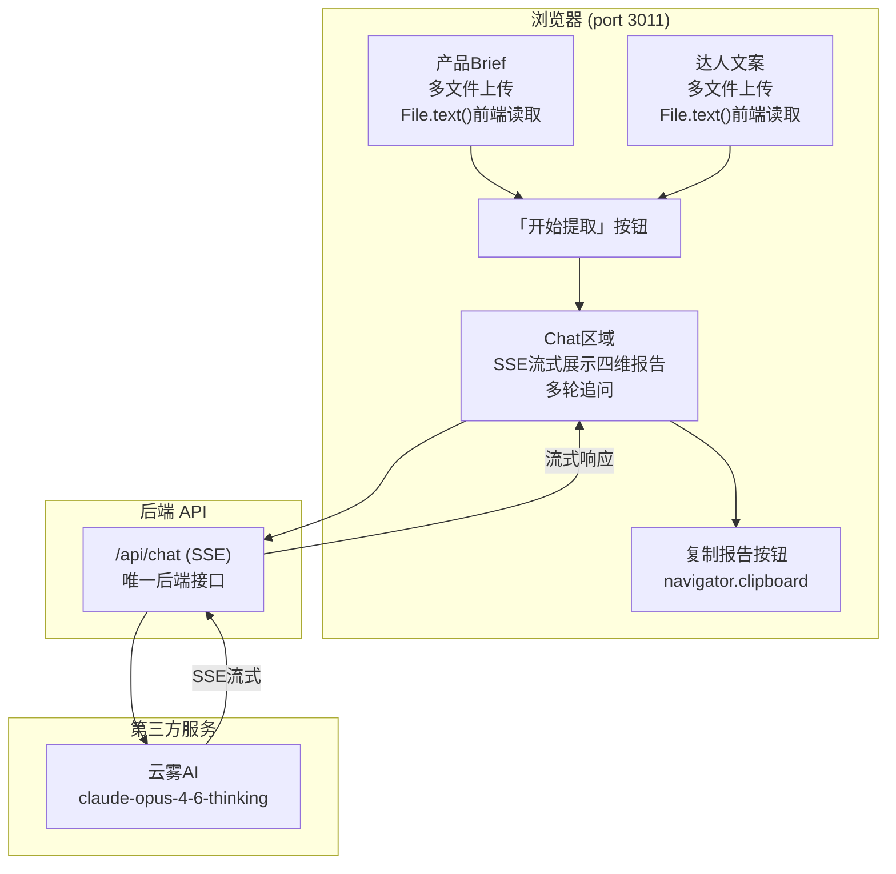
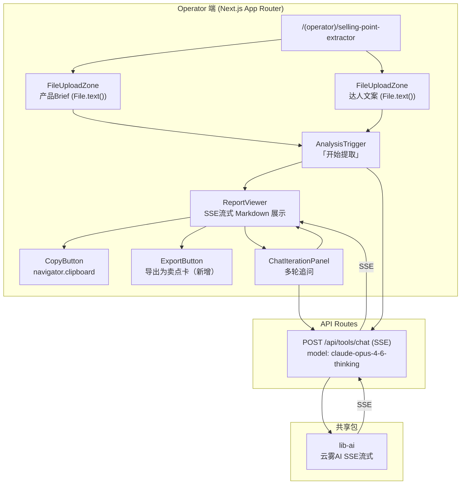
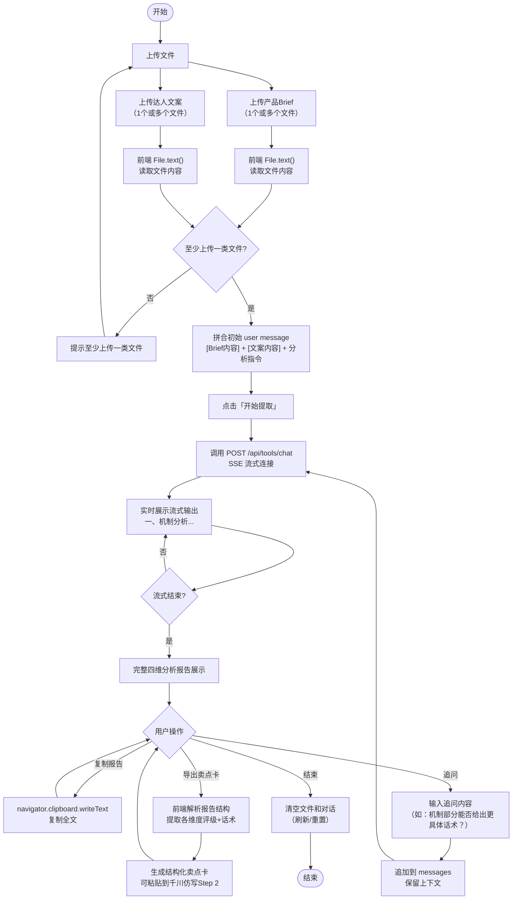
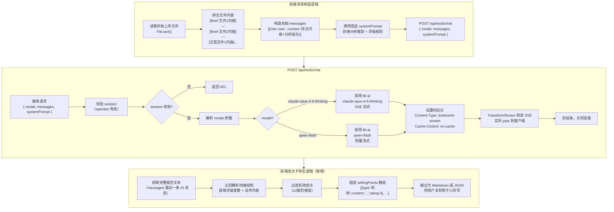

# 产品卖点提取（selling-point-extractor）迁移分析文档

> 旧路径：/selling-point-extractor | 旧端口：3011
> 迁移目标：新平台 (operator) 路由 → `/(operator)/selling-point-extractor`

---

## 1. 旧架构梳理

### 1.1 前端页面结构

**顶部双栏上传区**
- 左栏：产品 Brief（支持多文件上传）
- 右栏：达人文案（支持多文件上传）
- 已上传文件列表展示（文件名 + 删除按钮）
- 「开始提取」按钮：触发四维分析

**重要特点：文件读取在前端完成**
- 使用 `File.text()` 直接读取文件文本内容
- 文件内容直接拼入消息体（messages），不经过后端文件解析接口
- 不支持 PDF 等二进制格式（仅支持纯文本类文件）

**下方 Chat 区域**
- 展示 AI 四维分析报告（SSE 流式输出）
- 支持多轮追问（用户可针对某一维度深入提问）
- 「复制报告」按钮：`navigator.clipboard.writeText(reportContent)`

**固定输出结构（四维分析框架，严格按顺序）**：
```
一、机制分析（价格/促销力度）
    - 分析维度：破价 / 赠品 / 试用 / 限时限量 / 组合优惠
    - 综合评级 ⭐1-5星 + 话术建议

二、背书分析（信任状）
    - 分析维度：明星代言 / 权威认证 / 专业机构 / 行业荣誉 / 大牌同源
    - 综合评级 ⭐1-5星 + 话术建议

三、可视化分析（视觉冲击力）
    - 分析维度：包装颜值 / 效果可视化 / 视觉特点 / 体感 / 使用过程看点
    - 综合评级 ⭐1-5星

四、内容潜力（选题爆款潜力）
    - 分析维度：情绪钩子 / 故事线 / 争议话题 / 知识密度
    - 综合评级 ⭐1-5星
```

**评级输出规则**：
- ≥ 4 星：写具体话术建议
- ≤ 2 星：写「⚠️ 建议弱化」
- 3 星：列现有内容并标注现状

### 1.2 后端 API 清单

| 接口 | 方法 | 功能 |
|---|---|---|
| `/api/chat` | POST | 流式 AI 对话（SSE），四维分析首次生成 + 多轮追问，唯一后端接口 |

### 1.3 数据存储

旧架构**无任何数据库或持久化存储**，属于纯无状态工具：
- 上传文件内容：前端读取后存于 React state
- 分析报告：存于 messages 状态数组
- 会话结束后所有数据清空

### 1.4 第三方调用

| 服务 | 调用场景 | 调用方式 |
|---|---|---|
| 云雾AI（claude-opus-4-6-thinking） | 四维分析首次生成 + 多轮追问 | 后端 SSE 流式，`/api/chat` 调用 |

### 1.5 旧架构图



---

## 2. 新架构设计

### 2.1 前端

路由：`apps/web/src/app/(operator)/selling-point-extractor/page.tsx`

组件拆分建议：
- `SellingPointExtractorPage`：页面容器，管理全局状态（files、messages、isStreaming）
- `FileUploadZone`：双栏文件上传区（可复用同一组件，通过 `type` 区分产品Brief/达人文案）
  - 支持多文件、文件列表展示、删除
  - 内部调用 `File.text()` 读取文件文本
- `AnalysisTrigger`：「开始提取」按钮，校验是否已上传文件
- `ReportViewer`：SSE 流式展示区
  - `StreamingMarkdown`：实时 Markdown 渲染（四维结构带星级评定）
  - `CopyButton`：复制报告（`navigator.clipboard.writeText`）
  - `ExportButton`：导出为卖点卡（新增功能）
- `ChatIterationPanel`：多轮追问输入框 + 历史消息列表

**新增功能：导出为卖点卡**
- 解析报告内容，提取四维结构化数据
- 生成结构化卖点卡（JSON 或 Markdown 格式）
- 可直接复制到千川脚本仿写的 Step 2 卖点填写区
- 实现方式：前端解析 messages 中 AI 输出的 Markdown，提取各维度评级和话术，组装为 ProductInfo.sellingPoints 格式

**文件读取保持现有逻辑**：
- 继续使用 `File.text()` 在前端读取
- 读取后拼入初始 user message：`[产品Brief内容]\n\n[达人文案内容]\n\n请按四维分析框架进行分析`

### 2.2 后端

| 接口 | 方法 | 是否新增 | 说明 |
|---|---|---|---|
| `/api/tools/chat` | POST | 新增（复用）| 流式 AI 对话（SSE），接收 model / messages / systemPrompt，统一入口 |

> `/api/tools/chat` 为新平台工具类统一 AI 对话接口，selling-point-extractor 使用 `model: 'claude-opus-4-6-thinking'`。
>
> 此接口与千川脚本仿写共用同一实现，通过 model 参数区分。

**systemPrompt 设计（固化在前端或 API 层）**：
```
你是一位专业的MCN内容策划顾问，擅长分析产品在短视频带货场景下的卖点潜力。
请严格按照以下四个维度顺序进行分析，不得调换顺序：
一、机制分析（价格/促销力度）
二、背书分析（信任状）
三、可视化分析（视觉冲击力）
四、内容潜力（选题爆款潜力）

评级规则：
- ≥4星：写出具体可用的话术建议
- ≤2星：写"⚠️建议弱化"
- 3星：列出现有内容并标注现状
```

### 2.3 数据存储

| 表名 | 字段 | 说明 |
|---|---|---|
| 无 | — | 纯工具型，无状态，不持久化任何数据 |

> 如未来需要保存分析历史，可新增 `analysis_sessions` 表，但当前 M3 阶段不需要。

### 2.4 第三方调用

| 服务 | 包路径 | 用途 |
|---|---|---|
| 云雾AI（claude-opus-4-6-thinking） | `packages/lib-ai` | 四维分析生成 + 多轮追问，SSE 流式 |

### 2.5 新架构图



---

## 3. 核心流程图

### 3.1 用户操作流程图



### 3.2 后端业务逻辑图



---

## 4. 迁移差异对照

| 维度 | 旧架构 | 新架构 | 迁移工作量 |
|---|---|---|---|
| 路由/入口 | 独立服务 port 3011，/selling-point-extractor | `/(operator)/selling-point-extractor`，Next.js App Router | 小：页面迁移，文件结构调整 |
| 文件读取方式 | 前端 `File.text()`，不经后端 | 保持原有：前端 `File.text()`，不经后端 | 无：逻辑不变 |
| 文件格式支持 | 纯文本类（`.txt`、`.md` 等） | 保持一致（不引入后端解析，不新增格式） | 无 |
| AI 对话接口 | `/api/chat`（独立服务内） | `/api/tools/chat`（新平台统一接口） | 小：接口路径变更，数据结构基本一致 |
| AI 模型 | claude-opus-4-6-thinking（hardcode） | `model: 'claude-opus-4-6-thinking'`（参数化） | 小：接口参数化 |
| 流式输出方式 | SSE | SSE（ReadableStream，Next.js 14 方式） | 小：Next.js 14 SSE 写法调整 |
| 报告复制 | `navigator.clipboard.writeText` | 保持一致 | 无 |
| 导出功能 | 无 | 新增：导出为结构化卖点卡（与千川仿写联动） | 中：新增前端解析+导出逻辑 |
| 数据持久化 | 无 | 无（保持纯无状态） | 无 |
| 认证鉴权 | 无 | next-auth JWT，operator 角色校验 | 小：页面加 session 校验，API 加中间件 |
| 部署方式 | 独立 Node 服务 port 3011 | 合并到新平台 Next.js monorepo | 小：目录迁移，环境变量统一管理 |
| systemPrompt 维护 | 硬编码在服务内 | 前端传入（或 API 层固化，推荐前端传入） | 小：迁移 prompt 内容 |

---

## 5. 开发要点与风险

### 5.1 开发要点

**SSE 流式输出（Next.js 14 写法）**

Next.js 14 App Router 中 API Route 实现 SSE 的标准写法：

```typescript
// apps/web/src/app/api/tools/chat/route.ts
export async function POST(request: Request) {
  const { model, messages, systemPrompt } = await request.json()
  
  const stream = new ReadableStream({
    async start(controller) {
      // 调用 lib-ai 获取流式响应
      const aiStream = await libAi.streamChat({ model, messages, systemPrompt })
      for await (const chunk of aiStream) {
        controller.enqueue(new TextEncoder().encode(`data: ${JSON.stringify(chunk)}\n\n`))
      }
      controller.close()
    }
  })

  return new Response(stream, {
    headers: {
      'Content-Type': 'text/event-stream',
      'Cache-Control': 'no-cache',
      'Connection': 'keep-alive',
    }
  })
}
```

**前端 SSE 消费方式**

推荐使用 `fetch` + `ReadableStream`（而非 `EventSource`），因为 `EventSource` 不支持 POST 请求：

```typescript
const response = await fetch('/api/tools/chat', {
  method: 'POST',
  headers: { 'Content-Type': 'application/json' },
  body: JSON.stringify({ model, messages, systemPrompt }),
})

const reader = response.body!.getReader()
const decoder = new TextDecoder()

while (true) {
  const { done, value } = await reader.read()
  if (done) break
  const text = decoder.decode(value)
  // 解析 SSE data 行，更新 UI
}
```

**文件内容长度控制**

多文件上传时，所有文件内容拼合后可能超出 claude-opus-4-6-thinking 的 token 限制。建议：
- 单文件内容上限：前端截取前 10000 字符
- 多文件总内容上限：前端截取拼合后前 30000 字符
- 超出时给出提示：「文件内容较多，已截取前 N 字符进行分析」

**四维结构 Markdown 渲染**

AI 输出的四维报告包含星级（⭐ 字符）、序号、缩进列表。建议使用 `react-markdown` 渲染，并配置适当的 Tailwind prose 样式，确保：
- 星级符号正常显示
- ⚠️ 警告标记高亮显示
- 层级列表正确缩进

**卖点卡导出逻辑（新增功能）**

解析 AI 报告中的结构化内容，建议使用正则提取各维度信息：
- 提取维度名称（一、机制分析 / 二、背书分析 等）
- 提取星级评分（⭐ 个数或数字）
- 提取话术建议文本（≥4星维度下的具体话术）
- 过滤 ≤2星的维度（标注"建议弱化"，不纳入卖点卡）
- 输出格式与千川仿写 Step 2 的 `sellingPoints` 数组兼容

**operator 角色鉴权**

所有 `/(operator)/` 下的页面需要在 layout 或 middleware 中校验 session.user.role === 'operator'，`/api/tools/chat` 也需要在 API 层校验 session。

### 5.2 风险点

| 风险 | 等级 | 应对措施 |
|---|---|---|
| 多文件拼合超出 token 上限 | HIGH | 前端增加字符数截断逻辑，给出明确提示；API 层也加 token 估算校验 |
| Next.js 14 SSE 流式在某些部署环境被 buffering 中断 | MEDIUM | 确认部署环境支持流式（Vercel 支持；Nginx 需配置 `proxy_buffering off`） |
| 卖点卡导出解析正则不稳定（AI 输出格式不完全固定） | MEDIUM | 在 systemPrompt 中严格约束输出格式；导出功能做容错处理，解析失败时提示手动复制 |
| `File.text()` 不支持 PDF 等二进制格式 | LOW | 在上传区域明确说明支持格式（TXT / MD / CSV 等纯文本），拒绝二进制文件并给出提示 |
| 旧 systemPrompt 中的 ⭐ 评级字符在部分模型版本输出中不一致 | LOW | 在 prompt 中同时允许数字表示（如"4星"或"⭐⭐⭐⭐"），解析时兼容两种格式 |
| operator 端无用户数据隔离 | LOW | 当前无持久化，无隔离风险；如未来增加历史记录功能需同步加 operatorId 隔离 |
